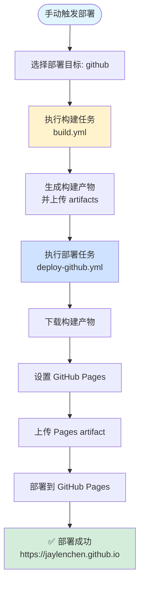

# GitHub Pages 部署说明

本文档详细说明如何将博客部署到 GitHub Pages。

## 📋 前置要求

### 1. 仓库设置

- ✅ GitHub 仓库已创建
- ✅ 仓库已启用 GitHub Pages
- ✅ 仓库设置了正确的 Pages 权限

### 2. GitHub Pages 配置

1. 进入仓库设置：`Settings` → `Pages`
2. 配置以下设置：
   - **Source**: `GitHub Actions`
   - **Branch**: 选择 `main` 分支（或你的主分支）

### 3. 权限配置

确保 GitHub Actions 具有以下权限：

```yaml
permissions:
  contents: read      # 读取仓库内容
  pages: write        # 写入 GitHub Pages
  id-token: write     # OIDC 身份验证
```

这些权限已在 `deploy-github.yml` 中配置，无需额外设置。

---

## 🔧 工作流文件

### 部署工作流 (`deploy-github.yml`)

**位置**: `.github/workflows/deploy-github.yml`

**功能**: 可复用的 GitHub Pages 部署任务

**触发方式**: 通过 `deploy.yml` 调用（手动触发且选择 `github`）

**执行步骤**:

1. **下载构建产物**
   - 从 artifacts 下载 `build.yml` 生成的构建产物

2. **设置 GitHub Pages**
   - 配置 Pages 环境

3. **上传 Pages artifact**
   - 上传构建产物到 Pages artifact

4. **部署到 GitHub Pages**
   - 执行实际部署操作

---

## 🚀 部署流程

### 自动触发

GitHub Pages 部署**不会**自动触发。需要通过手动触发并选择 `github` 作为部署目标。

### 手动触发

1. 进入 GitHub 仓库的 **Actions** 标签页
2. 选择 **"Deploy Blog"** 工作流
3. 点击右上角 **"Run workflow"** 按钮
4. 在部署目标下拉菜单中选择 **`github`**
5. 点击 **"Run workflow"** 开始部署

### 部署流程



---

## 📝 配置说明

### 工作流配置

`deploy-github.yml` 使用以下配置：

```yaml
environment:
  name: github-pages  # GitHub Pages 环境名称
  url: ${{ steps.deployment.outputs.page_url }}  # 部署后的 URL
```

### 构建产物路径

- **Artifact 名称**: `build-artifacts`
- **下载路径**: `./dist`
- **上传路径**: `./dist`

---

## 🌐 访问地址

部署成功后，博客将在以下地址可访问：

- **主地址**: `https://jaylenchen.github.io`
- **自定义域名**: 如果配置了自定义域名，可通过该域名访问

### 自定义域名配置

1. 在仓库根目录创建 `CNAME` 文件
2. 内容为你的自定义域名，例如：
   ```
   blog.example.com
   ```
3. 在你的 DNS 提供商处配置 CNAME 记录，指向 `jaylenchen.github.io`
4. 重新部署以应用更改

---

## 🔍 故障排除

### 问题 1: 部署失败，提示权限不足

**原因**: GitHub Actions 缺少必要的权限

**解决方案**:

1. 检查仓库设置 → `Settings` → `Actions` → `General`
2. 确保 **"Workflow permissions"** 设置为：
   - `Read and write permissions` 或
   - `Read repository contents and packages permissions`（并单独授予 Pages 权限）

### 问题 2: 部署成功但页面显示 404

**可能原因**:

1. **构建产物路径不正确**
   - 检查 `build.yml` 中的构建输出路径
   - 确保与 `deploy-github.yml` 中的路径一致

2. **GitHub Pages 源设置错误**
   - 确保设置为 `GitHub Actions` 而非 `Deploy from a branch`

3. **index.html 不存在**
   - 检查构建产物中是否包含 `index.html`
   - 确保 VitePress 构建配置正确

**解决方案**:

```bash
# 本地验证构建产物
yarn build:docs
ls -la docs/.vitepress/dist/
# 应该能看到 index.html
```

### 问题 3: 构建产物未找到

**原因**: `build.yml` 未成功上传 artifacts

**解决方案**:

1. 检查 `build.yml` 的执行日志
2. 确保 "Upload build artifacts" 步骤成功
3. 确认 artifacts 名称与 `deploy-github.yml` 中的下载名称一致

### 问题 4: 页面内容未更新

**原因**: GitHub Pages 缓存或部署未完成

**解决方案**:

1. 等待几分钟后刷新页面
2. 清除浏览器缓存
3. 检查 Actions 日志确认部署已完成
4. 尝试强制刷新：`Ctrl + F5`（Windows）或 `Cmd + Shift + R`（Mac）

---

## ✅ 验证部署

### 1. 检查 Actions 日志

1. 进入 **Actions** 标签页
2. 查看最新的工作流运行
3. 确认所有步骤都显示 ✅ 绿色

### 2. 检查部署状态

1. 进入仓库设置 → `Settings` → `Pages`
2. 查看 **"Your site is live at"** 下方的地址
3. 确认部署状态为绿色 ✅

### 3. 访问网站

在浏览器中访问 `https://jaylenchen.github.io`，确认：
- ✅ 页面正常加载
- ✅ 样式正确显示
- ✅ 链接正常工作
- ✅ 图片正常显示

---

## 📚 相关资源

- [GitHub Pages 文档](https://docs.github.com/en/pages)
- [GitHub Actions 文档](https://docs.github.com/en/actions)
- [VitePress 部署文档](https://vitepress.dev/guide/deploy)

---

## ⚠️ 注意事项

1. **构建产物大小限制**: GitHub Pages 有单文件大小限制（通常为 100MB），确保构建产物符合要求

2. **构建时间**: GitHub Actions 免费账户有月度使用时间限制，注意控制构建频率

3. **并发部署**: `deploy.yml` 中已配置并发控制，同一时间只允许一个部署运行

4. **构建缓存**: 可以通过缓存依赖来加速构建，已在上游工作流中配置

5. **自定义域名**: 如果使用自定义域名，需要正确配置 DNS 和 `CNAME` 文件

