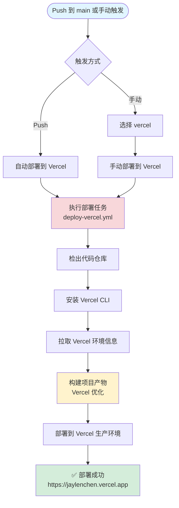
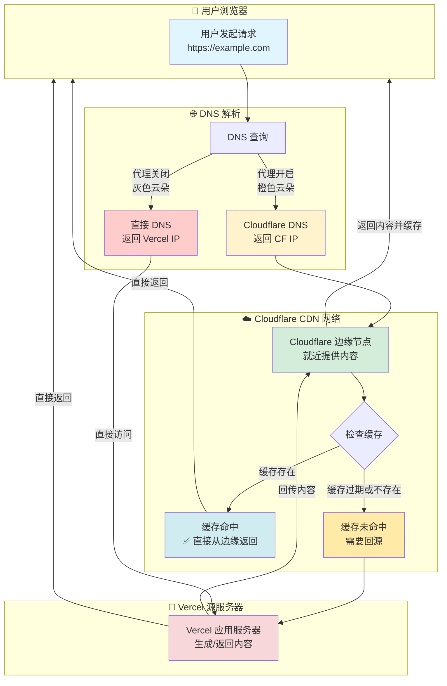
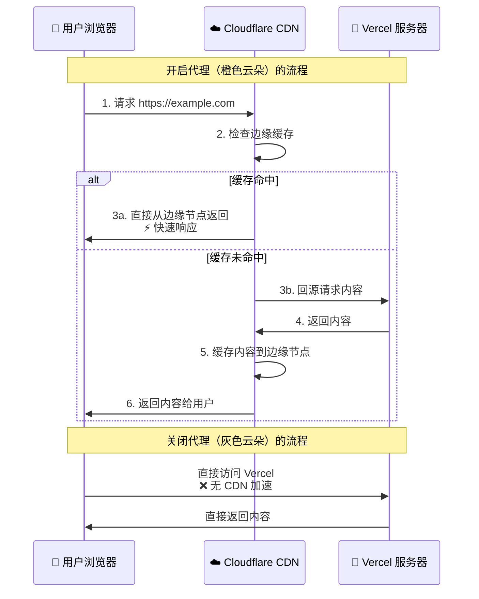
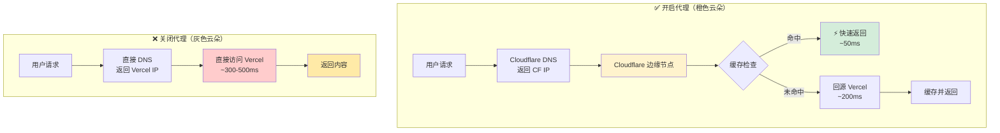
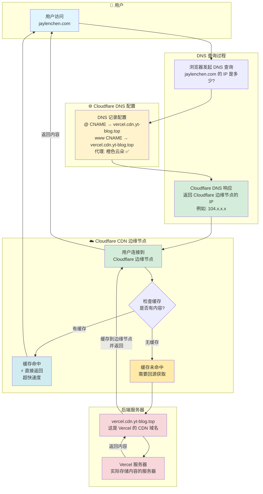
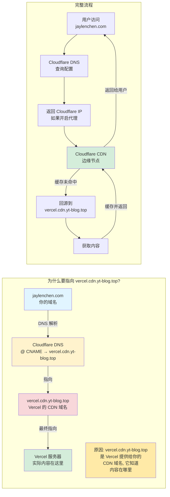

# Vercel 部署说明

本文档详细说明如何将博客部署到 Vercel。

## 📋 前置要求

### 1. Vercel 账户

- ✅ 已注册 Vercel 账户
- ✅ 已登录 Vercel Dashboard

### 2. Vercel 项目

有两种方式创建 Vercel 项目：

- **方式一（推荐）**：通过 GitHub 集成导入项目（会自动触发第一次构建）
- **方式二**：通过 Vercel CLI 手动创建项目

### 3. 获取 Vercel 凭证

需要以下三个凭证：

1. **VERCEL_TOKEN** - Vercel API Token
2. **VERCEL_ORG_ID** - Vercel Team/Organization ID
3. **VERCEL_PROJECT_ID** - Vercel Project ID

---

## 🚀 完整设置流程

### 步骤 1: 创建 Vercel Token

在创建项目之前，先获取 Token：

1. 访问 [Vercel Settings > Tokens](https://vercel.com/account/tokens)
2. 点击 **"Create Token"**
3. 输入 Token 名称（如：`github-actions-deploy`）
4. 设置过期时间（建议：`No Expiration`）
5. 点击 **"Create"**
6. **复制并保存 Token**（只显示一次，非常重要！）

### 步骤 2: 创建 Vercel 项目

#### 方法一：通过 GitHub 集成导入（推荐）

1. 访问 [Vercel Dashboard](https://vercel.com/dashboard)
2. 点击 **"Add New..."** → **"Project"**
3. 如果还没有连接 GitHub，点击 **"Import Git Repository"** 并授权 GitHub
4. 找到你的 GitHub 仓库，点击 **"Import"**
5. 配置项目：
   - **Project Name**: 会自动填充，可以修改
   - **Framework Preset**: 选择 `Other` 或 `Vite`（不重要，因为我们使用 `vercel.json` 配置）
   - **Root Directory**: 保持默认或设置为 `./`（如果配置文件在根目录）
   - **Build and Output Settings**: 保持默认（我们会在 `vercel.json` 中配置）
6. 点击 **"Deploy"**
7. **等待第一次部署完成**（这会自动触发构建）

#### 方法二：通过 Vercel CLI（可选）

```bash
# 安装 Vercel CLI
npm install -g vercel

# 登录 Vercel
vercel login

# 在项目根目录执行，创建新项目
vercel

# 按照提示选择：
# - Set up and deploy? Yes
# - Which scope? 选择你的账户或团队
# - Link to existing project? No
# - What's your project's name? 输入项目名称
# - In which directory is your code located? ./
# - Want to override the settings? No

# 项目创建后，会在 .vercel 目录生成配置文件
```

### 步骤 3: 获取 Project ID 和 Org ID

**⚠️ 重要**：项目创建后（无论是通过哪种方式），都需要获取 Project ID 和 Org ID。

#### 方法一：通过 Vercel Dashboard（最简单）

1. 进入你的项目页面（在 Vercel Dashboard 中点击项目）
2. 点击 **"Settings"** 标签页
3. 在左侧菜单中选择 **"General"**
4. 找到以下信息：

   - **Project ID** → 这就是 `VERCEL_PROJECT_ID`
     - 格式：`prj_xxxxxxxxxxxxx`
     - 示例：`prj_abc123def456`
   
   - **Team ID** 或 **Personal Account ID** → 这就是 `VERCEL_ORG_ID`
     - 如果是个人账户：格式为 `xxxxxxxxxxxxx`（纯字符串，没有前缀）
     - 如果是团队账户：格式为 `team_xxxxxxxxxxxxx`
     - 在页面上可能显示为：
       - "Team ID: team_xxxxx" 或
       - "Account ID: xxxxx"

5. **复制这两个 ID** 并保存

**截图说明**：
- 在 Settings → General 页面，向下滚动可以看到：
  - `Project ID` 在 "Project Information" 部分
  - `Team ID` 或 `Account ID` 在 "Team" 或 "Account" 部分

#### 方法二：通过 Vercel CLI（如果使用方法二创建项目）

如果你已经通过 CLI 创建了项目，配置文件会自动生成：

```bash
# 查看 Project ID
cat .vercel/project.json
# 输出示例：
# {
#   "projectId": "prj_xxxxxxxxxxxxx",
#   "orgId": "team_xxxxxxxxxxxxx" 或 "xxxxxxxxxxxxx"
# }

# 查看 Org ID（如果在团队中）
cat .vercel/org.json
# 输出示例：
# {
#   "id": "team_xxxxxxxxxxxxx"
# }
```

**注意**：
- 如果 `project.json` 中的 `orgId` 存在，就使用它
- 如果不存在，使用 `org.json` 中的 `id`
- 个人账户的 Org ID 没有 `team_` 前缀，团队账户有 `team_` 前缀

#### 方法三：通过 Vercel API（高级）

如果你已经有 Token，也可以通过 API 获取：

```bash
# 获取所有项目列表（会包含 Project ID）
curl -H "Authorization: Bearer YOUR_VERCEL_TOKEN" \
  https://api.vercel.com/v9/projects

# 获取团队/账户信息（会包含 Org ID）
curl -H "Authorization: Bearer YOUR_VERCEL_TOKEN" \
  https://api.vercel.com/v2/teams
```

---

## 📝 获取凭证总结

### 快速检查清单

完成以下步骤后，你应该拥有：

- [ ] ✅ **VERCEL_TOKEN**: 从 [Settings > Tokens](https://vercel.com/account/tokens) 获取
- [ ] ✅ **VERCEL_PROJECT_ID**: 从项目 Settings → General 获取（格式：`prj_xxx`）
- [ ] ✅ **VERCEL_ORG_ID**: 从项目 Settings → General 获取（可能是 `team_xxx` 或纯字符串）

### 常见问题

**Q: 我还没有在 Vercel 创建项目，能先获取 Project ID 吗？**

A: **不能**。Project ID 只有在项目创建后才会生成。建议流程：
1. 先创建 Token（可以在任何时候创建）
2. 通过 GitHub 集成导入项目（会自动创建项目并触发第一次构建）
3. 在项目 Settings → General 页面获取 Project ID 和 Org ID

**Q: 通过 GitHub 集成导入会触发构建，但我还没配置好，怎么办？**

A: 没关系！第一次构建可能会失败或使用默认配置，这不会影响你获取 Project ID 和 Org ID。你可以：
1. 先导入项目（创建项目）
2. 获取 Project ID 和 Org ID
3. 在 GitHub Secrets 中配置
4. 后续的部署会使用 GitHub Actions 工作流，而不是 Vercel 的自动构建

**Q: 我的项目已经存在了，在哪里找 Project ID？**

A: 在 Vercel Dashboard → 选择项目 → Settings → General 页面，向下滚动即可看到。

---

## 🔐 配置 GitHub Secrets

在 GitHub 仓库中配置 Vercel 凭证（**三个 Secrets 都是必需的**）：

1. 进入仓库设置：`Settings` → `Secrets and variables` → `Actions`
2. 点击 **"New repository secret"**
3. 添加以下三个 Secrets：

   | Secret 名称 | 是否必需 | 说明 | 示例值 |
   |------------|---------|------|--------|
   | `VERCEL_TOKEN` | ✅ **必需** | Vercel API Token | `xxxxxxxxxxxxxxxxxxxx` |
   | `VERCEL_ORG_ID` | ✅ **必需** | Vercel Team/Org ID | `team_xxxxxxxxxxxx` 或 `xxxxxxxxxxxx` |
   | `VERCEL_PROJECT_ID` | ✅ **必需** | Vercel Project ID | `prj_xxxxxxxxxxxx` |

4. 点击 **"Add secret"** 保存

### 获取 Secrets 值

如果还没有这些值，请参考文档开头的 **"🚀 完整设置流程"** 部分：
- **步骤 1**: 创建 VERCEL_TOKEN
- **步骤 2**: 创建 Vercel 项目
- **步骤 3**: 获取 VERCEL_ORG_ID 和 VERCEL_PROJECT_ID

---

## 🔧 工作流文件

### 部署工作流 (`deploy-vercel.yml`)

**位置**: `.github/workflows/deploy-vercel.yml`

**功能**: 可复用的 Vercel 部署任务

**触发方式**: 
- 自动触发：Push 到 `main` 分支
- 手动触发：通过 `deploy.yml` 调用（选择 `vercel`）

**执行步骤**:

1. **检出代码**
   - 从 GitHub 仓库检出最新代码

2. **安装 Vercel CLI**
   - 全局安装最新版本的 Vercel CLI

3. **拉取环境信息**
   - 使用 Vercel CLI 拉取项目配置和环境变量

4. **构建项目产物**
   - 使用 Vercel CLI 构建项目（优化构建）

5. **部署到 Vercel**
   - 部署构建产物到 Vercel 生产环境

---

## ⚙️ Vercel 配置文件

### `vercel.json`

**位置**: 项目根目录 `vercel.json`

**配置内容**:

```json
{
  "buildCommand": "yarn install && yarn build:docs",
  "outputDirectory": "docs/.vitepress/dist",
  "framework": null,
  "cleanUrls": true,
  "trailingSlash": false,
  "headers": [
    {
      "source": "/(.*)",
      "headers": [
        {
          "key": "X-Content-Type-Options",
          "value": "nosniff"
        },
        {
          "key": "X-Frame-Options",
          "value": "DENY"
        },
        {
          "key": "X-XSS-Protection",
          "value": "1; mode=block"
        }
      ]
    },
    {
      "source": "/assets/(.*)",
      "headers": [
        {
          "key": "Cache-Control",
          "value": "public, max-age=31536000, immutable"
        }
      ]
    },
    {
      "source": "/(.*\\.(ico|png|jpg|jpeg|gif|svg|webp|woff|woff2|ttf|eot))",
      "headers": [
        {
          "key": "Cache-Control",
          "value": "public, max-age=31536000, immutable"
        }
      ]
    }
  ]
}
```

**配置说明**:

- `buildCommand`: 构建命令，用于本地构建验证
- `outputDirectory`: 构建输出目录
- `cleanUrls`: 启用无扩展名 URL（如 `/about` 而非 `/about.html`）
- `trailingSlash`: 禁用尾部斜杠
- `headers`: 安全头和缓存策略
  - 所有路由添加安全头
  - 静态资源设置长期缓存

### `.vercelignore`

**位置**: 项目根目录 `.vercelignore`

**作用**: 指定 Vercel 部署时忽略的文件和目录

**配置内容**:

```
node_modules
.git
.github
.vscode
*.log
.DS_Store
.env.local
.env.*.local
```

---

## 🚀 部署流程

### 自动触发

当推送代码到 `main` 分支时，会自动触发 Vercel 部署：

```bash
git push origin main
```

### 手动触发

1. 进入 GitHub 仓库的 **Actions** 标签页
2. 选择 **"Deploy Blog"** 工作流
3. 点击右上角 **"Run workflow"** 按钮
4. 在部署目标下拉菜单中选择 **`vercel`**（默认）
5. 点击 **"Run workflow"** 开始部署

### 部署流程



---

## 🌐 访问地址

部署成功后，博客将在以下地址可访问：

### 默认地址

- **生产环境**: `https://jaylenchen.vercel.app`
- **预览环境**: 每次部署会生成唯一的预览 URL

### 自定义域名

如果配置了自定义域名，可通过该域名访问。

#### 配置步骤

**1. 在 Vercel Dashboard 中添加域名**

1. 进入 [Vercel Dashboard](https://vercel.com/dashboard)
2. 选择你的项目
3. 点击 **"Settings"** 标签页
4. 在左侧菜单中选择 **"Domains"**
5. 点击 **"Add Domain"** 按钮
6. 输入你的域名：
   - **子域名**：`blog.example.com` 或 `www.example.com`
   - **根域名**：`example.com`
7. 点击 **"Add"**

**2. 配置 DNS 记录**

根据你添加的域名类型，Vercel 会提供相应的 DNS 配置说明：

##### 方式一：根域名（example.com）

如果你添加的是根域名（如 `example.com`），需要配置 **A 记录**：

```
类型: A
名称: @ 或 (空白)
值: 76.76.21.21
TTL: 3600 (或自动)
```

**多个 A 记录**（推荐，提高可用性）：

```
类型: A
名称: @
值: 76.76.21.21

类型: A
名称: @
值: 76.76.21.22
```

##### 方式二：子域名（www.example.com 或 blog.example.com）

如果你添加的是子域名（如 `www.example.com`），需要配置 **CNAME 记录**：

```
类型: CNAME
名称: www (或 blog)
值: cname.vercel-dns.com.
TTL: 3600 (或自动)
```

**注意**：
- CNAME 记录的 `值` 必须以 `.` 结尾
- Vercel 会在添加域名时自动生成对应的 CNAME 值

##### 方式三：同时配置根域名和 www 子域名

如果你想要同时支持 `example.com` 和 `www.example.com`：

1. **添加根域名**：`example.com` → 配置 A 记录
2. **添加 www 子域名**：`www.example.com` → 配置 CNAME 记录指向 `cname.vercel-dns.com.`

或者使用重定向：
- 在 Vercel 项目设置中，可以将根域名重定向到 www 子域名

**3. 在 DNS 提供商处配置**

1. 登录你的域名注册商或 DNS 服务商（如 Cloudflare、阿里云、GoDaddy 等）
2. 进入域名管理页面
3. 找到 DNS 设置或域名解析设置
4. 添加上述对应的 DNS 记录（A 记录或 CNAME 记录）
5. 保存配置

**4. 等待 DNS 生效和 SSL 证书配置**

- DNS 记录生效时间：通常 5-30 分钟，最长可能需要 24-48 小时
- SSL 证书自动配置：Vercel 会自动为你的域名配置 SSL 证书（HTTPS）
- 验证状态：在 Vercel Dashboard → Domains 页面可以查看域名配置状态
  - ✅ **Valid Configuration**：配置正确，DNS 已生效
  - ⏳ **Pending**：DNS 传播中，等待生效
  - ❌ **Invalid Configuration**：配置有误，检查 DNS 记录

#### 常见 DNS 提供商配置示例

**Cloudflare（推荐使用 CDN 加速）**:
1. 登录 Cloudflare Dashboard
2. 选择你的域名
3. 进入 **"DNS"** 标签页
4. 点击 **"Add record"**
5. 根据类型添加 A 或 CNAME 记录
6. **重要**: 确保代理状态设置为 **"已代理"**（橙色云朵图标）✅

> 💡 **提示**: 使用 Cloudflare 作为 CDN 代理可以显著加速访问速度，特别是在国内。详细配置请参考下面的 **"⚡ Cloudflare CDN 加速"** 部分。

**阿里云/腾讯云**:
1. 登录域名控制台
2. 进入 **"域名解析"** 或 **"DNS 解析"**
3. 选择你的域名
4. 添加对应的解析记录

**GoDaddy**:
1. 登录 GoDaddy 账户
2. 进入 **"My Products"** → **"DNS"**
3. 添加对应的 DNS 记录

#### 验证配置

配置完成后，可以通过以下方式验证：

1. **检查 DNS 解析**：
   ```bash
   # 检查根域名
   dig example.com
   nslookup example.com
   
   # 检查子域名
   dig www.example.com
   nslookup www.example.com
   ```

2. **在 Vercel Dashboard 查看**：
   - 进入项目 Settings → Domains
   - 查看域名状态，应该显示 ✅ Valid Configuration

3. **访问测试**：
   - 在浏览器访问 `https://your-domain.com`
   - 确认可以正常访问且显示 HTTPS 锁图标

#### 常见问题

**Q: DNS 配置后还是显示 "Invalid Configuration"**

A: 
- 检查 DNS 记录是否正确添加
- 确认 TTL 时间（建议设置为 3600 或自动）
- 等待 DNS 传播完成（可能需要更长时间）
- 清除浏览器缓存后重试

**Q: 根域名和 www 子域名都要配置吗？**

A: 
- 不是必须的，可以只配置一个
- 建议同时配置，并在 Vercel 中设置重定向规则

**Q: SSL 证书需要手动配置吗？**

A: 
- 不需要！Vercel 会自动为所有添加的域名配置 SSL 证书
- 证书由 Vercel 自动续期

**Q: 可以配置多个自定义域名吗？**

A: 
- 可以！Vercel 支持为同一个项目配置多个域名
- 在 Domains 页面可以添加多个域名

#### 通过 Vercel CLI 配置（可选）

你也可以通过 CLI 添加域名：

```bash
# 添加域名
vercel domains add your-domain.com

# 查看已添加的域名
vercel domains ls

# 删除域名
vercel domains rm your-domain.com
```

---

## ⚡ Cloudflare CDN 加速

使用 Cloudflare 作为 CDN 代理层可以加速访问 Vercel 部署的网站，特别是在国内访问时。

### 配置步骤

#### 1. 在 Cloudflare 添加域名

1. 登录 [Cloudflare Dashboard](https://dash.cloudflare.com/)
2. 点击 **"Add a Site"**
3. 输入你的域名（如 `example.com`）
4. 选择免费计划（Free）或其他计划
5. 等待 Cloudflare 扫描现有的 DNS 记录

#### 2. 更新 Nameservers

1. 按照 Cloudflare 的提示，将域名的 Nameservers 更新为 Cloudflare 提供的地址
2. 在你的域名注册商处修改 Nameservers
3. 等待 Nameservers 生效（通常几分钟到几小时）

#### 3. 配置 DNS 记录（通过 Cloudflare）

在 Cloudflare 的 DNS 设置中，添加指向 Vercel 的记录：

##### 方式一：使用 CNAME（推荐）

**子域名（如 `www.example.com`）**:
```
类型: CNAME
名称: www
目标: cname.vercel-dns.com.
代理状态: 已代理（橙色云朵）✅
TTL: Auto
```

**根域名（example.com）** - 如果 Cloudflare 支持：
```
类型: CNAME
名称: @
目标: cname.vercel-dns.com.
代理状态: 已代理（橙色云朵）✅
TTL: Auto
```

**注意**：如果根域名不支持 CNAME，使用方式二。

##### 方式二：使用 A 记录（根域名）

如果 Cloudflare 不支持根域名的 CNAME，使用 A 记录：

```
类型: A
名称: @
IPv4 地址: 76.76.21.21
代理状态: 已代理（橙色云朵）✅
TTL: Auto
```

#### 4. 在 Vercel 中添加域名

1. 进入 Vercel Dashboard → 项目 Settings → Domains
2. 添加你的域名（已在 Cloudflare 配置的域名）
3. Vercel 会自动检测到 DNS 配置

#### 5. Cloudflare 优化设置

##### SSL/TLS 设置

1. 进入 Cloudflare Dashboard → SSL/TLS
2. 选择 **"Full"** 或 **"Full (strict)"** 模式
   - **Full**: 加密连接到源服务器（推荐）
   - **Full (strict)**: 验证源服务器的证书（需要源服务器有有效证书）
3. Vercel 会自动提供 SSL 证书，所以可以使用 **"Full"** 模式

##### 缓存设置

1. 进入 **"Caching"** → **"Configuration"**
2. 配置缓存级别：
   - **Caching Level**: Standard
   - **Browser Cache TTL**: Respect Existing Headers（尊重源服务器的缓存头）
3. 进入 **"Caching"** → **"Cache Rules"** 可以创建自定义缓存规则

##### 速度优化

1. **Auto Minify**: 
   - 进入 **"Speed"** → **"Optimization"**
   - 启用 **JavaScript**, **CSS**, **HTML** 的自动压缩

2. **Brotli 压缩**:
   - 自动启用（Cloudflare 默认支持）

3. **HTTP/2 和 HTTP/3**:
   - 自动启用

##### 页面规则（可选）

创建页面规则来优化特定路径的缓存：

1. 进入 **"Rules"** → **"Page Rules"**
2. 创建规则，例如：
   - **URL**: `example.com/assets/*`
   - **设置**:
     - Cache Level: Cache Everything
     - Edge Cache TTL: 1 month

#### 6. 验证配置

1. **检查 DNS 解析**:
   ```bash
   dig example.com
   # 应该返回 Cloudflare 的 IP 地址
   ```

2. **检查代理状态**:
   - 在 Cloudflare DNS 页面，确保记录显示 **橙色云朵**（已代理）
   - 如果显示灰色云朵，点击切换为已代理

3. **检查 SSL**:
   - 访问 `https://example.com` 应该显示 Cloudflare 的 SSL 证书
   - 查看证书详情，应该显示 "Issued by: Cloudflare"

4. **速度测试**:
   - 使用 [PageSpeed Insights](https://pagespeed.web.dev/) 测试速度
   - 或使用 `curl -I https://example.com` 查看响应头

### Cloudflare 加速原理

#### 架构流程图



#### 简化流程图



#### 关键区别



#### DNS 配置原理详解

**为什么 Cloudflare DNS 要指向 `vercel.cdn.yt-blog.top`？**



**DNS 指向关系说明**



**优势**:
- ✅ **全球 CDN 加速**: Cloudflare 的全球边缘节点就近提供内容
- ✅ **智能缓存**: 静态资源缓存在 Cloudflare 边缘节点
- ✅ **DDoS 保护**: Cloudflare 提供基础的 DDoS 防护
- ✅ **自动压缩**: JavaScript、CSS、HTML 自动压缩
- ✅ **HTTP/3 支持**: 更快的协议支持

### 注意事项

1. **SSL 证书**:
   - Cloudflare 会自动提供 SSL 证书（Edge Certificate）
   - 确保 SSL/TLS 模式设置为 **"Full"** 或 **"Full (strict)"**

2. **缓存冲突**:
   - Vercel 和 Cloudflare 都可能设置缓存头
   - 建议让 Cloudflare 尊重源服务器的缓存头（Browser Cache TTL: Respect Existing Headers）

3. **WebSocket 支持**:
   - 如果需要 WebSocket，确保在 Cloudflare 的 Network 设置中启用 **"WebSockets"**

4. **开发环境**:
   - 开发时可能需要暂时禁用 Cloudflare 代理（点击灰色云朵）
   - 或在 Cloudflare 的 Rules 中为开发子域名禁用缓存

5. **HTTPS 重定向**:
   - 在 Cloudflare 的 **"SSL/TLS"** → **"Edge Certificates"** 中启用 **"Always Use HTTPS"**

### 性能监控

Cloudflare 提供免费的 Analytics 和 Web Analytics：

1. 进入 **"Analytics"** → **"Web Analytics"**
2. 启用 Web Analytics 查看详细的访问统计
3. 查看 **"Performance"** 标签页了解加载性能

---

## 🔍 故障排除

### 问题 1: 部署失败，提示 "Invalid token"

**原因**: `VERCEL_TOKEN` 无效或已过期

**解决方案**:

1. 访问 [Vercel Settings > Tokens](https://vercel.com/account/tokens)
2. 检查 Token 是否仍然有效
3. 如果无效，创建新 Token
4. 更新 GitHub Secrets 中的 `VERCEL_TOKEN`

### 问题 2: 部署失败，提示 "Project not found"

**原因**: `VERCEL_ORG_ID` 或 `VERCEL_PROJECT_ID` 不正确

**解决方案**:

1. 确认项目是否存在于 Vercel
2. 重新获取 `VERCEL_ORG_ID` 和 `VERCEL_PROJECT_ID`
3. 检查 GitHub Secrets 中的值是否正确
4. 注意：如果是团队项目，`VERCEL_ORG_ID` 应为团队 ID

### 问题 3: 构建失败

**可能原因**:

1. **构建命令错误**
   - 检查 `vercel.json` 中的 `buildCommand`
   - 本地测试构建命令是否成功

2. **依赖安装失败**
   - 检查 `package.json` 和 `yarn.lock`
   - 确保所有依赖版本兼容

3. **Node.js 版本不匹配**
   - Vercel 默认使用 Node.js 18
   - 可在 `package.json` 中指定版本：
     ```json
     {
       "engines": {
         "node": "20"
       }
     }
     ```

**解决方案**:

```bash
# 本地测试构建
yarn install
yarn build:docs

# 本地测试 Vercel CLI
vercel login
vercel build --prod
```

### 问题 4: 部署成功但页面显示错误

**可能原因**:

1. **输出目录不正确**
   - 检查 `vercel.json` 中的 `outputDirectory`
   - 确保与构建输出路径一致

2. **路由配置问题**
   - VitePress 的 `base` 配置可能与 Vercel 不匹配
   - 检查 `docs/.vitepress/config.ts` 中的 `base` 设置

3. **环境变量缺失**
   - 检查 Vercel Dashboard 中的环境变量
   - 确保生产环境变量已配置

**解决方案**:

1. 检查 Vercel 部署日志中的错误信息
2. 在 Vercel Dashboard 中查看函数日志
3. 使用 Vercel CLI 本地测试：

```bash
vercel dev
```

### 问题 5: 资源加载失败（404）

**原因**: 静态资源路径不正确

**解决方案**:

1. 检查 `vercel.json` 中的 `headers` 配置
2. 确保静态资源路径在构建输出中存在
3. 检查 VitePress 的 `base` 配置是否正确

---

## ✅ 验证部署

### 1. 检查 Actions 日志

1. 进入 **Actions** 标签页
2. 查看最新的工作流运行
3. 确认所有步骤都显示 ✅ 绿色

### 2. 检查 Vercel Dashboard

1. 进入 Vercel Dashboard
2. 查看项目的 **Deployments** 标签页
3. 确认最新部署状态为 ✅ Ready

### 3. 访问网站

在浏览器中访问部署地址，确认：
- ✅ 页面正常加载
- ✅ 样式正确显示
- ✅ 链接正常工作
- ✅ 图片正常显示
- ✅ 路由跳转正常

---

## 🔄 环境变量配置

### 在 Vercel Dashboard 中配置

1. 进入项目设置：`Project Settings` → `Environment Variables`
2. 点击 **"Add New"**
3. 输入变量名称和值
4. 选择应用环境（Production, Preview, Development）
5. 点击 **"Save"**

### 在 GitHub Actions 中使用

如果需要在部署时使用环境变量，可以在 `deploy-vercel.yml` 中配置：

```yaml
steps:
  - name: Deploy project artifacts to Vercel
    run: vercel deploy --prebuilt --prod --token=${{ secrets.VERCEL_TOKEN }}
    env:
      VERCEL_ORG_ID: ${{ secrets.VERCEL_ORG_ID }}
      VERCEL_PROJECT_ID: ${{ secrets.VERCEL_PROJECT_ID }}
      # 添加其他环境变量
      MY_ENV_VAR: ${{ secrets.MY_ENV_VAR }}
```

---

## 📚 相关资源

- [Vercel 文档](https://vercel.com/docs)
- [Vercel CLI 文档](https://vercel.com/docs/cli)
- [VitePress 部署文档](https://vitepress.dev/guide/deploy)
- [Vercel 环境变量](https://vercel.com/docs/concepts/projects/environment-variables)

---

## ⚠️ 注意事项

1. **Token 安全**: 永远不要在代码中硬编码 `VERCEL_TOKEN`，始终使用 GitHub Secrets

2. **构建时间**: Vercel 免费账户有构建时间限制，注意控制构建频率

3. **并发部署**: `deploy.yml` 中已配置并发控制，同一时间只允许一个部署运行

4. **预览部署**: Vercel 会为每个 Pull Request 创建预览部署，这不会消耗生产环境的配额

5. **自定义域名**: 使用自定义域名时，确保 DNS 配置正确，并等待 DNS 生效

6. **环境变量**: 敏感信息应使用 Vercel Dashboard 的环境变量功能，而非硬编码在代码中

7. **构建缓存**: Vercel 会自动缓存依赖和构建产物以加速后续部署

