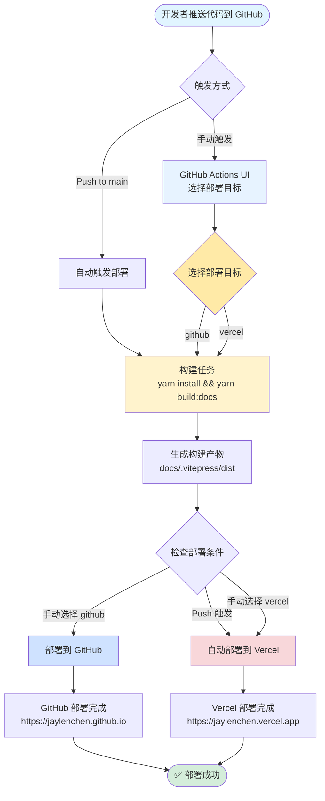
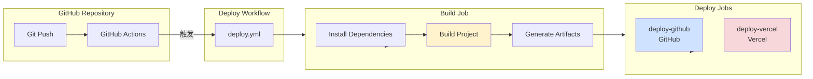
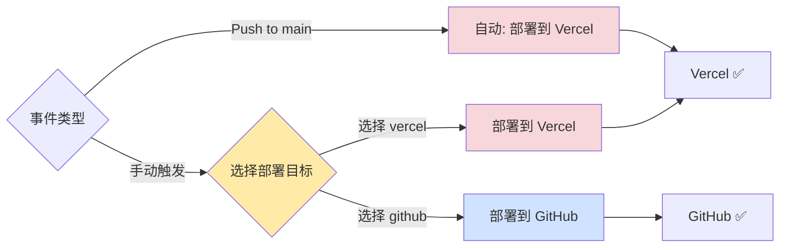

# 部署和工作流说明

本文档说明博客的部署配置和工作流程。

## 📁 文件结构

```
.github/
├── workflows/
│   ├── deploy.yml          # 统一部署工作流（主入口）
│   ├── build.yml           # 构建任务（可复用）
│   ├── deploy-github.yml   # GitHub 部署任务（可复用）
│   └── deploy-vercel.yml   # Vercel 部署任务（可复用）
├── DEPLOYMENT.md           # 本文件（总体说明）
├── DEPLOY-GITHUB.md        # GitHub Pages 部署详细说明
├── DEPLOY-VERCEL.md        # Vercel 部署详细说明
└── README.md               # 快速使用指南

根目录/
├── vercel.json             # Vercel 部署配置
└── .vercelignore           # Vercel 忽略文件
```

## 🚀 快速开始

### 自动部署（Push 触发）

推送代码到 `main` 分支会自动触发部署，**默认部署到 Vercel**。

```bash
git push origin main
```

### 手动部署（选择部署目标）

1. 进入 GitHub 仓库的 **Actions** 标签页
2. 选择 **"Deploy Blog"** 工作流
3. 点击右上角 **"Run workflow"** 按钮
4. 在弹出窗口中选择部署目标：
   - `github` - 部署到 GitHub
   - `vercel` - 部署到 Vercel（默认）
5. 点击 **"Run workflow"** 开始部署

## 📊 CI/CD 流程图

### 完整部署流程



### 工作流结构



### 部署条件判断



## 📋 工作流说明

### 工作流文件结构

工作流采用模块化设计，将构建和部署分离为独立的可复用文件：

- **`deploy.yml`** - 主入口工作流，负责触发和协调
- **`build.yml`** - 构建任务，可复用
- **`deploy-github.yml`** - GitHub 部署任务，可复用
- **`deploy-vercel.yml`** - Vercel 部署任务，可复用

### 主部署工作流 (`deploy.yml`)

**功能**：支持选择部署到 GitHub 或 Vercel

**触发时机**：
- **自动触发**：Push 到 `main` 分支 → 默认部署到 Vercel
- **手动触发**：GitHub Actions UI → 可以选择部署目标

**工作流结构**：

```
构建任务 (build.yml)
    ↓
├─→ 部署到 GitHub (deploy-github.yml) [需要构建产物]
└─→ 部署到 Vercel (deploy-vercel.yml) [独立构建]
```

### 构建工作流 (`build.yml`)

**功能**：可复用的构建任务

**执行步骤**：
1. 检出代码仓库 (`actions/checkout@v4`)
2. 设置 Node.js 环境（版本 20）
3. 启用 Corepack 和设置 Yarn
4. 安装依赖 (`yarn install --immutable`)
5. 构建项目 (`yarn build:docs`)
6. 上传构建产物到 artifacts

**输出**：
- 构建产物路径：`docs/.vitepress/dist`
- Artifact 名称：`build-artifacts`

### GitHub 部署工作流 (`deploy-github.yml`)

**功能**：可复用的 GitHub Pages 部署任务

**触发条件**：手动触发且选择 `github`

**执行步骤**：
1. 下载构建产物
2. 设置 GitHub Pages 环境
3. 上传 Pages artifact
4. 部署到 GitHub Pages

**部署地址**：`https://jaylenchen.github.io`

**依赖**：需要 `build.yml` 先执行完成

### Vercel 部署工作流 (`deploy-vercel.yml`)

**功能**：可复用的 Vercel 部署任务

**触发条件**：
- Push 到 `main` 分支（自动）
- 手动触发且选择 `vercel`

**执行步骤**：
1. 检出代码仓库
2. 安装 Vercel CLI
3. 拉取 Vercel 环境信息
4. 构建项目产物（Vercel 优化）
5. 部署到 Vercel 生产环境

**部署地址**：
- 默认：`https://jaylenchen.vercel.app`
- 自定义域名：`https://jaylenchen.com`（如果已配置）

**特点**：独立构建，不依赖 `build.yml`

---

## 📚 平台部署详细说明

每个平台的部署配置和详细说明已拆分到独立文档中：

### GitHub Pages 部署

📄 详细文档：**[DEPLOY-GITHUB.md](./DEPLOY-GITHUB.md)**

包含内容：
- ✅ 前置要求和仓库设置
- ✅ 工作流配置说明
- ✅ 部署流程和步骤
- ✅ 访问地址配置
- ✅ 故障排除和验证方法
- ✅ 相关资源和注意事项

### Vercel 部署

📄 详细文档：**[DEPLOY-VERCEL.md](./DEPLOY-VERCEL.md)**

包含内容：
- ✅ 前置要求和账户设置
- ✅ Vercel 凭证获取方法
- ✅ GitHub Secrets 配置
- ✅ `vercel.json` 配置说明
- ✅ 部署流程和步骤
- ✅ 环境变量配置
- ✅ 故障排除和验证方法
- ✅ 相关资源和注意事项

---

## ⚙️ 快速配置参考

### GitHub Pages 配置

**前置要求**：
- 仓库已启用 GitHub Pages
- 设置 Source 为 `GitHub Actions`

**工作流文件**：`.github/workflows/deploy-github.yml`

**触发方式**：手动触发并选择 `github`

👉 **详细配置请参考 [DEPLOY-GITHUB.md](./DEPLOY-GITHUB.md)**

### Vercel 配置

**前置要求**：
- Vercel 账户已创建
- 已获取 Vercel 凭证（Token、Org ID、Project ID）

**配置文件**：
- `vercel.json` - Vercel 部署配置
- `.vercelignore` - 部署忽略文件

**GitHub Secrets**：
- `VERCEL_TOKEN`
- `VERCEL_ORG_ID`
- `VERCEL_PROJECT_ID`

👉 **详细配置请参考 [DEPLOY-VERCEL.md](./DEPLOY-VERCEL.md)**

---

## 🔧 修改默认部署目标

### 修改为默认部署到 GitHub

编辑 `.github/workflows/deploy.yml`：

```yaml
# 将 deploy-github 的 if 条件改为：
deploy-github:
  if: |
    (github.event_name == 'push' && github.ref == 'refs/heads/main') ||
    (github.event_name == 'workflow_dispatch' && github.event.inputs.deploy_target == 'github')

# 将 deploy-vercel 的 if 条件改为：
deploy-vercel:
  if: github.event_name == 'workflow_dispatch' && github.event.inputs.deploy_target == 'vercel'
```

### 修改为同时部署到两个平台

```yaml
# deploy-github 和 deploy-vercel 都改为：
deploy-github:
  if: always()

deploy-vercel:
  if: always()
```

---

## 🔍 故障排除

### 通用问题

#### 问题 1: 手动触发时没有看到选择框

**原因**：工作流文件配置不正确

**解决**：确保工作流文件 `.github/workflows/deploy.yml` 包含 `workflow_dispatch` 和 `inputs` 配置。

#### 问题 2: 构建失败

**检查**：
- Node.js 版本是否匹配（工作流使用版本 20）
- Yarn 版本是否正确
- 依赖是否正确安装

**解决**：
```bash
# 清理并重新安装
rm -rf node_modules yarn.lock
yarn install
yarn build:docs
```

### 平台特定问题

👉 **GitHub Pages 故障排除**：请参考 [DEPLOY-GITHUB.md](./DEPLOY-GITHUB.md#-故障排除)

👉 **Vercel 故障排除**：请参考 [DEPLOY-VERCEL.md](./DEPLOY-VERCEL.md#-故障排除)

---

## 📚 参考资源

- [GitHub Actions 文档](https://docs.github.com/en/actions)
- [Vercel 文档](https://vercel.com/docs)
- [VitePress 部署文档](https://vitepress.dev/guide/deploy)

## ✅ 最佳实践

1. **使用统一的工作流**：使用 `deploy.yml` 统一管理部署
2. **保持一致性**：所有工作流使用相同的构建步骤和工具版本
3. **并发控制**：使用 concurrency 防止重复部署
4. **添加注释**：关键步骤和条件判断添加注释说明
5. **规范化命名**：遵循命名规范，保持代码整洁

## ⚠️ 注意事项

1. **默认部署目标**：Push 时默认部署到 Vercel
2. **手动部署**：可以随时通过 GitHub Actions UI 选择部署目标
3. **并发控制**：同一时间只允许一个部署运行，新的部署会取消正在进行的部署
4. **构建产物**：构建产物路径为 `docs/.vitepress/dist`
5. **环境变量**：如果使用 Vercel 部署，需要在 GitHub Secrets 中配置相关密钥
