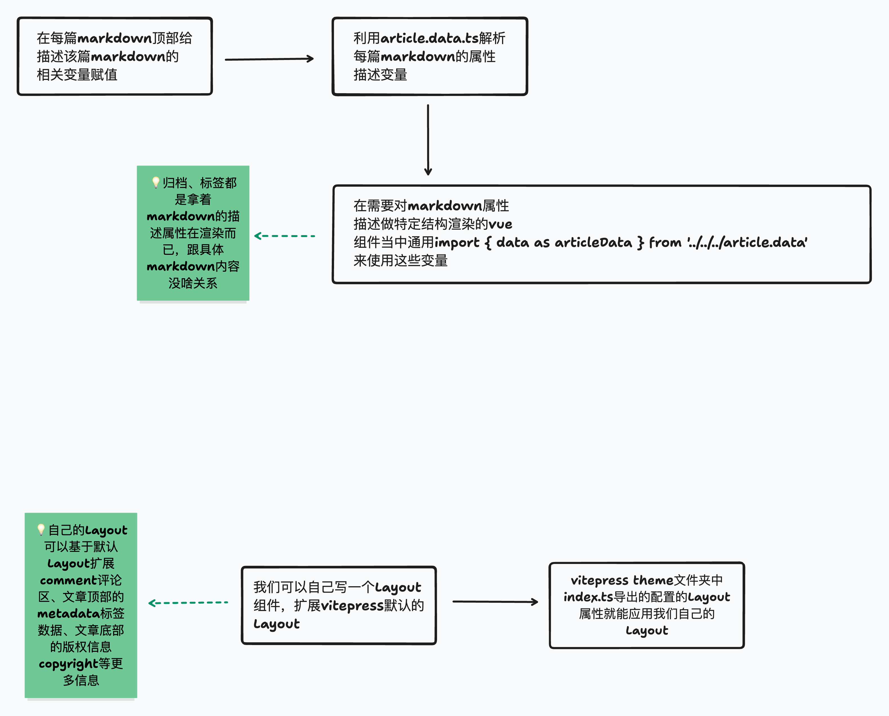

# 文思塾

## 源码组织

- config：vitepress配置
- docs： markdown文章
- theme：vitepress主题

## 使用变量配置（frontMatter）

在docs下的所有markdown文件的顶部可以使用yaml语法定义一些变量信息，类似于环境变量配置。定义之后，你可以选择在两个地方使用它们，Vue组件或者是Markdown文件。一般地，我们会描述一篇markdown文章的相关属性，比如常见的文章所属标签、文章的标题、文章的书写时间、文章的项目归属等。写这些的目的，是为了能够在一些类似归档的页面、标签的页面使用到这些在markdown文章顶部定义的变量，然后在Vue组件、Markdown页面中使用它们进行渲染。

## 扩展界面布局

默认地，vitepress会给我们提供一个默认主题。为了能够在文章的头部加上文章的描述信息，标签等，在文章的底部加上版权信息，在界面的末尾加上github 评论区功能，我们可以针对原始主题进行扩展，扩展出个人定制化的Layout替换掉原始的Layout。这部分内容都放在了theme下，你可以把它认为是跟常规的vue app没啥区别的一个web应用。

