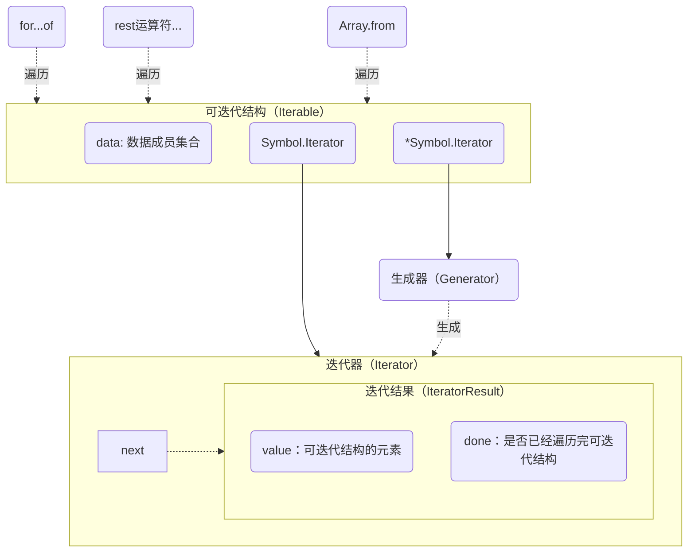
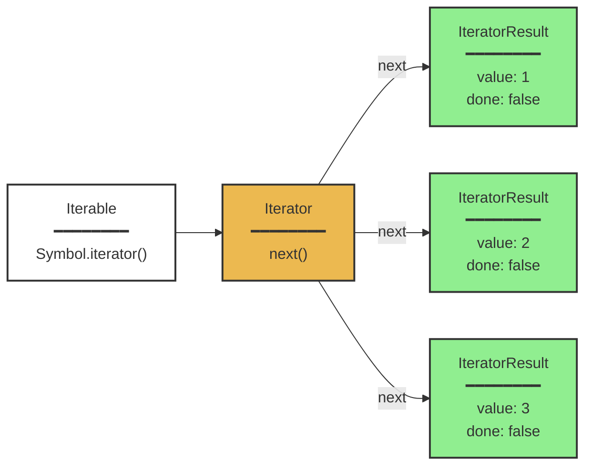

# 可迭代结构设计：Iterator与Generator

## 可迭代结构（Iterable）

虽然`JavaScript`为我们提供了不少可迭代结构，但在工程实践中有时候也会需要自己根据需求去设计一个可迭代结构。一个可迭代结构就是一个实现了`[Symbol.Iterator]`方法或者是`*[Symbol.Iterator]`的结构，前者通过实现一个迭代器（`Iterator`）结构来实现一个结构的可迭代，后者则是通过实现一个生成器（`Generator`）来实现一个结构的可迭代。两者的共同点是可迭代结构（`Iterable`）在调用`[Symbol.Iterator]`方法或者是`*[Symbol.Iterator]`方法后返回的都是迭代器（`Iterator`），不同点是手动实现符合协议的迭代器结构还是自动生成迭代器。




## 迭代器（Iterator）

迭代器（`Iterator`）是对可迭代结构（`Iterable`）的遍历状态封装，它提供对可迭代结构的逐步访问能力，通过不断调用`next` 方法，就能够按顺序访问结构中的每个元素。当迭代器每次调用`next`方法时都会将遍历状态推进到下一个位置，然后返回当前位置的元素（`IteratorResult`）。

由于不同的数据结构有着不同的状态推进方式（比如数组的推进方式是递增索引，再比如链表的推进方式是调用当前元素的`next`方法。），我们就需要有一个适配层统一这些不同的推进方式，因此迭代器的作用就是提供一个统一的方法`next`，标准化不同结构的状态化推进方式。接下来，不同的结构通过包装成可迭代结构就能够享用`js`提供的标准迭代工具（`for...of`、`...Rest运算符`等）。




如上图，一个可迭代结构（`Iterable`）通过调用自身的`Symbol.iterator`方法就能够创建一个迭代器（`Iterator`）。这个迭代器（`Iterator`）具有一个`next`方法，调用`next`方法后会返回迭代的结果元素（`IteratorResult`）。一个`IteratorResult`具有两个属性`value`和`done`，`value`代表被迭代结构（`Iterable`）的当前位置的元素，`done`代表是否已经遍历完被迭代结构的所有元素了。

下面给出两个可迭代结构的例子：

---

<center>可迭代的数组</center>

```ts
const iterable = {
    data: [1, 2, 3],
    
    [Symbol.iterator]() {
        let index = 0;
        const data = this.data;
        
        return {
            next() {
                if (index < data.length) {
                    return { value: data[index++], done: false };
                } else {
                    return { done: true };
                }
            }
        };
    }
};
```

---

<center>可迭代的链表</center>

```ts
const iterable = {
    data: (function() {
        // 在内部构建链表
        const node1 = { value: 1, next: null };
        const node2 = { value: 2, next: null };
        const node3 = { value: 3, next: null };
        
        node1.next = node2;
        node2.next = node3;
        
        return node1;  // 返回链表头
    })(),
    
    [Symbol.iterator]() {
        let current = this.data;
        
        return {
            next() {
                if (current) {
                    const value = current.value;
                    current = current.next;
                    return { value: value, done: false };
                } else {
                    return { done: true };
                }
            }
        };
    }
};
```

---

一个结构可以通过实现`Symbol.iterator`方法将自己变成可迭代结构，这个`Symbol.iterator`方法调用后返回一个`Iterator`，我们将这个实现了`Symbol.iterator`方法的结构称它是可迭代结构（`Iterable`）。比如上面的`iterable`就是一个可迭代结构，它实现了`Symbol.iterator`方法，调用后返回一个`Iterator`，通过消费这个`Iterator`我们就能够依次按需获取可迭代结构当前迭代的成员。

目前，一个可迭代结构的迭代方式有：

- 通过迭代器手动遍历可迭代结构：使用迭代器（`Iterator`）不断调用它的`next`方法。

  ```ts
  const iterator = iterable[Symbol.iterator]();
  iterator.next(); // 1
  iterator.next(); // 2
  iterator.next(); // 3
  ```

- 通过迭代工具自动遍历可迭代结构：使用`for...of Iterable`、扩展运算符`...`、`Array.from()`等工具。实际上内部还是会先调用`iterable[Symbol.iterator]()`获取一个`iterator`，然后不断`next`。

  ```ts
  for(const i of iterable) {
    // 1、2、3
  }
  ```

## 生成器（Generator）

生成器（`Generator`）本质上是一个函数，它的调用结果就是产生一个迭代器（`Iterator`）。

我们先用生成器重写两个可迭代结构的例子：

---

<center>可迭代的数组</center>

```ts
const iterable = {
    data: [1, 2, 3],
    
    *[Symbol.iterator](){
        const data = this.data
        for(let i = 0; i < data.length; i++) {
            yield data[i]
        }
    }
};
```

---

<center>可迭代的链表</center>

```ts
const iterable = {
    data: (function() {
        // 在内部构建链表
        const node1 = { value: 1, next: null };
        const node2 = { value: 2, next: null };
        const node3 = { value: 3, next: null };
        
        node1.next = node2;
        node2.next = node3;
        
        return node1;  // 返回链表头
    })(),
    
    *[Symbol.iterator]() {
        let current = this.data;

        while(current) {
           yield current.value;
           current = current.next;
        }
    }
};
```

---

如上，我们用生成器（`Generator`）重写了两个例子，可以看到使用生成器（`Generator`）我们能够将设计聚焦在业务逻辑的设计上，而不需要像手动实现迭代器（`Iterator`）结构那样去想什么时候返回什么样的迭代结果结构（`IteratorResult`），不需要思考何时结束的问题，生成器（`Generator`）帮我们完成了这部分工作。

> [!NOTE]
>
> 比喻来说，你可以这么对比理解“普通函数”和“生成器（`Genenrator`）”：普通函数就像是一台专车，司机开着它从起点走到终点从来不会停歇，而生成器就像是一台公交车，司机开着它从起点走到终点的过程中总会有停靠点，走走停停，走走停停。
>
> 从这个角度来理解，那么司机就是`for...of`等能够消费生成器的工具，而公交车就是“生成器（`Generator`）”。每当`for...of`内部调用“生成器（`Generator`）”产生的“迭代器（`Iterator`）”的`next`方法时，“生成器（`Generator`）”内的逻辑就开始往下运行（公交车开始跑动），直到碰到下一个`yield`停下来将`yield`表达式带的值送出去（公交车的乘客下车了）。当`for...of`（司机）再次调动生成器（`Generator`）产生的那个“迭代器（`Iterator`）”的`next`方法时（司机继续开车了），“生成器（`Generator`）”的逻辑再次运行下去（公交车再次跑动）。不断重复这个过程，直到“生成器（`Generator`）”逻辑跑完（公交车到达终点）。

## 工程实践

### 将提供数据的能力和消费数据的能力封装在一块

在工程上一个可迭代结构（`Iterable`）往往将提供数据的能力和消费数据的能力封装在一起，实现的方式往往是将数据存储逻辑和迭代逻辑放在一个结构内实现，这样可以让迭代状态和数据状态被统一管理。下面我们用类的方式重写下“可迭代数组”的例子：

```ts
type IterResult = IteratorResult<number>;

class IterableArray implements IterableIterator<number> {
    // 负责数据存储
    protected data: number[] = [];
    protected index = 0;

    constructor(data: number[]) {
        this.data = data;
    }


    [Symbol.iterator](): IterableIterator<number> {
        return this;
    }

    // 负责状态推进和数据获取
    next(): IterResult {
        if (this.index < this.data.length) {
            return {
                done: false,
                value: this.data[this.index++]
            }
        } else {
            return {
                done: true,
                value: undefined
            }
        }
    }

}


const array = new IterableArray([1, 2, 3, 4, 5]);

for (const item of array) {
    console.log(item);
}

```
上面实现了一个可迭代结构命名为`IterableArray`。特别注意的是，我们在实现`[Symbol.iterator]`方法时返回了`this`，这是因为我们希望`IterableArray`本身就是一个迭代器（`Iterator`）。对比每次返回一个新的迭代器（`Iterator`）的方式，这种结构更加灵活，十分适合一次性使用，每次都希望拥有新的实例的场景，它表示当前结构不需要重复被迭代，数据用完就用完了。比如下面要讲的异步流（`Async Stream`）就是这种场景，我们每次都希望拥有一个新的流实例，而不是每次都希望拥有一个新的迭代器（`Iterator`）去迭代相同的数据。

### 异步流（Async Stream）

流是源源不断吐出数据的结构，在异步编程中我们可以基于`Promise `+ `Async Generator` + `for...await...of` 设计出流。

```ts
const stream = {
    tokens: [],
    resolve: undefined,
    reject: undefined
}

async function* genStream() {
    let cur = -1;

    while (true) {
        if (cur < stream.tokens.length - 1) {
            const token = stream.tokens[++cur];
            if (token) {
                yield token;
            } else {
                break;
            }
        } else {
            await new Promise((resolve, reject) => {
                stream.resolve = resolve;
                stream.reject = reject;
            });
            stream.resolve = undefined;
            stream.reject = undefined;
        }
    }
}

function send(token) {
    stream.tokens.push(token);
    if (stream.resolve) {
        stream.resolve();
    }
}

function error() {
    if (stream.reject) {
        stream.reject();
    }
}

async function main() {
    // 启动迭代器（不阻塞）
    const iterPromise = (async () => {
        for await (const token of genStream()) {
            console.log(token);
        }
    })();

    // 异步发送数据
    setTimeout(() => send('token1'), 1000);
    setTimeout(() => send('token2'), 2000);
    setTimeout(() => send('token3'), 3000);
}

main();
```

可以看到，只要调用`send(token)`，那么就能够通过`for...await...of`不断吐出`token`，这种模式也叫做“生产者-消费者”模式。我们再配合`Promise`实现的另一种叫做“等待-唤醒”的模式实现了流的核心逻辑。那么何时停止吐出数据呢？当我们调用`error()`时，或者当吐出的数据为`undefined`的时候，停止吐出数据，整个流中断。