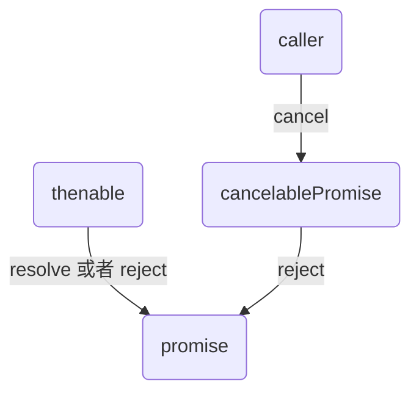
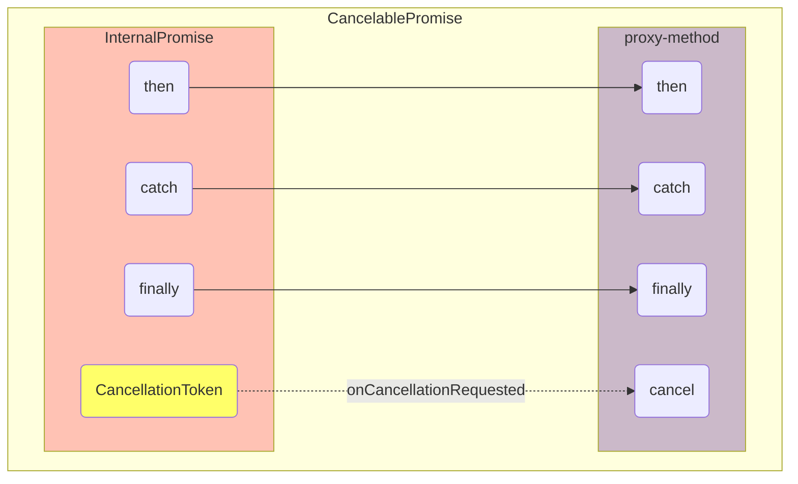

# 一种可取消的Promise：CancelablePromise

<details>
  <summary>前置知识</summary>

- [Cancellation机制](/technology/common/js/cancellation-token-source)
</details>

## 背景

传统的`Promise`是没有中断机制的，一旦执行无论如何都会执行到底。但是实际的应用场景当中，有可能希望创建一个可中断的`Promise`，尽早中断相关的异步操作，避免继续浪费资源和时间。

## 实现

可取消`Promise`是基于[Cancellation机制](/technology/common/js/cancellation-token-source)配合原生`Promise`进行实现的，它其实是[Cancellation机制](/technology/common/js/cancellation-token-source)的一个实际应用封装。实际上通过`createCancelablePromise()`调用后获取到的`CancelablePromise`拥有原生`Promise`常用的`then`、`catch`、`finally`三个方法，而内部的实现无非就是这三个方法原路转发给原生`Promise`而已。而多出来的`cancel`方法就是新增的取消操作，核心逻辑还是[Cancellation机制](/technology/common/js/cancellation-token-source)的取消操作，即使用`cancellationTokenSource.cancel`方法发起取消请求。

```ts
interface CancelablePromise<T> extends Promise<T> {
	cancel(): void;
}

function createCancelablePromise<T>(callback: (token: CancellationToken) => Promise<T>): CancelablePromise<T> {
	const source = new CancellationTokenSource();

	const thenable = callback(source.token);

	let isCancelled = false;

	const promise = new Promise<T>((resolve, reject) => {
      // 如果这个新创建的promise被取消了，那么该promise的处理结果会被丢弃，不会返回任何结果，而是得到一个`CancellationError`
		const subscription = source.token.onCancellationRequested(() => {
			isCancelled = true;
			subscription.dispose();
			reject(new CancellationError());
		});
     // 否则将根据thenable的执行情况执行promise的`then`或者`catch`。
     // 这里使用Promise.resolve(thenable)是为了无论 callback 返回的是 Promise 还是自定义 thenable，先包装成原生 Promise
		Promise.resolve(thenable).then(value => {
			subscription.dispose();
			source.dispose();

			if (!isCancelled) {
				resolve(value);

			} else if (isDisposable(value)) {
				value.dispose();
			}
		}, err => {
			subscription.dispose();
			source.dispose();
			reject(err);
		});
	});

	return <CancelablePromise<T>>new class {
		cancel() {
			source.cancel();
			source.dispose();
		}
    
		then<TResult1 = T, TResult2 = never>(resolve?: ((value: T) => TResult1 | Promise<TResult1>) | undefined | null, reject?: ((reason: unknown) => TResult2 | Promise<TResult2>) | undefined | null): Promise<TResult1 | TResult2> {
			return promise.then(resolve, reject);
		}
    
		catch<TResult = never>(reject?: ((reason: unknown) => TResult | Promise<TResult>) | undefined | null): Promise<T | TResult> {
			return this.then(undefined, reject);
		}
    
		finally(onfinally?: (() => void) | undefined | null): Promise<T> {
			return promise.finally(onfinally);
		}
	};
}
```
重点理解的关键是外部通过`cancelablePromise.cancel`到`cancellationTokenSource.cancel`到`cancellationToken.onCancellationRequested`再到`reject(new CancellationError())`这条交互线控制的是代码中创建的`promise`对象状态的转变，而不是代码中`thenable`对象状态的转变。

对于外部调用方来说拿到的就是`CancelablePromise`对象，如果`cancel`发起，那么外部不会获得任何返回结果，而是得到一个`CancellationError`。这是因为`CancelablePromise`对象实际上只是内部创建的`promise`对象的一个代理包装而已，它的状态及结果全都由内部创建的`promise`对象的执行行为来决定。

那你可能会有疑问：`cancelablePromise.cancel`只是控制的内部创建的`promise`对象的状态更改，那么`thenable`对象的状态更改呢？按照当前说法不是脱裤子放屁吗？其实不然，仔细看我们在`callback(source.token)`时传入了`source.token`，这个异步任务的执行框架接收了`CancellationToken`，它能够在内部通过`token.onCancellationRequested`监听取消请求或者`token.isCancellationRequested`判断是否已经取消，从而决定是否继续执行相关异步任务。



我们进一步通过下图理解对应关系，调用方拿到的`CancelablePromise`实际上是通过`createCancelablePromise`工厂内部创建的`promise`的一个代理包装而已。




`CancelablePromise`的状态由内部这个`promise`的状态来决定。内部创建出来的`promise`通过两个行为途径来决定自身的状态改变：

- `token.onCancellationRequested`：它在取消请求到来时最终将该`promise`转换到`rejected`状态。
- `const thenable = callback(source.token)`：它自身状态确立后进一步决定将该`promise`转换到`resolved`状态或者是`rejected`状态，具体的状态确立由它自身执行的结果来决定。

调用方可以使用`cancelablePromise.cancel`发起取消请求到内部创建的`promise`，内部`promise`在创建之初就通过构造函数接收的`executor`里头通过`token.onCancellationRequested`监听外部调用方发来的取消请求，从而进一步将内部的`promise`状态转为`rejected`，从而将外部使用的这个`cancelablePromise`转为`rejected`状态。

## 总结

通过[Cancellation机制](/technology/common/js/cancellation-token-source)配合`Promise`，我们就能够封装出`CancelablePromise`，核心思路就是在`Promise`中接收取消请求并进行处理，而处理的核心逻辑其实就是使用`reject`确定`Promise`的状态为`rejected`，从而抛出`CancellationError`完成`Promise`的中断。

> [!NOTE]
>
> 思考一个问题：`Promise.resolve(promise)`返回的`Promise`对象的状态到底是由谁控制的？
>
> ```ts
> const thenable = new Promise(() => {});
> const promise = Promise.resolve(thenable);
> ```
>
> 上面代码，当`Promise.resolve(thenable)`时，其中`thenable`是一个`Promise`对象，则`promise`的状态由`thenable`来控制，`thenable`从`pending`转变为`resolved`，则`promise`的状态就从`pending`转变成`resolved`状态，此时如果接着有`promise.then(fn)`，则随后会执行`fn`。这个问题的本质是`Promise.resolve(promise)`返回的就是`promise`本身，状态是共享的。

