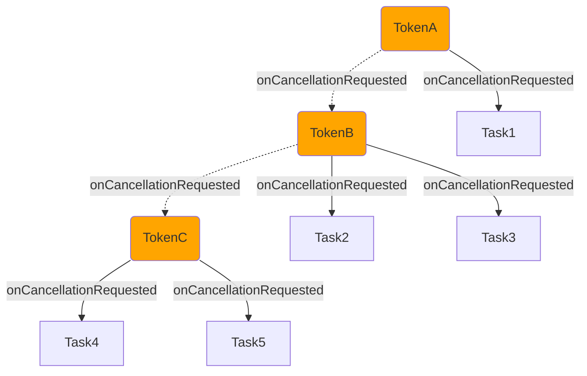

# 一种协作式取消机制：CancellationTokenSource

<details>
  <summary>前置知识</summary>

- Event机制
- Disposable机制
</details>

## 背景

在异步编程中，我们经常需要取消一个异步操作。比如在异步任务执行过程中，我们希望在某个时刻取消任务的执行。但是很多时候任务的执行和取消操作往往是不同的对象来完成的，因此我们需要一种机制来统一协作完成取消操作，而这正是CancellationTokenSource的用武之地，它作为抽象层统一了相关任务取消接口，将异步的取消操作统一，忽视底层具体的取消操作并且跨平台支持的同时提供了更多功能。

## 使用

我们先用一个简单的例子来演示一下CancellationTokenSource的使用。

```ts
const source = new CancellationTokenSource();

function request(request:UserRequest, token: CancallationToken): Promise<SearchResponse> {
  const stream = anthropic.messages.stream(params, { maxRetries: this.maxRetries });

  token.onCancellationRequest(() => {
    stream.abort();
  })
  
  ...
}
  
// 发起请求
request(userRequest, source.token);
  
// 取消请求
source.cancel();
```
上面代码中，我们通过`source.token`获取了一个取消令牌，然后通过`request`函数发起请求，请求过程中通过`token.onCancellationRequest`监听取消请求，当取消请求到来时，通过`stream.abort`取消请求。最后通过`source.cancel`取消请求。任务方`request`只需要等待取消请求到来，并做出相关回应和处理即可，而控制方只需要在合适的取消时机通过`source.cancel`来发起取消请求。两者完全解耦，任务方不需要知道控制方的具体实现，控制方也不需要知道任务方的具体实现，只需要通过`token`和`source`来完成取消操作。


## 实现

### 基本结构

我们需要两个基本结构，分别是`CancellationToken`和`CancellationTokenSource`。其中`CancellationToken`会被设计成为一个只读的取消令牌用于任务的取消监听及状态判断，而`CancellationTokenSource`则被设计成管理这个令牌的控制器用于控制该`token`的状态改变和取消信号的派发等控制操作。

下面给出`CancellationToken`的结构定义：

```ts
interface CancellationToken {
    readonly isCancellationRequested: boolean;  // 状态：是否已取消
    readonly onCancellationRequested: Event<void>;  // 事件：取消时通知
}
```

由于`CancellationToken`被设计成只允许接收一次取消请求，这样一来外部对象需要知道一个`CancellationToken`是否已经接收过取消信号从而针对该信息做出更加准确的判断以执行相关操作，因此`isCancellationRequested`这个属性就是这一状态的描述。

另一方面，一个可供取消的任务有必要知道何时取消相关操作，我们利用“事件驱动”的方式提供了`onCancellationRequested`，任务执行方可以使用`token.onCancellationRequested(fn)`来完成取消信号的接收，从而取消相关任务。

下面给出`CancellationToken`这个结构的具体实现：

```ts
class MutableToken implements CancellationToken {

    private _isCancelled: boolean = false; // 只读属性isCancellationRequested的内部实现
    private _emitter: Emitter<void> | undefined; // 只读事件onCancellationRequested的内部实现

    // 取消操作
    public cancel(): void {
        if (!this._isCancelled) {
            this._isCancelled = true;
            if (this._emitter) {
                this._emitter.fire(undefined);
                this._emitter = undefined;
            }
        }
    }

    // 是否已经接收取消请求
    get isCancellationRequested(): boolean {
        return this._isCancelled;
    }

    // 当取消请求时，触发事件
    get onCancellationRequested(): Event<void> {
        if (this._isCancelled) {
            return shortcutEvent;
        }
        if (!this._emitter) {
            this._emitter = new Emitter<void>();
        }
        return this._emitter.event;
    }

    // 释放emitter资源而已
    public dispose(): void {
        if (this._emitter) {
            this._emitter.dispose();
            this._emitter = undefined;
        }
    }
}
```

实际上如果只看核心逻辑，那么一个`CancellationToken`的实现是十分简单的，就是利用一个`Emitter`创建一个相关事件，并提供该事件的触发操作和监听操作而已，本质上就是“发布-订阅” + “状态机”。其中“发布-订阅”的部分体现在`_emitter`的相关实现上，任务方通过`token.onCancellationRequested(fn)`订阅“取消请求”，等待请求到来时做出相关回应和处理，控制方通过`token.cancel()`来发送“取消请求”，请求相关订阅方对该请求做出回应和处理。而`token.cancel`实际上是由接下来要说的控制方`CancellationTokenSource`来调用的。

下面给出控制方`CancellationTokenSource`的结构实现：

```ts
export class CancellationTokenSource {

    private _token: CancellationToken;  // 只读属性token的内部实现，延迟加载，只有在需要时才创建

    // 任务方可以接收这个token用于监听取消请求
    get token(): CancellationToken {
        if (!this._token) {
            this._token = new MutableToken();
        }
        return this._token;
    }

    // 发起取消请求，内部核心逻辑其实就是调用CancellationToken的cancel方法而已
    cancel(): void {
        if (!this._token) {
            this._token = CancellationToken.Cancelled;
        } else if (this._token !== CancellationToken.Cancelled) {
            (<MutableToken>this._token).cancel();
        }
    }

    dispose(): void {
        this.cancel();
        if (!this._token) {
            this._token = CancellationToken.None;
        } else if (this._token instanceof MutableToken) {
            this._token.dispose();
        }
    }
}
```

`CancellationTokenSource`作为`CancellationToken`的控制方分离了`CancellationToken`的监听取消请求的操作(`token.onCancellationRequested(fn)`)和发起取消请求的操作(`token.cancel`)。这样一来多个可取消操作的任务方就能够通过接收`token`，在任务内部通过`token.onCancellationRequested(fn)`监听取消请求。而业务方能够在合适的时机通过`source.cancel`来发起取消请求，从而让各任务方接收到该请求后做出相关任务中断或者取消的回应和处理。

### 链式取消

如果你希望在一个操作本身能够独立取消的前提下，当一个父操作取消的时候所有子操作都能够取消，这种场景下链式取消将会十分有用。下面我们在`CancellationTokenSource`的基本结构下进行增强，实现链式取消：

```ts
export class CancellationTokenSource {

    private _token: CancellationToken;
    private _parentListener?: Disposable = undefined; // [!code ++]

    constructor(parent?: CancellationToken) { // [!code ++]
        this._parentListener = parent && parent.onCancellationRequested(this.cancel, this);// [!code ++]
    } // [!code ++]

    get token(): CancellationToken {
        if (!this._token) {
            this._token = new MutableToken();
        }
        return this._token;
    }

    cancel(): void {
        if (!this._token) {
            this._token = CancellationToken.Cancelled;
        } else if (this._token !== CancellationToken.Cancelled) {
            (<MutableToken>this._token).cancel();
        }
    }

    dispose(): void {
        this.cancel();
        this._parentListener?.dispose(); // [!code ++]
        if (!this._token) {
            this._token = CancellationToken.None;
        } else if (this._token instanceof MutableToken) {
            this._token.dispose();
        }
    }
}
```
实际上链式取消的实现也十分简单：接收一个父`token`并监听它的取消请求，当请求到来时处理该请求。具体的请求处理操作就是调用当前子`token`的`cancel`发起当前子`token`的取消请求。这个过程，用一张图来说会更加清楚：


如上，`TokenC`接收`TokenB`作为其父`Token`，`TokenB`接收`TokenA`作为其父`Token`。当`TokenA`发起取消请求时，所有监听取消请求的任务都会做出取消回应，于是`TokenB`和`Task1`都做出了取消回应。`TokenB`的取消回应处理就是发起自己的取消请求，于是`TokenC`、`Task2`、`Task3`都对`TokenB`的取消请求做出了取消回应，而`TokenC`的取消回应就是发起自己的取消请求，于是`Task4`和`Task5`都对`TokenC`的取消请求发起了取消回应。在操作上，我们只是对`TokenA`做出了取消请求，但是在过程上就像是这个取消请求在`Token`链条上进行传播一样，将这条`Token`链的所有任务都取消了。

其实说白了链式取消的核心思路就是通过监听其他`token`的`onCancellationRequested`从而将各`token`的单独取消操作组合在了一起。你是谁的子操作，你就将谁的`token`挂在自己`token`之上并等待它的取消请求到来之时发起自己的取消请求，好像接力赛一样，一棒接一棒。从另一个角度来说，链式取消只是将`token`也看作了任务本身而已。
