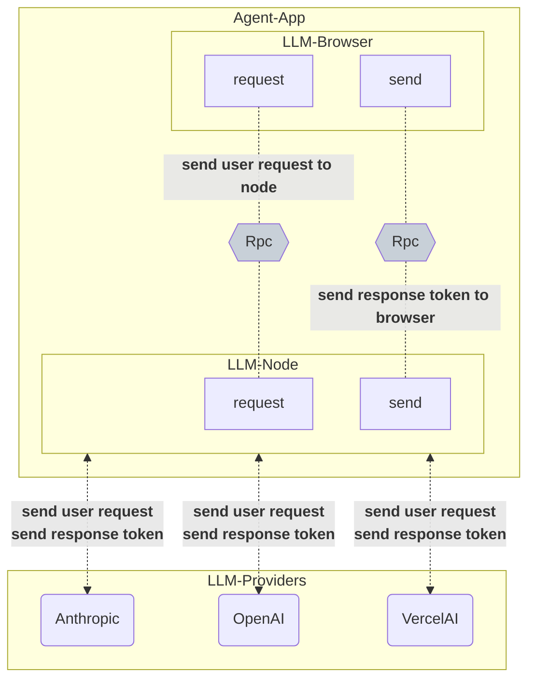

# 一种跨进程异步流推送与消费的实现方案

<details>
  <summary>前置知识</summary>

- RPC机制
</details>

## 背景

在一个AI Chat系统的开发当中，流式响应的实现是一个无法逃避的问题，它能让用户实时看到AI的回答，而不是等AI回答完之后再一次性展示给用户。这一回，我们来探讨一种跨进程（Browser-Node）异步流推送与消费的实现方式。

## 架构

设想下我们要从头设计一个AI Chat系统，要适配多种不同的语言模型供应商，管理多种语言模型。为了安全性，功能实现上真正的`LanguageModel`的管理只能够放在`Node`侧，而`Browser`侧只需要管理这些`LanguageModel`的代理。那么就产生了这样的交互线：

- `Browser`侧通过选择指定的`LanguageModel`代理发起请求，经过`RPC`将请求发送到`Node`侧获取真正的`LanguageModel`进行`LLM`请求处理。
- 在`Node`侧通过`RPC`将响应发送到`Browser`侧并消费该响应。

基本示意图如下：




```mermaid
graph LR
```

