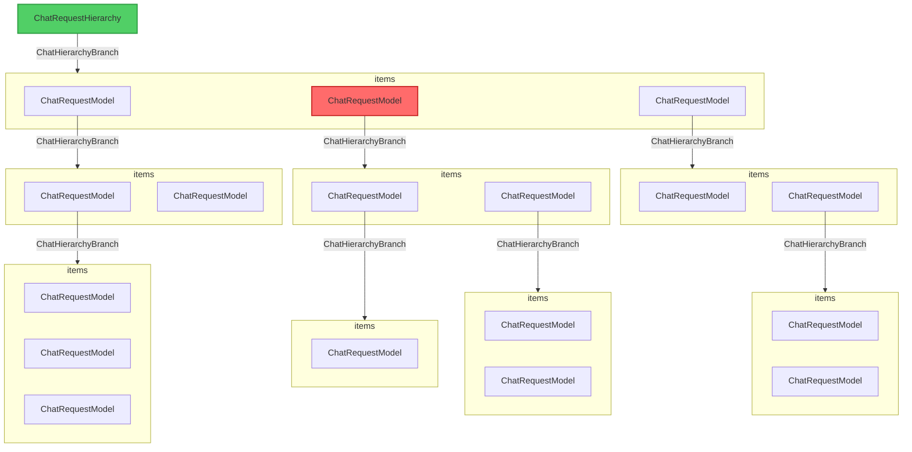
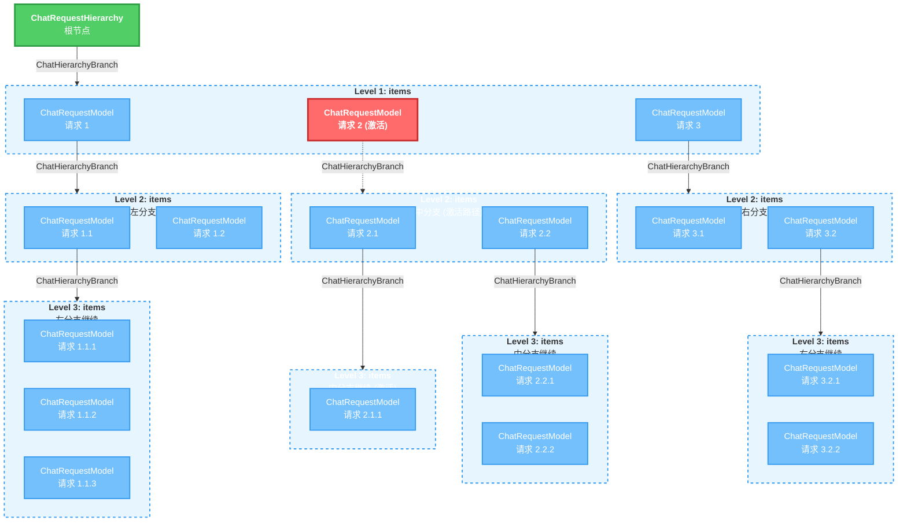

# 设计一个聊天会话的数据模型

```mermaid
flowchart TD
    Root[ChatRequestHierarchy]
    
    Root -->|ChatHierarchyBranch| L1_Container["items"]
    
    subgraph L1_Container["items"]
        direction LR
        L1_Left[ChatRequestModel]
        L1_Middle[ChatRequestModel]
        L1_Right[ChatRequestModel]
    end
    
    L1_Left -->|ChatHierarchyBranch| L2_Left_Container["items"]
    L1_Middle -->|ChatHierarchyBranch| L2_Middle_Container["items"]
    L1_Right -->|ChatHierarchyBranch| L2_Right_Container["items"]
    
    subgraph L2_Left_Container["items"]
        direction LR
        L2_Left_1[ChatRequestModel]
        L2_Left_2[ChatRequestModel]
    end
    
    subgraph L2_Middle_Container["items"]
        direction LR
        L2_Middle_1[ChatRequestModel]
        L2_Middle_2[ChatRequestModel]
    end
    
    subgraph L2_Right_Container["items"]
        direction LR
        L2_Right_1[ChatRequestModel]
        L2_Right_2[ChatRequestModel]
    end
    
    L2_Left_1 -->|ChatHierarchyBranch| L3_Left_1_Container["items"]
    L2_Middle_1 -->|ChatHierarchyBranch| L3_Middle_1_Container["items"]
    L2_Middle_2 -->|ChatHierarchyBranch| L3_Middle_2_Container["items"]
    L2_Right_2 -->|ChatHierarchyBranch| L3_Right_2_Container["items"]
    
    subgraph L3_Left_1_Container["items"]
        direction LR
        L3_Left_1_1[ChatRequestModel]
        L3_Left_1_2[ChatRequestModel]
        L3_Left_1_3[ChatRequestModel]
    end
    
    subgraph L3_Middle_1_Container["items"]
        L3_Middle_1_1[ChatRequestModel]
    end
    
    subgraph L3_Middle_2_Container["items"]
        direction LR
        L3_Middle_2_1[ChatRequestModel]
        L3_Middle_2_2[ChatRequestModel]
    end
    
    subgraph L3_Right_2_Container["items"]
        direction LR
        L3_Right_2_1[ChatRequestModel]
        L3_Right_2_2[ChatRequestModel]
    end
    
    style L1_Middle fill:#ff6b6b,stroke:#c92a2a,stroke-width:2px
    style Root fill:#51cf66,stroke:#2f9e44,stroke-width:2px
```

```mermaid
flowchart TD
    Root["`**ChatRequestHierarchy**<br/>根节点`"]
    
    Root -->|ChatHierarchyBranch| L1_Container
    
    subgraph L1_Container["`**Level 1: items**<br/>第一层分支容器`"]
        direction LR
        L1_Left["`ChatRequestModel<br/>请求 1`"]
        L1_Middle["`**ChatRequestModel**<br/>**请求 2 (激活)**`"]
        L1_Right["`ChatRequestModel<br/>请求 3`"]
    end
    
    L1_Left -->|ChatHierarchyBranch| L2_Left_Container
    L1_Middle -.->|ChatHierarchyBranch| L2_Middle_Container
    L1_Right -->|ChatHierarchyBranch| L2_Right_Container
    
    subgraph L2_Left_Container["`**Level 2: items**<br/>左分支`"]
        direction LR
        L2_Left_1["`ChatRequestModel<br/>请求 1.1`"]
        L2_Left_2["`ChatRequestModel<br/>请求 1.2`"]
    end
    
    subgraph L2_Middle_Container["`**Level 2: items**<br/>中分支 (激活路径)`"]
        direction LR
        L2_Middle_1["`ChatRequestModel<br/>请求 2.1`"]
        L2_Middle_2["`ChatRequestModel<br/>请求 2.2`"]
    end
    
    subgraph L2_Right_Container["`**Level 2: items**<br/>右分支`"]
        direction LR
        L2_Right_1["`ChatRequestModel<br/>请求 3.1`"]
        L2_Right_2["`ChatRequestModel<br/>请求 3.2`"]
    end
    
    L2_Left_1 -->|ChatHierarchyBranch| L3_Left_1_Container
    L2_Middle_1 -->|ChatHierarchyBranch| L3_Middle_1_Container
    L2_Middle_2 -->|ChatHierarchyBranch| L3_Middle_2_Container
    L2_Right_2 -->|ChatHierarchyBranch| L3_Right_2_Container
    
    subgraph L3_Left_1_Container["`**Level 3: items**<br/>左分支继续`"]
        direction LR
        L3_Left_1_1["`ChatRequestModel<br/>请求 1.1.1`"]
        L3_Left_1_2["`ChatRequestModel<br/>请求 1.1.2`"]
        L3_Left_1_3["`ChatRequestModel<br/>请求 1.1.3`"]
    end
    
    subgraph L3_Middle_1_Container["`**Level 3: items**<br/>中分支继续 (激活)`"]
        L3_Middle_1_1["`ChatRequestModel<br/>请求 2.1.1`"]
    end
    
    subgraph L3_Middle_2_Container["`**Level 3: items**<br/>中分支继续`"]
        direction LR
        L3_Middle_2_1["`ChatRequestModel<br/>请求 2.2.1`"]
        L3_Middle_2_2["`ChatRequestModel<br/>请求 2.2.2`"]
    end
    
    subgraph L3_Right_2_Container["`**Level 3: items**<br/>右分支继续`"]
        direction LR
        L3_Right_2_1["`ChatRequestModel<br/>请求 3.2.1`"]
        L3_Right_2_2["`ChatRequestModel<br/>请求 3.2.2`"]
    end
    
    %% 样式定义
    classDef rootNode fill:#51cf66,stroke:#2f9e44,stroke-width:3px,color:#fff
    classDef activeNode fill:#ff6b6b,stroke:#c92a2a,stroke-width:3px,color:#fff
    classDef normalNode fill:#74c0fc,stroke:#339af0,stroke-width:2px,color:#fff
    classDef containerStyle fill:#e7f5ff,stroke:#339af0,stroke-width:2px,stroke-dasharray: 5 5
    classDef activePath stroke:#ff6b6b,stroke-width:3px
    
    class Root rootNode
    class L1_Middle,L2_Middle_Container,L3_Middle_1_Container activeNode
    class L1_Left,L1_Right,L2_Left_1,L2_Left_2,L2_Middle_1,L2_Middle_2,L2_Right_1,L2_Right_2,L3_Left_1_1,L3_Left_1_2,L3_Left_1_3,L3_Middle_1_1,L3_Middle_2_1,L3_Middle_2_2,L3_Right_2_1,L3_Right_2_2 normalNode
    class L1_Container,L2_Left_Container,L2_Middle_Container,L2_Right_Container,L3_Left_1_Container,L3_Middle_1_Container,L3_Middle_2_Container,L3_Right_2_Container containerStyle
```