# 检测和处理Prompt模板引擎中变量的循环依赖

## 背景

为了解决Prompt内容过长与相关提示词实时更新等问题，综合考虑方案下我们决定设计一个Prompt模板引擎。在模板中我们通过引用变量的方式来代表一些需要动态更新的内容。由于模板的设计是开放灵活的，因此我们有可能在不经意间就写出下面这样一些变量循环依赖的模板：
```shell
# foo.prompttemplate

This is prompt foo.
It wants to include prompt bar below:

{{prompt:bar}}
```

```shell
# bar.prompttemplate

This is prompt bar.
It wants to include prompt foo below:

{{prompt:foo}}
```

以上两个模板，`foo`依赖了`bar`，`bar`又依赖了`foo`造成了循环依赖问题。

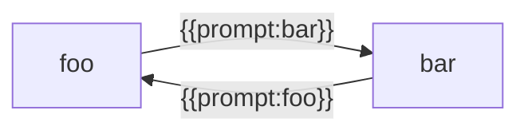

由于在编译期间我们是无法提前得知依赖关系的，因此我们有必要在运行时对这种情况进行检测处理，避免模板解析出错。

## 有向图的环检测

### 场景

假如你跟一群朋友在荒山野岭中迷路了，急需找到出路。不过还好你们有一张地图，上面标注了所有路口和路的关系。你发现了这是一个岔路口，有很多条路可以走，但有些路可能存在环（无论你沿着这条路怎么走，最终都会走回原来路上经过的某个位置 ，永远无法逃出去）。为了减少资源消耗，作为领队的你必须先去探路，快速找到哪些路是"死循环"，哪些路是“生路”，找到后回来带着大家一起逃出去。

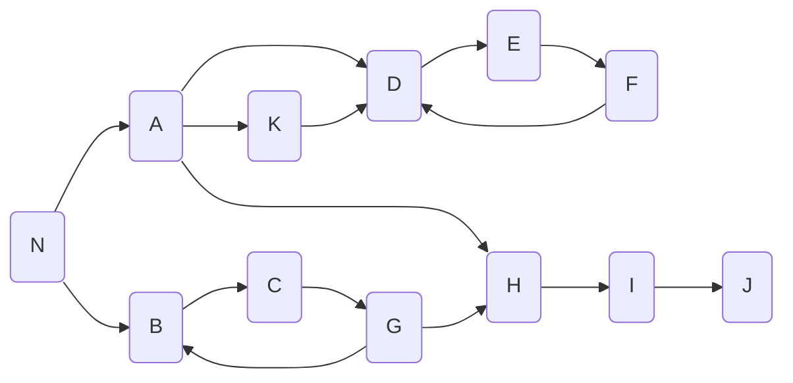

### 方案

作为领队的你很快想到了一种探路方案：你准备了一个记录本，分别叫"路径记录本"，用来记录探索的当前路径和已探索的路径（可能是环路，可能是逃生路）。每当到达一个路口时，你都会先到路口看下有没有在该路口做过标记（一个路口只可能有三种状态：没标记、"刚走过"、"已探索"），并在"路口记录本"上记录下相关情况。

> [!NOTE]
> 为了更直观地展示探索过程，我们在图中使用颜色来表示节点的状态：
> - **灰色**：刚走过（正在探索路径上的节点）
> - **深灰色**：已探索（已完成探索的节点）
> - **白色**：未探索（尚未访问的节点）

现在你从路口`N`出发，发现路口`N`没有被标记过，处于"未标记"状态，于是你对路口`N`进行了标记，将其标记为"刚走过"，并在"路径记录本"上的当前路径一栏将其加入：`[N]`。

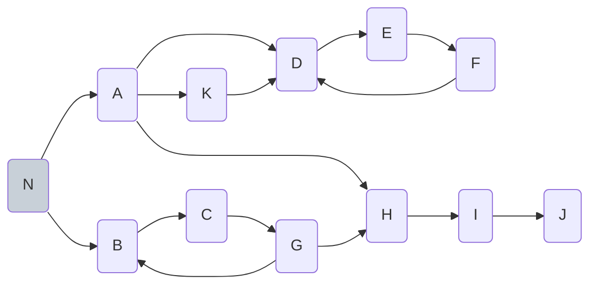

接下来你发现有两个岔路口`A`和`B`。既然是探路，我们就一个个看，从`A`探起。

现在你来到了路口`A`，发现路口`A`没有被标记过，处于"未标记"状态，于是你对路口`A`进行了标记，将其标记为"刚走过"，并在"路径记录本"上的当前路径一栏将其加入：`[N, A]`。

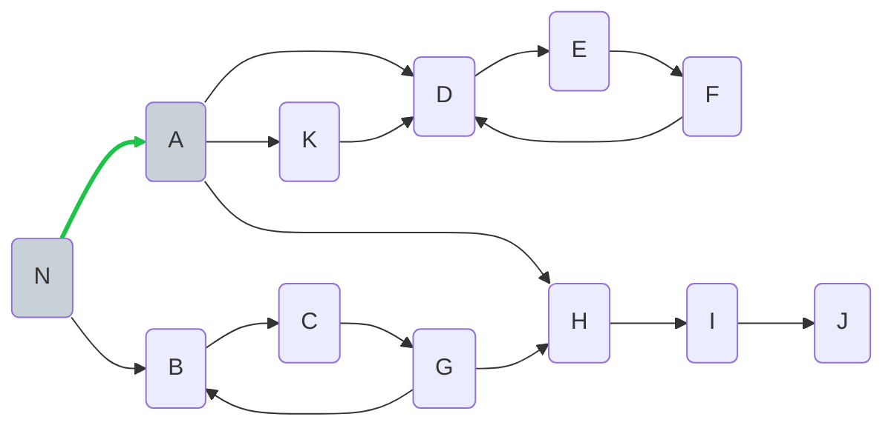

接下来，你继续走，发现有三个岔路口，分别是`D`、`K`、`H`。同样地，一个个探，从`D`探起。

现在你来到了路口`D`，发现路口`D`没有被标记过，处于"未标记"状态，于是你对路口`D`进行了标记，将其标记为"刚走过"，并在"路径记录本"上的当前路径一栏将其加入：`[N, A, D]`。

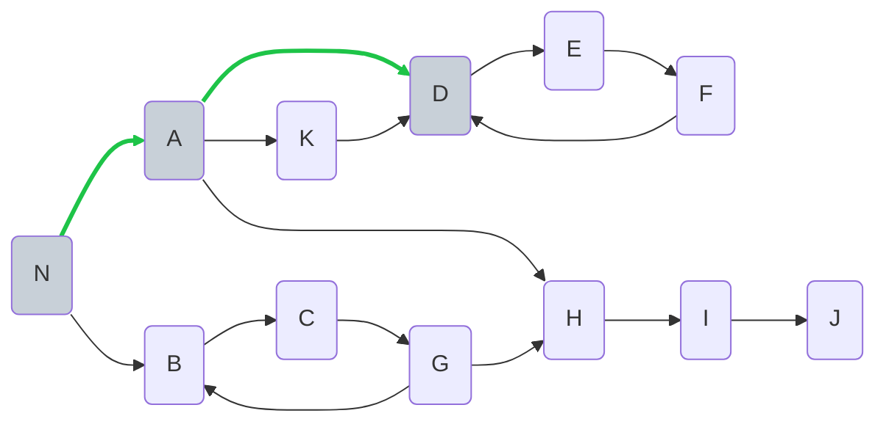

接下来，你继续走，发现只有一个岔路口，是`E`。从`E`探起。

现在你来到了路口`E`，发现路口`E`没有被标记过，处于"未标记"状态，于是你对路口`E`进行了标记，将其标记为"刚走过"，并在"路径记录本"上的当前路径一栏将其加入：`[N, A, D, E]`。

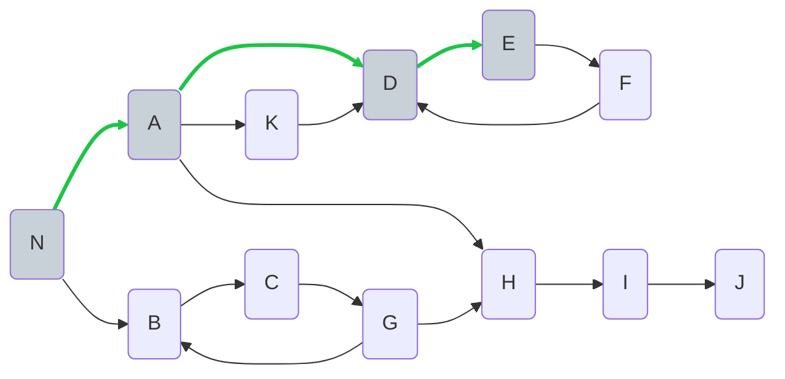

接下来，你继续走，发现只有一个岔路口，是`F`。从`F`探起。

现在你来到了路口`F`，发现路口`F`没有被标记过，处于"未标记"状态，于是你对路口`F`进行了标记，将其标记为"刚走过"，并在"路径记录本"上的当前路径一栏将其加入：`[N, A, D, E, F]`。

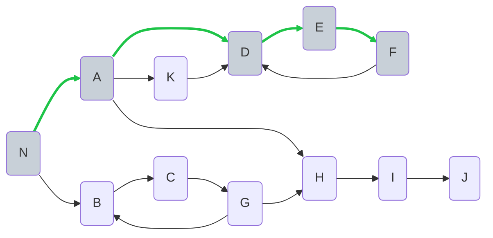

接下来，你继续走，发现只有一个岔路口，是`D`。从`D`探起。

现在你来到了路口`D`，老远就发现路口`D`已经被标记过，处于"刚走过"状态，于是你意识到自己在绕圈子了，便在"路径记录本"上的当前路径一栏将其加入：`[N, A, D, E, F, D]`，并写上"环路"：`[N, A, D, E, F, D]`，再将"当前路径"中的`D`擦掉变成`[N, A, D, E, F]`,接着往回走。

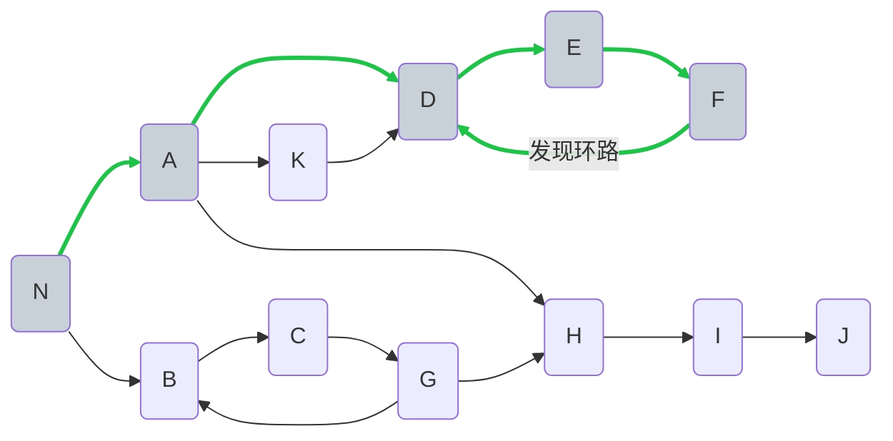
于是你回到了路口`F`，发现没有新的岔路口不需要从`F`出发探索新的路口了，于是给`F`路口标记上"已探索"。再将"当前路径"中的`F`擦掉变成`[N, A, D, E]`，接着往回走。

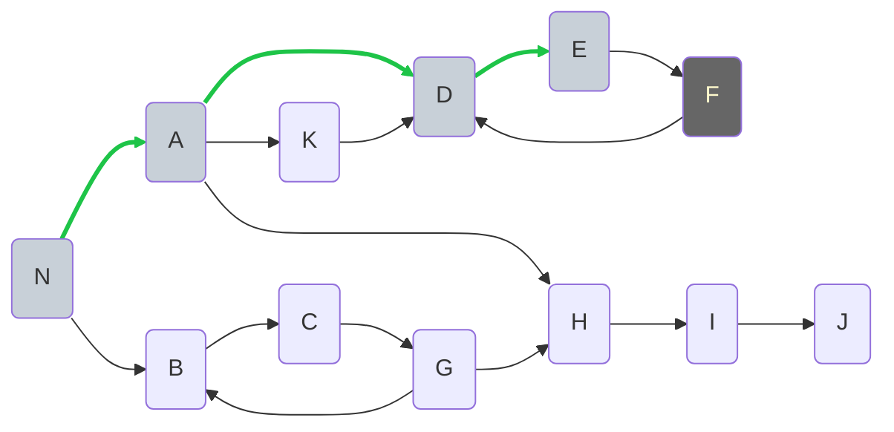

于是你回到了路口`E`，发现没有新的岔路口不需要从`E`出发探索新的路口了，于是给`E`路口标记上"已探索"。再将"当前路径"中的`E`擦掉变成`[N, A, D]`，接着往回走。

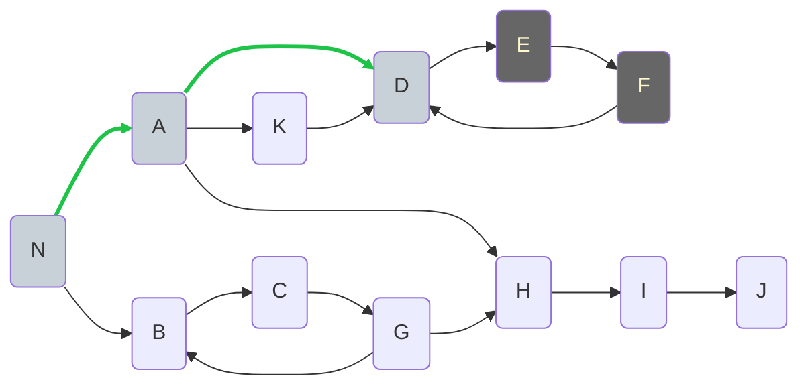

于是你回到了路口`D`，发现没有新的岔路口不需要从`D`出发探索新的路口了，于是给`D`路口标记上"已探索"。再将"当前路径"中的`D`擦掉变成`[N, A]`，接着往回走。

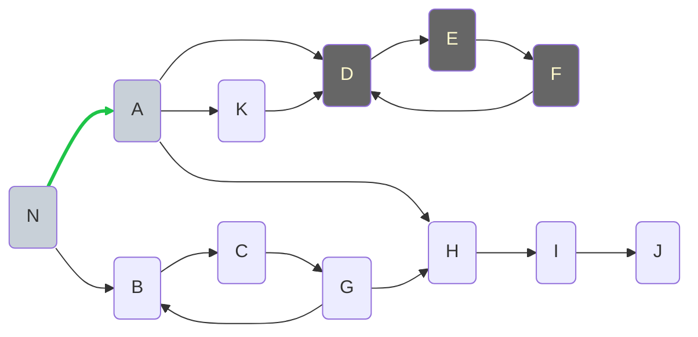

于是你回到了路口`A`，此时你发现从路口`A`出发还有两个路口`K`和`H`没探索过。于是，你从`K`探起。

现在你来到了路口`K`，发现路口`K`没有被标记过，处于"未标记"状态，于是你对路口`K`进行了标记，将其标记为"刚走过"，并在"路径记录本"上的当前路径一栏将其加入：`[N, A, K]`。

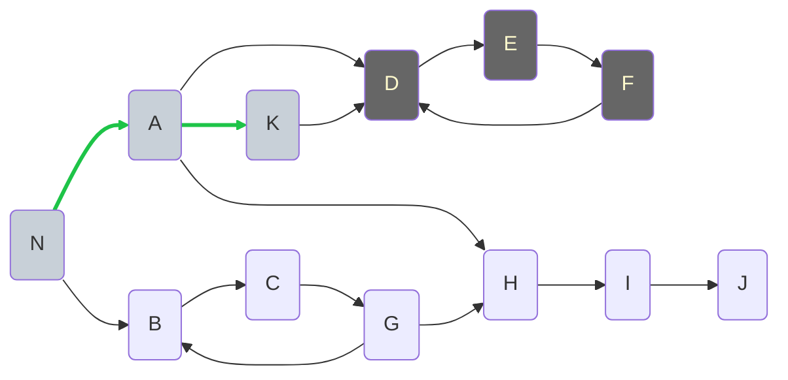

接下来，你继续走，发现只有一个岔路口，是`D`。从`D`探起。

现在你来到了路口`D`，老远就发现路口`D`已经被标记过，处于"已探索"状态，于是你意识到从`D`开始的所有可能的路你都探索过了，只需要从本子上找所有从`D`开始的路径片段，将其拼接起来。最终你记录下了"当前路径"：`[N, A, K, D, E, F, D]`，然后记录上"环路"：`[N, A, K, D, E, F, D]`，完毕后，你擦除`K`往后的部分，回到"当前路径"：`[N, A, K]`。然后你接着往回走。

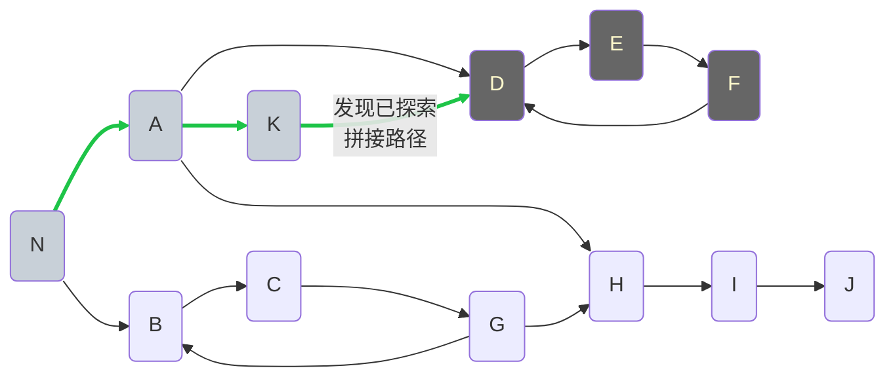

于是你回到了路口`K`，发现没有新的岔路口不需要从`K`出发探索新的路口了，于是给`K`路口标记上"已探索"。再将"当前路径"中的`K`擦掉变成`[N, A]`，接着往回走。

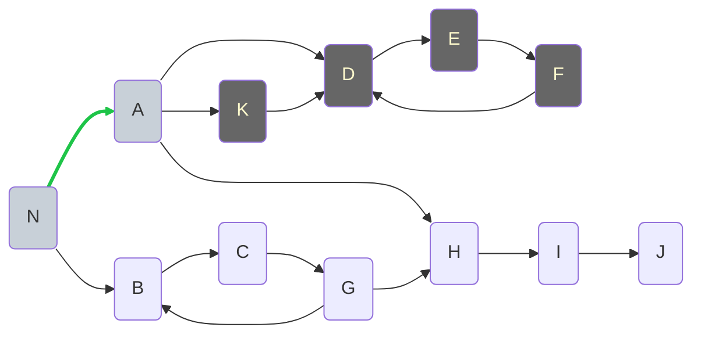

于是你回到了路口`A`，此时你发现从路口`A`出发还有一个路口`H`没探索过。于是，你从`H`探起。

现在你来到了路口`H`，发现路口`H`没有被标记过，处于"未标记"状态，于是你对路口`H`进行了标记，将其标记为"刚走过"，并在"路径记录本"上的当前路径一栏将其加入：`[N, A, H]`。

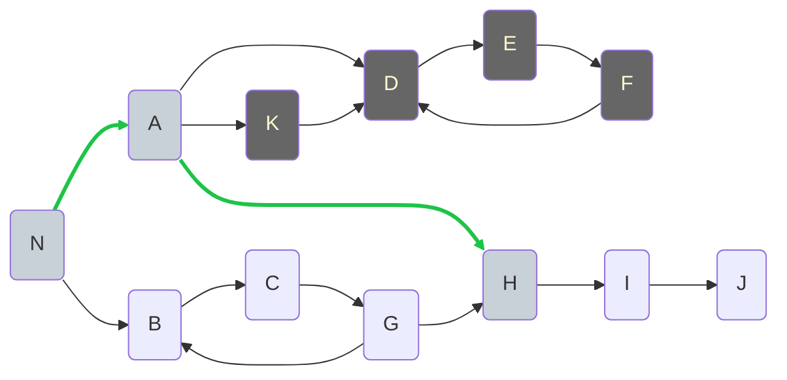

接下来，你继续走，发现只有一个岔路口，是`I`。从`I`探起。

现在你来到了路口`I`，发现路口`I`没有被标记过，处于"未标记"状态，于是你对路口`I`进行了标记，将其标记为"刚走过"，并在"路径记录本"上的当前路径一栏将其加入：`[N, A, H, I]`。

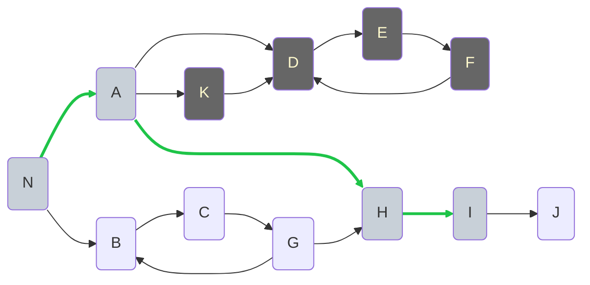

接下来，你继续走，发现只有一个岔路口，是`J`。从`J`探起。

现在你来到了路口`J`，发现路口`J`没有被标记过，处于"未标记"状态，于是你对路口`J`进行了标记，将其标记为"刚走过"，并在"路径记录本"上的当前路径一栏将其加入：`[N, A, H, I, J]`。

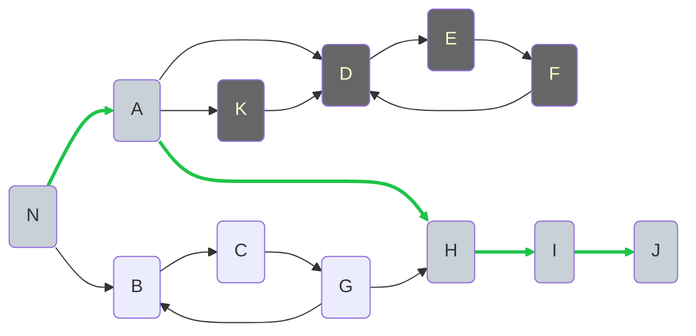

接下来，你继续走，发现没有岔路口了，这意味着你找到了一条逃生路！于是你在"路径记录本"上记录下"逃生路"：`[N, A, H, I, J]`，然后给`J`路口标记上"已探索"。再将"当前路径"中的`J`擦掉变成`[N, A, H, I]`，接着往回走。

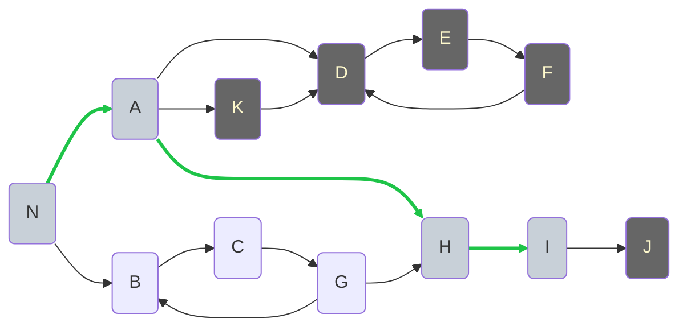

于是你回到了路口`I`，发现没有新的岔路口不需要从`I`出发探索新的路口了，于是给`I`路口标记上"已探索"。再将"当前路径"中的`I`擦掉变成`[N, A, H]`，接着往回走。

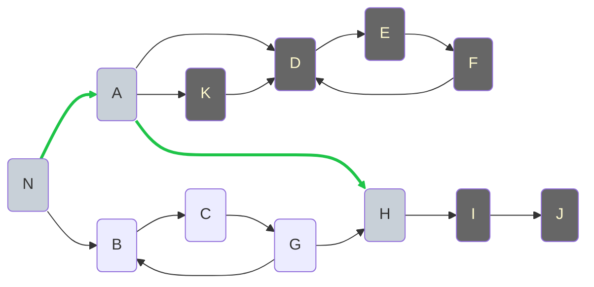

于是你回到了路口`H`，发现没有新的岔路口不需要从`H`出发探索新的路口了，于是给`H`路口标记上"已探索"。再将"当前路径"中的`H`擦掉变成`[N, A]`，接着往回走。

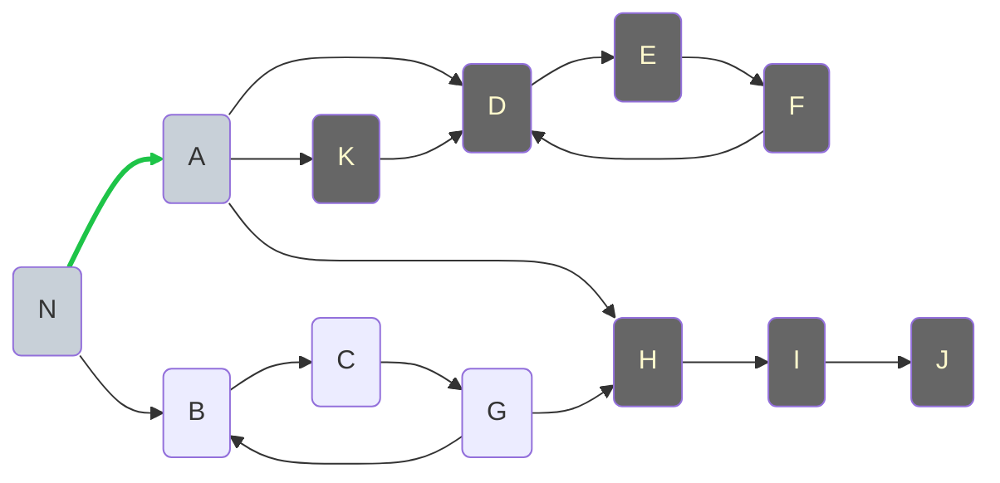

于是你回到了路口`A`，发现没有新的岔路口不需要从`A`出发探索新的路口了，于是给`A`路口标记上"已探索"。再将"当前路径"中的`A`擦掉变成`[N]`，接着往回走。

```mermaid
graph LR
    N(N)
    A(A)
    B(B)
    D(D)
    C(C)
    E(E)
    F(F)
    G(G)
    H(H)
    I(I)
    J(J)
    K(K)
    
    N --> A
    N --> B
    A --> D
    A --> H
    A --> K
    K --> D
    D --> E
    E --> F
    F --> D
    B --> C
    H --> I
    I --> J
    C --> G
    G --> B
    G --> H
    
    style N fill:#c8d0d8
    style A fill:#666666
    style A color:#fffacd
    style D fill:#666666
    style D color:#fffacd
    style E fill:#666666
    style E color:#fffacd
    style F fill:#666666
    style F color:#fffacd
    style H fill:#666666
    style H color:#fffacd
    style I fill:#666666
    style I color:#fffacd
    style J fill:#666666
    style J color:#fffacd
    style K fill:#666666
    style K color:#fffacd
    
    linkStyle 0 stroke:#1ec448,stroke-width:3px
```

于是你回到了路口`N`，此时你发现从路口`N`出发还有一个路口`B`没探索过。于是，你从`B`探起。

现在你来到了路口`B`，发现路口`B`没有被标记过，处于"未标记"状态，于是你对路口`B`进行了标记，将其标记为"刚走过"，并在"路径记录本"上的当前路径一栏将其加入：`[N, B]`。

```mermaid
graph LR
    N(N)
    A(A)
    B(B)
    D(D)
    C(C)
    E(E)
    F(F)
    G(G)
    H(H)
    I(I)
    J(J)
    K(K)
    
    N --> A
    N --> B
    A --> D
    A --> H
    A --> K
    K --> D
    D --> E
    E --> F
    F --> D
    B --> C
    H --> I
    I --> J
    C --> G
    G --> B
    G --> H
    
    style N fill:#c8d0d8
    style B fill:#c8d0d8
    style A fill:#666666
    style A color:#fffacd
    style D fill:#666666
    style D color:#fffacd
    style E fill:#666666
    style E color:#fffacd
    style F fill:#666666
    style F color:#fffacd
    style H fill:#666666
    style H color:#fffacd
    style I fill:#666666
    style I color:#fffacd
    style J fill:#666666
    style J color:#fffacd
    style K fill:#666666
    style K color:#fffacd
    
    linkStyle 1 stroke:#1ec448,stroke-width:3px
```

接下来，你继续走，发现只有一个岔路口，是`C`。从`C`探起。

现在你来到了路口`C`，发现路口`C`没有被标记过，处于"未标记"状态，于是你对路口`C`进行了标记，将其标记为"刚走过"，并在"路径记录本"上的当前路径一栏将其加入：`[N, B, C]`。

```mermaid
graph LR
    N(N)
    A(A)
    B(B)
    D(D)
    C(C)
    E(E)
    F(F)
    G(G)
    H(H)
    I(I)
    J(J)
    K(K)
    
    N --> A
    N --> B
    A --> D
    A --> H
    A --> K
    K --> D
    D --> E
    E --> F
    F --> D
    B --> C
    H --> I
    I --> J
    C --> G
    G --> B
    G --> H
    
    style N fill:#c8d0d8
    style B fill:#c8d0d8
    style C fill:#c8d0d8
    style A fill:#666666
    style A color:#fffacd
    style D fill:#666666
    style D color:#fffacd
    style E fill:#666666
    style E color:#fffacd
    style F fill:#666666
    style F color:#fffacd
    style H fill:#666666
    style H color:#fffacd
    style I fill:#666666
    style I color:#fffacd
    style J fill:#666666
    style J color:#fffacd
    style K fill:#666666
    style K color:#fffacd
    
    linkStyle 1 stroke:#1ec448,stroke-width:3px
    linkStyle 9 stroke:#1ec448,stroke-width:3px
```

接下来，你继续走，发现只有一个岔路口，是`G`。从`G`探起。

现在你来到了路口`G`，发现路口`G`没有被标记过，处于"未标记"状态，于是你对路口`G`进行了标记，将其标记为"刚走过"，并在"路径记录本"上的当前路径一栏将其加入：`[N, B, C, G]`。

```mermaid
graph LR
    N(N)
    A(A)
    B(B)
    D(D)
    C(C)
    E(E)
    F(F)
    G(G)
    H(H)
    I(I)
    J(J)
    K(K)
    
    N --> A
    N --> B
    A --> D
    A --> H
    A --> K
    K --> D
    D --> E
    E --> F
    F --> D
    B --> C
    H --> I
    I --> J
    C --> G
    G --> B
    G --> H
    
    style N fill:#c8d0d8
    style B fill:#c8d0d8
    style C fill:#c8d0d8
    style G fill:#c8d0d8
    style A fill:#666666
    style A color:#fffacd
    style D fill:#666666
    style D color:#fffacd
    style E fill:#666666
    style E color:#fffacd
    style F fill:#666666
    style F color:#fffacd
    style H fill:#666666
    style H color:#fffacd
    style I fill:#666666
    style I color:#fffacd
    style J fill:#666666
    style J color:#fffacd
    style K fill:#666666
    style K color:#fffacd
    
    linkStyle 1 stroke:#1ec448,stroke-width:3px
    linkStyle 9 stroke:#1ec448,stroke-width:3px
    linkStyle 12 stroke:#1ec448,stroke-width:3px
```

接下来，你继续走，发现有两个岔路口，分别是`B`和`H`。一个个探，从`B`探起。

现在你来到了路口`B`，老远就发现路口`B`已经被标记过，处于"刚走过"状态，于是你意识到自己在绕圈子了，便在"路径记录本"上的当前路径一栏将其加入：`[N, B, C, G, B]`，并写上"环路"：`[N, B, C, G, B]`，再将"当前路径"中的`B`擦掉变成`[N, B, C, G]`，接着往回走。

```mermaid
graph LR
    N(N)
    A(A)
    B(B)
    D(D)
    C(C)
    E(E)
    F(F)
    G(G)
    H(H)
    I(I)
    J(J)
    K(K)
    
    N --> A
    N --> B
    A --> D
    A --> H
    A --> K
    K --> D
    D --> E
    E --> F
    F --> D
    B --> C
    H --> I
    I --> J
    C --> G
    G -->|发现环路| B
    G --> H
    
    style N fill:#c8d0d8
    style B fill:#c8d0d8
    style C fill:#c8d0d8
    style G fill:#c8d0d8
    style A fill:#666666
    style A color:#fffacd
    style D fill:#666666
    style D color:#fffacd
    style E fill:#666666
    style E color:#fffacd
    style F fill:#666666
    style F color:#fffacd
    style H fill:#666666
    style H color:#fffacd
    style I fill:#666666
    style I color:#fffacd
    style J fill:#666666
    style J color:#fffacd
    style K fill:#666666
    style K color:#fffacd
    
    linkStyle 1 stroke:#1ec448,stroke-width:3px
    linkStyle 9 stroke:#1ec448,stroke-width:3px
    linkStyle 12 stroke:#1ec448,stroke-width:3px
    linkStyle 13 stroke:#1ec448,stroke-width:3px
```

于是你回到了路口`G`，此时你发现从路口`G`出发还有一个路口`H`没探索过。于是，你从`H`探起。

现在你来到了路口`H`，老远就发现路口`H`已经被标记过，处于"已探索"状态，于是你意识到从`H`开始的所有可能的路你都探索过了，只需要从本子上找所有从`H`开始的路径片段，将其拼接起来。最终你记录下了"当前路径"：`[N, B, C, G, H, I, J]`，然后记录上"逃生路"：`[N, B, C, G, H, I, J]`，完毕后，你擦除`H`往后的部分，回到"当前路径"：`[N, B, C, G]`。然后你接着往回走。

```mermaid
graph LR
    N(N)
    A(A)
    B(B)
    D(D)
    C(C)
    E(E)
    F(F)
    G(G)
    H(H)
    I(I)
    J(J)
    K(K)
    
    N --> A
    N --> B
    A --> D
    A --> H
    A --> K
    K --> D
    D --> E
    E --> F
    F --> D
    B --> C
    H --> I
    I --> J
    C --> G
    G --> B
    G -->|发现已探索<br/>拼接路径| H
    
    style N fill:#c8d0d8
    style B fill:#c8d0d8
    style C fill:#c8d0d8
    style G fill:#c8d0d8
    style A fill:#666666
    style A color:#fffacd
    style D fill:#666666
    style D color:#fffacd
    style E fill:#666666
    style E color:#fffacd
    style F fill:#666666
    style F color:#fffacd
    style H fill:#666666
    style H color:#fffacd
    style I fill:#666666
    style I color:#fffacd
    style J fill:#666666
    style J color:#fffacd
    style K fill:#666666
    style K color:#fffacd
    
    linkStyle 1 stroke:#1ec448,stroke-width:3px
    linkStyle 9 stroke:#1ec448,stroke-width:3px
    linkStyle 12 stroke:#1ec448,stroke-width:3px
    linkStyle 14 stroke:#1ec448,stroke-width:3px
```

于是你回到了路口`G`，发现没有新的岔路口不需要从`G`出发探索新的路口了，于是给`G`路口标记上"已探索"。再将"当前路径"中的`G`擦掉变成`[N, B, C]`，接着往回走。

```mermaid
graph LR
    N(N)
    A(A)
    B(B)
    D(D)
    C(C)
    E(E)
    F(F)
    G(G)
    H(H)
    I(I)
    J(J)
    K(K)
    
    N --> A
    N --> B
    A --> D
    A --> H
    A --> K
    K --> D
    D --> E
    E --> F
    F --> D
    B --> C
    H --> I
    I --> J
    C --> G
    G --> B
    G --> H
    
    style N fill:#c8d0d8
    style B fill:#c8d0d8
    style C fill:#c8d0d8
    style G fill:#666666
    style G color:#fffacd
    style A fill:#666666
    style A color:#fffacd
    style D fill:#666666
    style D color:#fffacd
    style E fill:#666666
    style E color:#fffacd
    style F fill:#666666
    style F color:#fffacd
    style H fill:#666666
    style H color:#fffacd
    style I fill:#666666
    style I color:#fffacd
    style J fill:#666666
    style J color:#fffacd
    style K fill:#666666
    style K color:#fffacd
    
    linkStyle 1 stroke:#1ec448,stroke-width:3px
    linkStyle 9 stroke:#1ec448,stroke-width:3px
```

于是你回到了路口`C`，发现没有新的岔路口不需要从`C`出发探索新的路口了，于是给`C`路口标记上"已探索"。再将"当前路径"中的`C`擦掉变成`[N, B]`，接着往回走。

```mermaid
graph LR
    N(N)
    A(A)
    B(B)
    D(D)
    C(C)
    E(E)
    F(F)
    G(G)
    H(H)
    I(I)
    J(J)
    K(K)
    
    N --> A
    N --> B
    A --> D
    A --> H
    A --> K
    K --> D
    D --> E
    E --> F
    F --> D
    B --> C
    H --> I
    I --> J
    C --> G
    G --> B
    G --> H
    
    style N fill:#c8d0d8
    style B fill:#c8d0d8
    style C fill:#666666
    style C color:#fffacd
    style G fill:#666666
    style G color:#fffacd
    style A fill:#666666
    style A color:#fffacd
    style D fill:#666666
    style D color:#fffacd
    style E fill:#666666
    style E color:#fffacd
    style F fill:#666666
    style F color:#fffacd
    style H fill:#666666
    style H color:#fffacd
    style I fill:#666666
    style I color:#fffacd
    style J fill:#666666
    style J color:#fffacd
    style K fill:#666666
    style K color:#fffacd
    
    linkStyle 1 stroke:#1ec448,stroke-width:3px
```

于是你回到了路口`B`，发现没有新的岔路口不需要从`B`出发探索新的路口了，于是给`B`路口标记上"已探索"。再将"当前路径"中的`B`擦掉变成`[N]`，接着往回走。

```mermaid
graph LR
    N(N)
    A(A)
    B(B)
    D(D)
    C(C)
    E(E)
    F(F)
    G(G)
    H(H)
    I(I)
    J(J)
    K(K)
    
    N --> A
    N --> B
    A --> D
    A --> H
    A --> K
    K --> D
    D --> E
    E --> F
    F --> D
    B --> C
    H --> I
    I --> J
    C --> G
    G --> B
    G --> H
    
    style N fill:#c8d0d8
    style B fill:#666666
    style B color:#fffacd
    style C fill:#666666
    style C color:#fffacd
    style G fill:#666666
    style G color:#fffacd
    style A fill:#666666
    style A color:#fffacd
    style D fill:#666666
    style D color:#fffacd
    style E fill:#666666
    style E color:#fffacd
    style F fill:#666666
    style F color:#fffacd
    style H fill:#666666
    style H color:#fffacd
    style I fill:#666666
    style I color:#fffacd
    style J fill:#666666
    style J color:#fffacd
    style K fill:#666666
    style K color:#fffacd
    
    linkStyle 1 stroke:#1ec448,stroke-width:3px
```

于是你回到了路口`N`，发现没有新的岔路口不需要从`N`出发探索新的路口了，于是给`N`路口标记上"已探索"。再将"当前路径"中的`N`擦掉，探路完成。

```mermaid
graph LR
    N(N)
    A(A)
    B(B)
    D(D)
    C(C)
    E(E)
    F(F)
    G(G)
    H(H)
    I(I)
    J(J)
    K(K)
    
    N --> A
    N --> B
    A --> D
    A --> H
    A --> K
    K --> D
    D --> E
    E --> F
    F --> D
    B --> C
    H --> I
    I --> J
    C --> G
    G --> B
    G --> H
    
    style N fill:#666666
    style N color:#fffacd
    style A fill:#666666
    style A color:#fffacd
    style B fill:#666666
    style B color:#fffacd
    style C fill:#666666
    style C color:#fffacd
    style D fill:#666666
    style D color:#fffacd
    style E fill:#666666
    style E color:#fffacd
    style F fill:#666666
    style F color:#fffacd
    style G fill:#666666
    style G color:#fffacd
    style H fill:#666666
    style H color:#fffacd
    style I fill:#666666
    style I color:#fffacd
    style J fill:#666666
    style J color:#fffacd
    style K fill:#666666
    style K color:#fffacd
```

最终探路回来，你就可以从"路径记录本"上看到所有逃生通道，选择一条带着同伴们逃出去。

打开"路径记录本"，你会发现上面记录的内容被分成了两个分类：

**环路**（这些路径会让人绕圈子，永远无法逃出去）：
- `[N, A, D, E, F, D]`
- `[N, A, K, D, E, F, D]`
- `[N, B, C, G, B]`

**逃生路**（这些路径可以成功逃出去）：
- `[N, A, H, I, J]`
- `[N, B, C, G, H, I, J]`

### 原理

之所以[逃生方案](#方案)能够找到生路，是因为实际上在探路的过程当中我们加入了路口状态判断的机制，从而将一个个环路找到排除。而这其实是图论当中的有向图的环检测问题，这种检测环的方法有个经典的名字叫做“三色标记法”。

“三色标记法”将节点分成三种状态：

- 白色（White / 0）：未访问

- 灰色（Gray / 1）：正在访问中（在当前 DFS 路径上）

- 黑色（Black / 2）：已完成访问（所有后续路径已探索完）

其中检测环的核心原理是：如果在遍历边 `u → v` 时，发现 `colors[v] === Gray`，说明 `v` 在当前 DFS 路径上，存在从 `v` 回到 `v` 的路径，说明找到环了。

那么何时将节点状态设置成“黑色”？答案就是当前节点的所有邻居dfs完成确认状态后，当前节点才能设置成“黑色”并回溯。

> [!NOTE]
>
> 思考下加入异步编程的时候怎么保证当前节点设置成“黑色”之前邻居的dfs完成后确认状态这个步骤？


### 实现

下面我们正式给出有向图环检测的算法描述并实现：给定有向图 G = (V, E)，检测是否存在环，使用三色标记法结合深度优先搜索。

```ts
/**
 * 节点在 DFS 遍历过程中的状态
 */
enum Color {
    White,  // 未访问：节点尚未被 DFS 访问过
    Gray,   // 正在访问：节点在当前 DFS 路径上（递归栈中）
    Black,  // 已完成：从该节点出发的所有路径都已探索完
}

/**
 * 使用三色标记法检测从节点 x 开始的 DFS 路径中是否存在环
 * 
 * 算法原理：
 * - 如果遇到 Gray 节点，说明回到了当前 DFS 路径上的某个节点，存在环
 * - 如果遇到 Black 节点，说明该节点的所有路径已探索完，可以跳过
 * - 如果遇到 White 节点，继续递归探索
 * 
 * @param x - 当前正在访问的节点
 * @param colors - 颜色数组，记录每个节点的当前状态
 * @param g - 有向图的邻接表表示，g[x] 表示节点 x 的所有出边指向的邻居节点
 * @returns 如果在以 x 为起点的 DFS 路径中发现环，返回 true；否则返回 false
 */
function dfs(x: number, colors: Color[], g: number[][]): boolean {
    // 如果当前节点是 Gray，说明回到了当前 DFS 路径上的某个节点，发现环
    if (colors[x] === Color.Gray) {
        return true;
    }
    
    // 如果当前节点是 Black，说明该节点的所有路径已探索完，无需重复处理
    if (colors[x] === Color.Black) {
        return false;
    }
    
    // 当前节点是 White，标记为 Gray（表示正在当前 DFS 路径上）
    colors[x] = Color.Gray;
    
    // 遍历当前节点的所有邻居节点
    for (const y of g[x]) {
        // 递归探索邻居节点，如果在子树中发现环，向上传播
        if (dfs(y, colors, g)) {
            return true;
        }
    }
    
    // 所有邻居节点都探索完毕，标记当前节点为 Black（已完成）
    colors[x] = Color.Black;
    
    // 从当前节点出发的所有路径都无环
    return false;
}

/**
 * 检测有向图是否存在环
 * 
 * 算法流程：
 * 1. 初始化所有节点为 White（未访问）
 * 2. 对每个 White 节点执行 DFS
 * 3. 如果在任何 DFS 路径中发现环，返回 true
 * 4. 如果所有 DFS 路径都无环，返回 false
 * 
 * @param g - 有向图的邻接表表示，g[i] 表示节点 i 的所有出边指向的邻居节点列表
 * @returns 如果图中存在有向环，返回 true；否则返回 false
 */
function hasCycle(g: number[][]): boolean {
    const n = g.length;
    // 初始化所有节点为 White（未访问状态）
    const colors = new Array<Color>(n).fill(Color.White);
    
    // 遍历所有节点，对每个未访问的节点执行 DFS
    for (let i = 0; i < n; i++) {
        // 只对 White 节点执行 DFS（避免重复处理已完成的节点）
        if (colors[i] === Color.White) {
            // 如果在以节点 i 为起点的 DFS 路径中发现环，返回 true
            if (dfs(i, colors, g)) {
                return true;
            }
        }
    }
    
    // 所有 DFS 路径都无环
    return false;
}
```


> [!TIP]
>
> 邻接表（Adjacency List）：为每个节点维护一个列表，记录它直接指向的所有邻居节点。

## 解决模板中变量的循环引用问题

在理解了“三色标记法”的思想后现在我们回过头来解决模板引擎当中可能存在的变量循环引用的问题。

首先，模板中使用的变量按照变量的依赖关系同样可以建立成一张有向图，避免变量的循环引用的风险就在于在这张有向图当中找环和处理环。

其次，由于加入了异步，在处理节点状态的时候我们也必须按照异步的方式来处理。

> [!NOTE]
>
> 我们使用三色标记法去检测有向图中的环看起来十分自然，但是其实我们还可以进一步想想，为啥有向图的环检测一定得是三色标记法而不是两色标记法呢？如果只用白、黑两种颜色，而不是白、灰、黑是否能将环测出来？
>
> 如果你也开始思考这个问题了，想要得到相关解释，可以看看[这里](https://cs.stackexchange.com/questions/9676/the-purpose-of-grey-node-in-graph-depth-first-search)。

