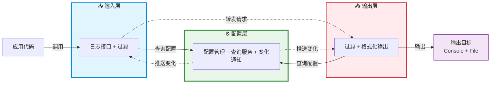
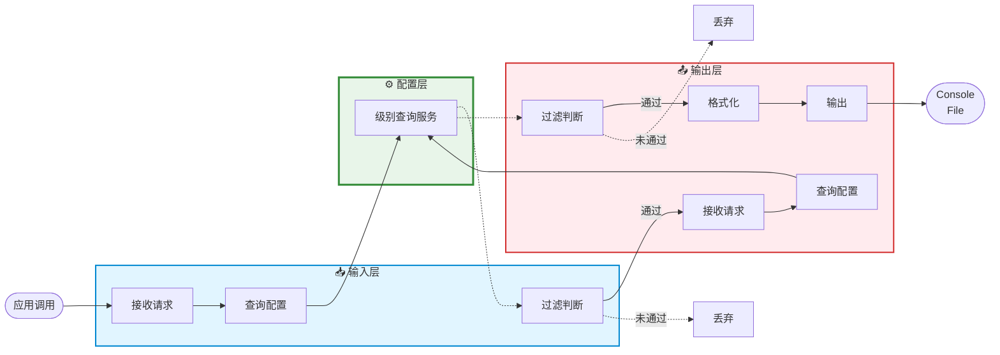
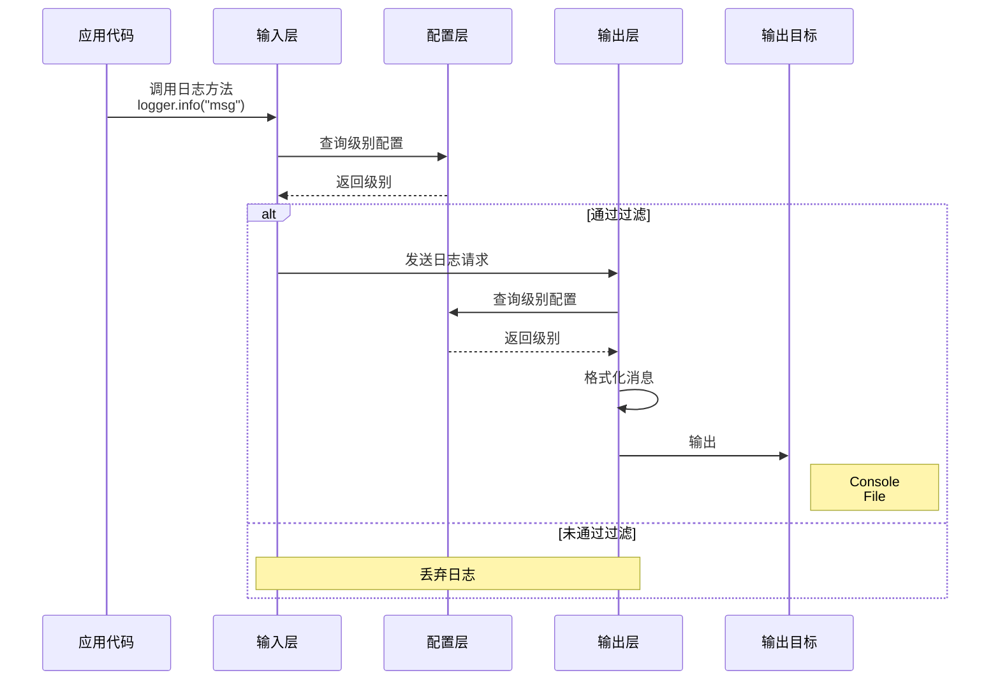

# 如何设计一个跨进程日志系统

<details>
  <summary>前置知识</summary>

- 依赖注入机制
- Contribution机制
- RPC机制
</details>

## 背景

在一些复杂项目当中，我们往往需要对某些场景进行日志记录和调试，这个时候只针对某个端的日志记录是远远不够的。我们需要统一管理所有进程的日志，并能够根据不同的场景进行日志的过滤和输出。这个时候就需要设计一个跨进程的日志系统。

理解一个跨进程日志系统的使用场景可以是前后端分离架构中，前端所做的日志输出目标不仅仅是浏览器，同时也可以是文件系统。在需要的时候可以查询到所有进程的日志，并进行分析。

## 设计

我们先将焦点从“跨进程”转移到“同进程”，如果我们设计好一个同进程日志系统，那么跨进程日志系统可以将其看成是同进程日志系统的扩展。

### 同进程日志系统

假设我们要为一个 Node.js 应用设计一个轻量级的日志系统，它只需要满足下面基本需求：

- 支持多个日志级别输入（`TRACE/DEBUG/INFO/WARN/ERROR/FATAL`）
- 输出到控制台和文件
- 支持配置热更新

基于上述需求，我们将系统架构分成三层模型，分别是输入层、输出层、配置层。



#### 系统工作流程



上面是针对同进程日志系统架构的工作流程图，它主要分为以下几个部分：

- **日志输出请求**：应用层代码使用日志系统提供的统一结构进行日志输出请求，它可能使用各种日志级别的请求API （`TRACE/DEBUG/INFO/WARN/ERROR/FATAL`）来尝试输入自己想要记录的日志内容。

- **日志过滤机制**：尽管应用层能够使用输入层不同级别的日志请求API输入内容，实际场景是我们往往需要聚焦某个级别日志内容进行查看。这就不得不涉及到日志的内容过滤，当符合条件时允许通过该级别内容的请求，不符合的请求内容我们直接丢弃该日志级别的请求。

- **日志输出处理**：当符合条件的日志级别输入请求到达输出层时，输出层会针对日志输入请求做统一处理。它将进行二次过滤、内容格式化以及目标输出三大主要处理。最终，我们将输入层的日志内容输入到各个输出目标，例如控制台、文件系统。最终我们将看到如下的日志输出效果：

  ```shell
  2025-11-04T10:30:00.123Z MyApp INFO 应用启动
  2025-11-04T10:30:00.124Z MyApp WARN 警告信息
  2025-11-04T10:30:00.125Z MyApp ERROR 错误信息
  2025-11-04T10:30:01.000Z MyApp DEBUG 现在可以看到了
  ```

- **日志配置处理**：配置层实际上是配置持久化处理所在的层次，它负责配置日志系统的相关功能（日志输出文件、系统配置文件）以及配置变化通知。无论是输入层、输出层都将从配置层查询日志的服务级别，将其用于日志输出的校验门槛；同时它们也监听配置层的配置变化，从而对自身做出一些调整。想象一个应用场景是你修改了日志系统的配置文件，就能够对日志系统进行日志级别热更新，毕竟在运行中的系统谁都不希望为了某个配置的修改不断的重启它，这将会显得十分繁琐，对用户和开发都不友好。

#### 日志系统实现

##### 输入层实现

从业务方使用日志系统的方式，我们会从输入层开始实现。按照架构所述，日志系统的输入层主要完成以下核心职责：**提供统一的日志输出请求结构**。

调用方将会按照如下方式使用该结构：

```ts
class BackendApp extends AbstractService {
    @ILogger protected readonly logger: ILogger;
  
    onAppStart() {
        this.logger.info("应用启动");
    }
}
```

据此我们给出一个Logger的结构设计：

```ts
// 定义日志输出级别
export enum LogLevel {
    TRACE = 10,
    DEBUG = 20,
    INFO = 30,
    WARN = 40,
    ERROR = 50,
    FATAL = 60
}

// 定义统一的日志请求输出结构
export interface ILogger {
    log(logLevel: LogLevel, message: any, ...params: any[]): Promise<void>;
  
    trace(message: any, ...params: any[]): Promise<void>;
    debug(message: any, ...params: any[]): Promise<void>;
    info(message: any, ...params: any[]): Promise<void>;
  	warn(message: any, ...params: any[]): Promise<void>;
    error(message: any, ...params: any[]): Promise<void>;
  	fatal(message: any, ...params: any[]): Promise<void>;
}
```

接下来我们按照职责描述给出Logger的具体实现：

```ts
export class Logger implements ILogger {
    protected _logLevel: Promise<number>;
  
    constructor(
        @ILoggerName name: ILoggerName,
        @ILoggerServer server: ILoggerServer
    ){
        this._logLevel = this.server.getLogLevel(this.name);  // 初始化时获取级别并缓存
    }
  
    async log(logLevel: number, message: any, ...params: any[]): Promise<void> {
				 // 第一次过滤：使用缓存的级别（性能优化）
        if (await this.isEnabled(logLevel)) {
            // 格式化消息（Error 对象转为堆栈信息）
            const formatted = this.format(message);
            
            // 关键：调用 LoggerServer 进行输出
            await this.server.log(
                this.name,      // logger 名称
                logLevel,       // 日志级别
                formatted,      // 格式化后的消息
                params          // 额外参数
            );
        }
    }
  
  
    // ==========================================
    // 各个级别的日志方法
    // ==========================================
    async trace(message: any, ...params: any[]): Promise<void> {
        return this.log(LogLevel.TRACE, message, ...params);
    }
    
    async debug(message: any, ...params: any[]): Promise<void> {
        return this.log(LogLevel.DEBUG, message, ...params);
    }
    
    async info(message: any, ...params: any[]): Promise<void> {
        return this.log(LogLevel.INFO, message, ...params);
    }
    
    async warn(message: any, ...params: any[]): Promise<void> {
        return this.log(LogLevel.WARN, message, ...params);
    }
    
    async error(message: any, ...params: any[]): Promise<void> {
        return this.log(LogLevel.ERROR, message, ...params);
    }
    
    async fatal(message: any, ...params: any[]): Promise<void> {
        return this.log(LogLevel.FATAL, message, ...params);
    }
  
    // 检查级别是否够得到日志输出级别的门槛
    protected async isEnabled(logLevel: number): Promise<boolean> {
        const currentLevel = await this._logLevel;
        return logLevel >= currentLevel;
    }
  
  	// 格式化消息（处理 Error 对象）
    protected format(value: any): any {
        if (value instanceof Error) {
            return value.stack || value.toString();
        }
        return value;
    }
}
```

上面是`Logger`的核心实现，关键的API只有一个就是`log`。至于其余的日志级别API只不过是固定了日志级别`TRACE/DEBUG/INFO/WARN/ERROR/FATAL`））的`log`而已。

`log`主要任务就是作为**输入层**和**输出层**交互的桥梁，它将业务方的日志内容进行格式化后调用`logger server`正式发起日志输出请求。不过，在正式发起日志输出请求之前，我们还需要对日志内容进行过滤，通过`isEnabled`我们可以判断当前准备调用的日志请求是否达到了日志输出要求的级别门槛，只有达到了门槛才会通过并正式发起请求，否则直接丢弃当前条日志请求。最终通过的日志输出请求将被正式调用（`this.server.log`），由输出层的`ILoggerServer`接收处理。

##### 输出层实现

当输出层的`ILoggerServer`接收来自`ILogger`的日志请求时，它使用与`ILogger`同名的`log`处理该请求。下面我们给出`ILoggerServer`的结构描述：

```ts
export interface ILoggerServer {
  log(name: string, logLevel: number, message: any, params: any[]): Promise<void>;
}
```

上述就是一个`ILoggerServer`的核心结构描述，基于此我们进一步给出其的具体实现：

```ts
export class LoggerServer implements ILoggerServer {
  	@ILogLevelCliContribution cli: ILogLevelCliContribution
  
    async log(name: string, logLevel: number, message: string, params: any[]): Promise<void> {
        const configuredLogLevel = await this.getLogLevel(name);
        if (logLevel >= configuredLogLevel) {
            // 格式化并输出到控制台
            const fullMessage = ConsoleLogger.log(name, logLevel, message, params);
            // 同时写入文件系统
            this.logToFile(fullMessage, params);
        }
    }
  
  	async getLogLevel(name: string): Promise<number> {
        return this.cli.logLevelFor(name);
    }
  
    protected logToFile(message: string, params: any[]): void { ... }
}
```

在`LoggerServer`当中，核心的API也是`log`。它的主要任务同`Logger`中同名方法的`log`相似，都是先进入到日志级别校验环节，只在完成日志输出级别校验后，将符合要求的日志内容输出到指定输出目标（控制台、文件系统）；否则就会直接丢弃整个日志输出请求。到这里，你至少能看到控制台输出：

```shell
2025-11-04T10:30:00.123Z INFO root 应用启动
```

在这里，我们看到无论是`Logger`还是`LoggerServer`都需要调用的一个方法是`getLogLevel`。`Logger`在`constructor`初始化阶段使用到了这个方法，`LoggerServer`在日志过滤阶段也用到了这个方法。

`getLogLevel`方法正是**输出层**与**配置层**之间沟通的主要桥梁。它获取Logger的名字，通过配置层`cli`从持久化配置文件中查询指定名字的Logger的输出日志级别门槛，转而告知**输出层**和**输入层**。

我们将聚焦点放在**日志输出流程**这条主线上的话，那么整个交互流程就呼之欲出了，下面我们给出该流程的时序图加深一下这个日志输出流程的印象：




##### 配置层实现

一个完整的日志系统不仅仅需要由主线的交互构成，同时也要有系统的相关配置及更新交互参与才行。日志系统的配置层正是作为这样的角色存在的，它提供如下基本配置：

- 日志配置文件路径：用于配置日志系统的log level
- 日志输出文件路径：用于存储日志输出内容

同时，它还支持了热更新机制，允许你在系统运行期间修改配置文件后立马生效。基于此，配置层的主要职责是：

- **提供配置项在应用启动时指定`log config file`和`log file`**
- **观测`log config file`的变化情况及时通知给关心的组件**

接下来，我们来实现配置层的相关成分，***这部分内容会涉及到其他系统，建议是先到相关文章了解下对应系统的作用，然后回到本文会更加容易理解***。

配置层的基本骨架实际上是一个`CLI Contribution`，在运行结构上它实际上是`CLI`系统的一部份内容。引用`CLI`系统的一张图来回顾下这部分内容：


作为一个可扩展的`CLI`系统，它的主要作用就是处理整个应用的启动工作。我们将会使用`gepick main.js`启动`BackendApp`，它允许你在启动应用时传入相关参数。不同的功能系统会向`CLI`系统提供属于自己功能的参数选项，同时它们也将在指定时机处理自己功能的参数选项。对于日志系统来说，它通过`Contribution`机制向`CLI`系统贡献了自己的参数选项：用于指定配置文件路径的`log-config`和用于指定日志文件路径的`log-file`。因此，在启动应用的时候，我们可以通过`gepick main.js --log-config /path/to/config.json --log-file xxx`来完成对日志系统的基本运行配置。

下面，我们给出日志系统对`CLI`系统的贡献的核心实现，它其实就是我们的配置层主要组件，也是整个配置层的骨架：

```ts
class LogLevelCliContribution extends AbstractService implements CliContribution {
    protected _logLevels: LogLevels = {};
  
    protected logConfigChangedEvent: Emitter<void> = new Emitter<void>();
    get onLogConfigChanged(): Event<void> {
        return this.logConfigChangedEvent.event;
    }
  	
    // 查询指定logger名字的log level
    logLevelFor(loggerName: string): LogLevel {
        const level = this._logLevels[loggerName];

        if (level !== undefined) {
            return level;
        } else {
            return this.defaultLogLevel;
        }
    }
    
    // 定义运行参数选项
    defineOptions(conf: yargs.Argv): void {
        conf.option('log-config', {
            description: 'Path to the JSON file specifying the configuration of various loggers',
            type: 'string',
            nargs: 1,
        });
      
        conf.option('log-file', {
              description: 'Path to the log file',
              type: 'string',
              nargs: 1
        });
    }
  	
    // 处理运行实际传入的参数选项值
    processArguments(args:yargs.Arguments): MaybePromise<void> {
        if (args['log-config'] !== undefined) {
          	let filename: string = args['log-config'] as string;
            try {
                filename = path.resolve(filename);

                await this.slurpLogConfigFile(filename);
                await this.watchLogConfigFile(filename);
            } catch (e) {
                console.error(`Error reading log config file ${filename}: ${e}`);
            }
        }
      
        if (args['log-file'] !== undefined) {
          // log-file路径不存在就创建
          ...
        }
    }
      
    // 读取log config内容
    protected async slurpLogConfigFile(filename: string): Promise<void> {}
     
    // 观测log config内容变化
    protected async watchLogConfigFile(filename: string): Promise<void> {}
}
  
  
export interface LogLevels {
    [key: string]: LogLevel,
}
```


### 跨进程日志系统

## 总结


