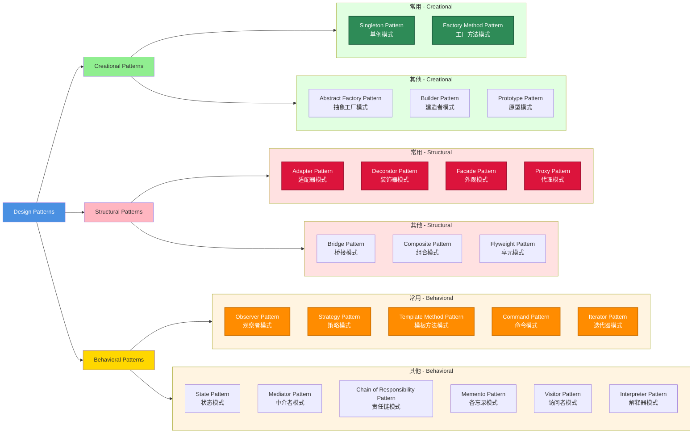

# 关于设计模式应用的回顾与思考

## 回顾

在Gepick的实现当中会运用到不少软件模式，它们都是为了解决对应的场景而使用的。下面我们就来回顾下在开发过程当中用到的一些设计模式，算是一个阶段性的小结。

设计模式根据要解决的问题类型可以分成三种类型：

- **创建型模式**：解决"对象怎么生出来"的问题。
- **结构型模式**：解决“对象怎么拼起来”的问题。
- **行为型模式**：解决“对象之间怎么配合干活”的问题。

而在此三类痛点问题的基础上，还会再根据实际需求细分出了多种不同的设计模式。接下来我们回顾我们用到的重要模式和它的经典使用场景，并在之后不断补充。

- **代理模式**

  - 场景：[**通讯系统**]-为了让前后端通讯交互方便设计集成了“通讯系统”，它能够让调用方通过RPC的方式来进行前后端互操作。
  - 问题：只是设计了底层RPC协议，调用方操作需要重复操作底层代码，如何让实现的结构有啥API就能直接以`Struct.method()`的方式来调用，屏蔽掉底层API具体使用呢？
  - 思考：假如我们能够实现一个控制对象，让其代理底层API具体使用，调用方直接使用控制对象，通过`Struct.method()`的方式调用，而内部可以自动转换为底层RPC协议的具体使用就能解决这个问题了。
  - 方案：运用代理模式，利用`Proxy`包装底层RPC协议的具体使用。

- **外观模式**

  - 场景：[**偏好系统**]-为了提升用户使用体验，我们设计集成了“偏好系统”并设计了多个级别的“偏好作用域”。但是对于业务调用方是不需要去关心具体作用域的设计的，他们只需要用偏好系统向外统一暴露的服务即可，利用该服务来操作偏好系统。
  - 问题：多作用域的设计要如何组合起来向外部提供一个统一的访问点来操作内部服务？
  - 方案：运用外观模式，统一所有作用域的设计，对外界提供`PreferencesService`，调用方只需要使用`PreferencesService`即可操作偏好系统。

- **装饰器模式**

  - 场景：[**服务框架**]-在设计“基础服务框架”时使用到了InversifyJS，它是一个依赖注入服务框架，功能很强大。但是我发现这个框架很喜欢将服务的注册和服务的实现混在一块，比如你实现Constant Value的时候，需要在服务注册的地方再进行服务实现，因为你可能需要用到其他服务，而这些服务又是从容器当中获取的，似乎无法脱离那个位置。（另外我们也其实希望使用类似vscode注入的做法来完成我们的服务注入，因为Inversifyjs本身服务注入时代码存在大量重复工作，完全可以简化。不过我们这里不谈这部分，例子只说明如何解决主要问题。）
  - 问题：是否有办法将`toConstantValue`这一类`InversifyJS`提供的API的服务注册和服务实现进行解耦？
  - 思考：或许我们能够通过某种方式包装对应的`API`，然后将服务的实现进行统一，能够在新的实现方式当中也能够直接获取其他服务，就好像InversifyJS的标准绑定API那样`bind(XXX).to(XXXService)`统一所有的服务的实现方式，让内部自动识别具体的绑定类型。
  - 方案：运用装饰器模式，通过配合`Reflect`API生态，我们能够在Typescript的项目里头实现API的服务注册和服务实现进行解耦，同时统一服务实现方式以及获取其他服务来使用的问题。整个Gepick的基础服务框架其实大量运用了装饰器模式来完成的，其实内部的InversifyJS也是大量运用了装饰器，我们只是基于它二次开发运用上新的想法而已。

- **适配器模式**

  - 场景：[**AI系统**]-在设计集成“AI系统”的时候，不同的LLM Provider有不同的数据结构和开发方式。比如`OpenAI`的请求-响应结构就和`Anthropic`的请求-响应结构不同。但是我们必须统一请求响应结构以及Model的相关结构才能放在一块统一管理。
  - 问题：如何兼容不同的LLM请求-响应结构以及LLM的结构呢？
  - 思考：既然第三方AI的相关结构和开发方式无法改变，那么我们是否可以抽离出一个中间层，让中间层来标准化相关的结构和开发方式？项目内部只通过统一的标准接口进行业务操作，而标准接口的具体实现或者说兼容的能力交给兼容层来做，在对接不同的LLM Provider的时候就能够按照标准接口来做兼容层的实现，也具有动态扩展的能力。
  - 方案：使用适配器模式，定义LLM适配层作为标准的`LanguageModel`，提供统一的请求、响应接口，在对接不同的LLM Provider的时候动态扩展兼容层。比如说：对接`OpenAI`平台时，就通过适配层提供的标准接口实现该平台的请求和响应能力；而对接`Anthropic`平台时，也能通过标准接口实现自己平台的请求和响应能力。业务调用方只需要关心标准`LanguageModel`提供的能力，不需要关心兼容层要做的事，等到需要兼容了再到兼容层实现相关能力即可。

- **模板方法模式**

  - 场景：[**插件系统**]-在设计集成“插件系统”的时候，插件系统可能运行在三种不同的运行环境，分别如下：

    - Browser 环境：HostedPluginSupport（浏览器前端）

    - Electron 环境：HostedPluginSupport（Electron 前端）+ Backend

    - Headless 环境：HeadlessHostedPlugin（无 UI 的纯后端）

      | 环境            | 运行位置            | 通信方式       | 用途                       |
      | :-------------- | :------------------ | :------------- | :------------------------- |
      | Browser Plugin  | WebWorker           | MessageChannel | 前端逻辑、UI 交互          |
      | Backend Plugin  | 独立 Node.js 子进程 | IPCChannel     | 文件操作、系统调用、工具链 |
      | Headless Plugin | 独立 Node.js 子进程 | IPCChannel     | 纯后台任务、无 UI 需求     |

    这里不变的东西就是插件加载的"顺序、异常处理、状态同步"完全一致，变化的东西就是Browser 环境插件要运行在 WebWorker，Electron 环境插件运行在 Node.js 子进程，Headless 环境插件也是运行在Node.js子进程。

  - 问题：如何保证运行时各环境操作顺序一致，而实际环境可能操作的具体行为可以定制呢？

  - 思考：假如我们能够定制一个基础结构，利用该结构来强制固定运行时必要操作顺序。然后根据不同环境实现对应环境的具体结构，让它们继承自这个基础结构，从而重写相关操作去定制环境行为，这个问题不就解决了么？

  - 方案：使用模板方法模式，我们可以将不变的、一致的必要行为操作封装在例如抽象类中，就像搭建骨架一样将行为的顺序固定在其中。让不同环境的插件支持行为继承该骨架，然后实现环境对应的生命周期行为。

## 思考

在OOP编程当中经常放在一块谈的东西就是设计模式，它似乎成为了程序员修炼的一门必备技能。很多人在工程开发当中恨不得一次性将设计模式全丢上来，至于实际应用场景复杂度一概不谈，将其看作是设计代码时的标准答案。这似乎情有可原也是预料之中，因为我自己也反复经历着这个过程。随着开发经验的增长，我逐步形成了一套新的思维模式：“场景-问题-思考-方案”，在运用这套思维模式去践行开发当中碰到的相关需求时，对曾经经历的一些过程又有了一些新的看法。

模式的形成总是经历过一个个工程落地后由人进行总结得出的一套经验，它可能随着时代的变化更新得到改善和内嵌。因此，我们不能使用静止的眼光去看待一个模式，如果一门语言当中天然就存在这样的一种模式，那么我们似乎就不需要再去实现这种模式。比如在JS标准中已经有了`Proxy`，如果你想要使用代理模式去解决一个应用场景所引发的问题，那么我们可能直接使用`Proxy`会比自己去实现代理模式更好。

模式应该更注重在模式所表达的思想，而不是模式的一种具体代码模板的实现。记忆模式的模板不如理解应用的场景以及场景所引发的问题和问题思考方案更有效，前者虽然能够让你能够用出招来，但后者可能更能让你在掌握模式识别的基础上有新的思想启发。毕竟模式的产生都是为了解决软件工程当中变与不变的实际问题。还是拿`Proxy`来举例子，在指定的应用场景下，比如设计通讯系统的RPC应用层，为了让调用方调用透明和更加方便的使用RPC，我们会通过应用`Proxy`来包装底层的RPC协议的使用。而不是自己按照设计模式的模板代码来套用包装底层的RPC协议的使用，因为语言给予我们的`Proxy`已经是代理模式的载体了，我们已经能够解决当前场景的问题：“如何让调用方透明地、方便地使用RPC协议”。当然，如果在当前场景下官方给到的代理模式的载体还不够用，我们基于官方的或者按照代理模式的标准形式设计一套也不迟。总之就是够用就好，不够再来迭代。

