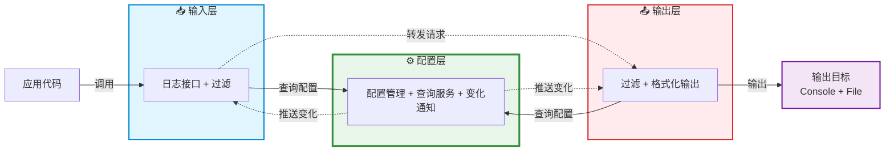
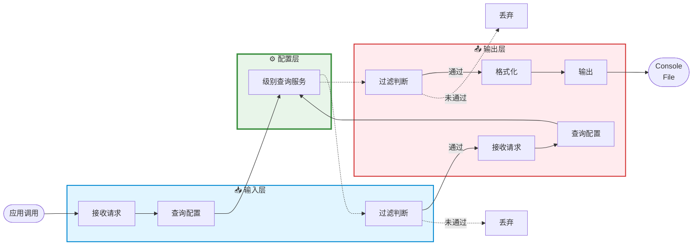
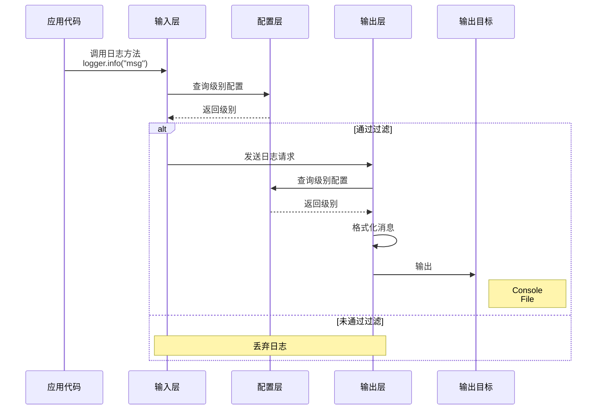
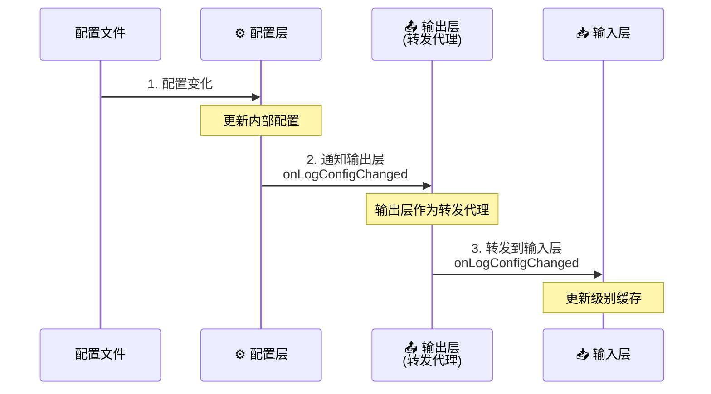
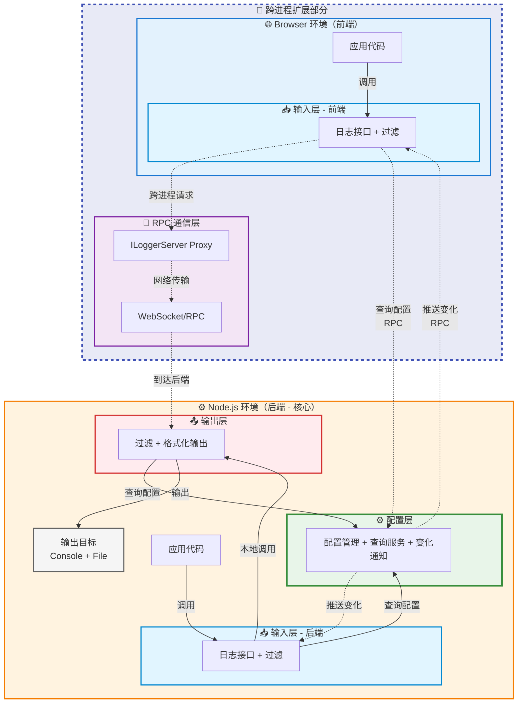

# 设计一个跨进程日志系统

<details>
  <summary>前置知识</summary>

- 依赖注入机制
- Contribution机制
- RPC机制
</details>

## 背景

在一些复杂项目当中，我们往往需要对某些场景进行日志记录和调试，这个时候只针对某个端的日志记录是远远不够的。我们需要统一管理所有进程的日志，并能够根据不同的场景进行日志的过滤和输出。这个时候就需要设计一个跨进程的日志系统。

理解一个跨进程日志系统的使用场景可以是前后端分离架构中，前端所做的日志输出目标不仅仅是浏览器，同时也可以是文件系统。在需要的时候可以查询到所有进程的日志，并进行分析。

## 设计

我们先将焦点从“跨进程”转移到“同进程”，如果我们设计好一个同进程日志系统，那么跨进程日志系统可以将其看成是同进程日志系统的扩展。

### 同进程日志系统

假设我们要为一个 Node.js 应用设计一个轻量级的日志系统，它只需要满足下面基本需求：

- 支持多个日志级别输入（`TRACE/DEBUG/INFO/WARN/ERROR/FATAL`）
- 输出到控制台和文件
- 支持配置热更新

基于上述需求，我们将系统架构分成三层模型，分别是输入层、输出层、配置层。



#### 系统工作流程



上面是针对同进程日志系统架构的工作流程图，它主要分为以下几个部分：

- **日志输出请求**：应用层代码使用日志系统提供的统一结构进行日志输出请求，它可能使用各种日志级别的请求API （`TRACE/DEBUG/INFO/WARN/ERROR/FATAL`）来尝试输入自己想要记录的日志内容。

- **日志过滤机制**：尽管应用层能够使用输入层不同级别的日志请求API输入内容，实际场景是我们往往需要聚焦某个级别日志内容进行查看。这就不得不涉及到日志的内容过滤，当符合条件时允许通过该级别内容的请求，不符合的请求内容我们直接丢弃该日志级别的请求。

- **日志输出处理**：当符合条件的日志级别输入请求到达输出层时，输出层会针对日志输入请求做统一处理。它将进行二次过滤、内容格式化以及目标输出三大主要处理。最终，我们将输入层的日志内容输入到各个输出目标，例如控制台、文件系统。最终我们将看到如下的日志输出效果：

  ```shell
  2025-11-04T10:30:00.123Z MyApp INFO 应用启动
  2025-11-04T10:30:00.124Z MyApp WARN 警告信息
  2025-11-04T10:30:00.125Z MyApp ERROR 错误信息
  2025-11-04T10:30:01.000Z MyApp DEBUG 现在可以看到了
  ```

- **日志配置处理**：配置层实际上是配置持久化处理所在的层次，它负责配置日志系统的相关功能（日志输出文件、系统配置文件）以及配置变化通知。无论是输入层、输出层都将从配置层查询日志的服务级别，将其用于日志输出的校验门槛；同时它们也监听配置层的配置变化，从而对自身做出一些调整。想象一个应用场景是你修改了日志系统的配置文件，就能够对日志系统进行日志级别热更新，毕竟在运行中的系统谁都不希望为了某个配置的修改不断的重启它，这将会显得十分繁琐，对用户和开发都不友好。

#### 日志系统实现

##### 输入层实现

从业务方使用日志系统的方式，我们会从输入层开始实现。按照架构所述，日志系统的输入层主要完成以下核心职责：**提供统一的日志输出请求结构**。

调用方将会按照如下方式使用该结构：

```ts
class BackendApp extends AbstractService {
    @ILogger protected readonly logger: ILogger;
  
    onAppStart() {
        this.logger.info("应用启动");
    }
}
```

据此我们给出一个Logger的结构设计：

```ts
// 定义日志输出级别
export enum LogLevel {
    TRACE = 10,
    DEBUG = 20,
    INFO = 30,
    WARN = 40,
    ERROR = 50,
    FATAL = 60
}

// 定义统一的日志请求输出结构
export interface ILogger {
    log(logLevel: LogLevel, message: any, ...params: any[]): Promise<void>;
  
    trace(message: any, ...params: any[]): Promise<void>;
    debug(message: any, ...params: any[]): Promise<void>;
    info(message: any, ...params: any[]): Promise<void>;
  	warn(message: any, ...params: any[]): Promise<void>;
    error(message: any, ...params: any[]): Promise<void>;
  	fatal(message: any, ...params: any[]): Promise<void>;
}
```

接下来我们按照职责描述给出Logger的核心实现：

```ts
export class Logger implements ILogger {
    protected _logLevel: Promise<number>;
  
    constructor(
        @ILoggerName name: ILoggerName,
        @ILoggerServer server: ILoggerServer
    ){
        this._logLevel = this.server.getLogLevel(this.name);  // 初始化时获取级别并缓存
    }
  
    async log(logLevel: number, message: any, ...params: any[]): Promise<void> {
        // 第一次过滤：使用缓存的级别（性能优化）
        if (await this.isEnabled(logLevel)) {
            // 格式化消息（Error 对象转为堆栈信息）
            const formatted = this.format(message);
            
            // 关键：调用 LoggerServer 进行输出
            await this.server.log(
                this.name,      // logger 名称
                logLevel,       // 日志级别
                formatted,      // 格式化后的消息
                params          // 额外参数
            );
        }
    }
  
  
    // ==========================================
    // 各个级别的日志方法
    // ==========================================
    async trace(message: any, ...params: any[]): Promise<void> {
        return this.log(LogLevel.TRACE, message, ...params);
    }
    
    async debug(message: any, ...params: any[]): Promise<void> {
        return this.log(LogLevel.DEBUG, message, ...params);
    }
    
    async info(message: any, ...params: any[]): Promise<void> {
        return this.log(LogLevel.INFO, message, ...params);
    }
    
    async warn(message: any, ...params: any[]): Promise<void> {
        return this.log(LogLevel.WARN, message, ...params);
    }
    
    async error(message: any, ...params: any[]): Promise<void> {
        return this.log(LogLevel.ERROR, message, ...params);
    }
    
    async fatal(message: any, ...params: any[]): Promise<void> {
        return this.log(LogLevel.FATAL, message, ...params);
    }
  
    // 检查级别是否够得到日志输出级别的门槛
    protected async isEnabled(logLevel: number): Promise<boolean> {
        const currentLevel = await this._logLevel;
        return logLevel >= currentLevel;
    }
  
  	// 格式化消息（处理 Error 对象）
    protected format(value: any): any {
        if (value instanceof Error) {
            return value.stack || value.toString();
        }
        return value;
    }
}
```

上面是`Logger`的核心实现，关键的API只有一个就是`log`。至于其余的日志级别API只不过是固定了日志级别`TRACE/DEBUG/INFO/WARN/ERROR/FATAL`））的`log`而已。

`log`主要任务就是作为**输入层**和**输出层**交互的桥梁，它将业务方的日志内容进行格式化后调用`logger server`正式发起日志输出请求。不过，在正式发起日志输出请求之前，我们还需要对日志内容进行过滤，通过`isEnabled`我们可以判断当前准备调用的日志请求是否达到了日志输出要求的级别门槛，只有达到了门槛才会通过并正式发起请求，否则直接丢弃当前条日志请求。最终通过的日志输出请求将被正式调用（`this.server.log`），由输出层的`ILoggerServer`接收处理。

##### 输出层实现

当输出层的`ILoggerServer`接收来自`ILogger`的日志请求时，它使用与`ILogger`同名的`log`处理该请求。下面我们给出`ILoggerServer`的结构描述：

```ts
export interface ILoggerServer {
  log(name: string, logLevel: number, message: any, params: any[]): Promise<void>;
}
```

上述就是一个`ILoggerServer`的核心结构描述，基于此我们进一步给出其的具体实现：

```ts
export class LoggerServer implements ILoggerServer {
  	@ILogLevelCliContribution cli: ILogLevelCliContribution
  
    async log(name: string, logLevel: number, message: string, params: any[]): Promise<void> {
        const configuredLogLevel = await this.getLogLevel(name);
        if (logLevel >= configuredLogLevel) {
            // 格式化并输出到控制台
            const fullMessage = ConsoleLogger.log(name, logLevel, message, params);
            // 同时写入文件系统
            this.logToFile(fullMessage, params);
        }
    }
  
  	async getLogLevel(name: string): Promise<number> {
        return this.cli.logLevelFor(name);
    }
  
    protected logToFile(message: string, params: any[]): void { ... }
}
```

在`LoggerServer`当中，核心的API也是`log`。它的主要任务同`Logger`中同名方法的`log`相似，都是先进入到日志级别校验环节，只在完成日志输出级别校验后，将符合要求的日志内容输出到指定输出目标（控制台、文件系统）；否则就会直接丢弃整个日志输出请求。到这里，你至少能看到控制台输出：

```shell
2025-11-04T10:30:00.123Z INFO root 应用启动
```

在这里，我们看到无论是`Logger`还是`LoggerServer`都需要调用的一个方法是`getLogLevel`。`Logger`在`constructor`初始化阶段使用到了这个方法，`LoggerServer`在日志过滤阶段也用到了这个方法。

`getLogLevel`方法正是**输出层**与**配置层**之间沟通的主要桥梁。它获取Logger的名字，通过配置层`cli`从持久化配置文件中查询指定名字的Logger的输出日志级别门槛，转而告知**输出层**和**输入层**。

我们将聚焦点放在**日志输出流程**这条主线上的话，那么整个交互流程就呼之欲出了，下面我们给出该流程的时序图加深一下这个日志输出流程的印象：




##### 配置层实现

###### 配置管理器实现

一个完整的日志系统不仅仅需要由主线的交互构成，同时也要有系统的相关配置及更新交互参与才行。日志系统的配置层正是作为这样的角色存在的，它提供如下基本配置：

- 日志配置文件路径：用于配置日志系统的log level
- 日志输出文件路径：用于存储日志输出内容

同时，它还支持了热更新机制，允许你在系统运行期间修改配置文件后立马生效。基于此，配置层的主要职责是：

- **提供配置项在应用启动时指定`log config file`和`log file`**
- **观测`log config file`的变化情况及时通知给关心的组件**

接下来，我们来实现配置层的相关成分，***这部分内容会涉及到其他系统，建议是先到相关文章了解下对应系统的作用，然后回到本文会更加容易理解***。

配置层的基本骨架实际上是一个`CLI Contribution`，在运行结构上它实际上是`CLI`系统的一部份内容。引用`CLI`系统的一张图来回顾下这部分内容：


作为一个可扩展的`CLI`系统，它的主要作用就是处理整个应用的启动工作。我们将会运行命令`gepick main.js`启动`BackendApp`，它允许你在启动应用时传入相关参数。不同的功能系统会向`CLI`系统提供属于自己功能的参数选项，同时它们也将在指定时机处理自己功能的参数选项。对于日志系统来说，它通过`Contribution`机制向`CLI`系统贡献了自己的参数选项：用于指定配置文件路径的`log-config`和用于指定日志文件路径的`log-file`。因此，在启动应用的时候，我们可以通过`gepick main.js --log-config /path/to/config.json --log-file xxx`来完成对日志系统的基本运行配置。

下面，我们给出日志系统对`CLI`系统的贡献的核心实现，它其实就是我们的配置层主要组件，也是整个配置层的骨架：

```ts
class LogLevelCliContribution extends AbstractService implements ICliContribution {
    protected _logLevels: LogLevels = {};
    get logLevels(): LogLevels {
        return this._logLevels;
    }
  
    protected _logFile?: string;
    get logFile(): string | undefined {
        return this._logFile;
    }
  
    protected logConfigChangedEvent: Emitter<void> = new Emitter<void>();
    get onLogConfigChanged(): Event<void> {
        return this.logConfigChangedEvent.event;
    }
  	
    // 查询指定logger名字的log level
    logLevelFor(loggerName: string): LogLevel {
        const level = this._logLevels[loggerName];

        if (level !== undefined) {
            return level;
        } else {
            return this.defaultLogLevel;
        }
    }
    
    // 定义运行参数选项
    defineOptions(conf: yargs.Argv): void {
        conf.option('log-config', {
            description: 'Path to the JSON file specifying the configuration of various loggers',
            type: 'string',
            nargs: 1,
        });
      
        conf.option('log-file', {
              description: 'Path to the log file',
              type: 'string',
              nargs: 1
        });
    }
  	
    // 处理运行实际传入的参数选项值
    processArguments(args:yargs.Arguments): MaybePromise<void> {
        if (args['log-config'] !== undefined) {
          	let filename: string = args['log-config'] as string;
            try {
                filename = path.resolve(filename);

                await this.slurpLogConfigFile(filename);
                await this.watchLogConfigFile(filename);
            } catch (e) {
                console.error(`Error reading log config file ${filename}: ${e}`);
            }
        }
      
        if (args['log-file'] !== undefined) {
          // log-file路径不存在就创建
          ...
        }
    }
      
    // 读取log config内容
    protected async slurpLogConfigFile(filename: string): Promise<void> {...}
     
    // 观测log config内容变化
    protected async watchLogConfigFile(filename: string): Promise<void> {
        ...
        this.logConfigChangedEvent.fire();
        ...
    }
}
  
  
export interface LogLevels {
    [key: string]: LogLevel,
}
```

基于`ICliContribution`接口要求，`LogLevelCliContribution`实现了`defineOptions`和`processArguments`API。通过`defineOptions`为日志系统的配置提供了选项`log-config`和`log-file`，又通过`processArguments`处理了这两个选项参数，其中`log-file`的处理就是创建指定路径的日志输出文件，而`log-config`的处理则是从指定config文件当中读取出配置内容，并观测配置文件变化，一旦配置内容发生变化，则通过`logConfigChangedEvent`通知外界配置发生变化了。

> [!NOTE]
>
> 在gepick当中的事件机制是通过具名Emitter的形式来实现的，一个类可以拥有多种事件，也就是拥有多个具名Emitter。关心这个事件的调用方，可以通过使用这个类向外暴露的事件函数来达到观察该类的目的。我们通过如下组合来完成某个类的事件定义：
>
> ```ts
> class App extends AbstractService {
>     // 定义app启动生命周期事件
>     protected readonly onAppStartEmitter = new Emitter<void>();
>     // 定义外部可以使用这个事件函数来监听app启动时机
>     get onAppStart(){
>         return this.onAppStartEmitter.event;
>     }
>   
>     start(){
>         // 当app启动时我们派发该事件
>         this.onAppStartEmitter.fire();
>     }
> }
> 
> // 应用代码
> class ServiceA extends AbstractService {
>     @IApp app: IApp
>   
>     @PostConstruct()
>     init() {
>         this.app.onAppStart(() => {
>             console.log("app 启动了，可以做一些事情了！")
>         })
>     }
> }
> ```
>
> 

###### 多层之间的交互



如上是联动三个架构层次，针对配置变化所做的**配置变化传播流程**，它的传播路径是**配置层 → 输出层（转发代理）→ 输入层**。

- **配置层 → 输出层**

  配置层是一直在动态观察配置文件的变化的，只要文件一变化立马触发配置层的`onLogConfigChanged`事件，由于输出层与配置层直接关联，它会使用`this.cli.onLogConfigChanged(() => {})`来接收配置层派发的配置变化通知。

  这部分内容在[输出层实现](#输出层实现)当中为了描述日志输出交互主线我们并没有加上，现在可以将其加入了：

  ```ts
  export class LoggerServer implements ILoggerServer {
      protected client?: ILoggerClient;
    	@ILogLevelCliContribution cli: ILogLevelCliContribution
    
      @PostConstruct()//[!code ++]
      protected init(): void {//[!code ++]
          // 监听配置层的配置变化，向client进行转发 //[!code ++]
          this.cli.onLogConfigChanged(() => {//[!code ++]
              this.client?.onLogConfigChanged();//[!code ++]
          });//[!code ++]
      }//[!code ++]
    
      async log(name: string, logLevel: number, message: string, params: any[]): Promise<void> {
          const configuredLogLevel = await this.getLogLevel(name);
          if (logLevel >= configuredLogLevel) {
              // 格式化并输出到控制台
              const fullMessage = ConsoleLogger.log(name, logLevel, message, params);
              // 同时写入文件系统
              this.logToFile(fullMessage, params);
          }
      }
    
    	async getLogLevel(name: string): Promise<number> {
          return this.cli.logLevelFor(name);
      }
    
      protected logToFile(message: string, params: any[]): void { ... }
  }
  ```

  上面我们通过`this.cli.onLogConfigChanged`完成了输出层对配置层的监听工作，并在其通知配置变化时将该通知转发给相应的client。

- **输出层 → 输入层**

  输出层在**配置变化传播流程**当中主要充当转发代理的角色，它的任务就是在配置层派发配置变化通知时，将该事件转发出去，让输入层能够实现对配置层配置文件变化的侦听。

  但实际工程中，在**配置变化传播流程**中，我们并没有直接让输出层的`LoggerServer`和输入层的`Logger`直接关联起来，而是通过设计了一个`IDispatchingLoggerClient`结构作为client中间层将二者关联起来。因此你可以看到在`LoggerServer`当中监听到配置变化做通知转发时，我们是通过这个中间层来进行操作的，它被用来管理多个真正的logger client的配置变化通知。
  
  `IDispatchingLoggerClient`的作用简而言之就是实现**一对多的分发机制**，我们把它放在这部分内容来讲也是为了逐步过渡到**跨进程日志系统**的设计与实现当中。为啥需要设计这个结构并放置在`LoggerServer`当中作为唯一的client中间层存在呢？答案是一旦涉及了跨进程日志系统，将浏览器端考虑上，那么一个应用系统是可能打开多个tab进行使用的，此时不同的tab可能是用到呈现不同的功能，而不同的功能又涉及到`Logger`的使用。那么如何解决一个`LoggerServer`转发配置变化通知所有client客户端的`Logger`做log level的变化就十分重要了，因此`LoggerServer`与`LoggerClient`之间应该是**一对多**的关系，这就是为什么我们需要设计`IDispatchingLoggerClient`作为唯一的`LoggerServer`的`client`属性，并利用它来代为分发配置变化事件通知所有客户端：你们应该更改自己的log level了，下一次允许输出的log级别发生变化了。紧接着当对应的`LoggerClient`接收到通知后，便会让`Logger`做出log level处理，于是下一次`Logger`再次进行日志输出请求时，能输出的日志级别也就发生变化了，这样子就完成了一次配置热更新。

### 跨进程日志系统

#### 系统架构扩展

关于同进程日志系统我们所提出的三个基本需求已经得到了设计实现，我们将其推广开来看看跨进程日志系统要如何实现。下面我们看下跨进程日志系统的系统架构：



如果我们将左边的虚线矩形遮住，留下橙色部分（Node.js环境），实际上这就是同进程日志系统的架构。相比较于同进程日志系统，跨进程日志系统多了一层**RPC通信层**，并且将**输入层**推广到跨进程的场景中。因此，跨进程日志系统既允许你在Node.js当中使用`Logger`，也能够让允许你在Browser当中使用`Logger`，而它们的工作流程与同进程日志系统完全一样，只不过**输出层**的日志输出请求需要经过**RPC通信层**辅助完成。

#### 扩展系统实现

##### RPC通信层实现

为了让你能够理解RPC通信层将要做的事情，我们有必要回顾下**输入层**的实现，没错跨进程日志系统的输入层和同进程日志系统的输入层完全一样，这都得益于依赖注入机制：我们只关心功能接口，不关心具体实现。

我们再次看下输入层核心组件Logger的部分核心实现：

```ts
export class Logger implements ILogger {
    protected _logLevel: Promise<number>;
  
    constructor(
        @ILoggerName name: ILoggerName,
        @ILoggerServer server: ILoggerServer
    ){
        this._logLevel = this.server.getLogLevel(this.name);  // 初始化时获取级别并缓存
    }
  
    async log(logLevel: number, message: any, ...params: any[]): Promise<void> {
        // 第一次过滤：使用缓存的级别（性能优化）
        if (await this.isEnabled(logLevel)) {
            // 格式化消息（Error 对象转为堆栈信息）
            const formatted = this.format(message);
            
            // 关键：调用 LoggerServer 进行输出
            await this.server.log(
                this.name,      // logger 名称
                logLevel,       // 日志级别
                formatted,      // 格式化后的消息
                params          // 额外参数
            );
        }
    }
  
   // ...其他代码
}
```

上面我们看到`Logger`会直接引用`LoggerServer`，而`LoggerServer`是输出层的核心组件，输出层位于Node.js环境。在同进程日志系统当中，所有代码都在Node.js环境，我们在Node.js环境中生成的`Logger`当然能够直接使用同环境当中的`LoggerServer`。但是，一旦涉及到不同进程，当`Logger`处于Browser环境，`LoggerServer`处于Node.js环境，我们又想继续沿用之前的功能，这就需要动脑稍微思考下了。此时，**RPC通信层**的存在让我们的设想得到了可能，这就是跨进程日志系统当中**RPC通信层**存在的意义，它让你能够在不同进程当中能够像同进程代码调用那样去使用你的`Logger`，一样的API，一样的最终输出目标，你甚至能够基于此做一些更多的事情。

接下来，我们来实现通信层的相关成分，***这部分内容会涉及到其他系统，建议是先到相关文章了解下对应系统的作用，然后回到本文会更加容易理解***。

通信层的基础是文章"[如何设计一个RPC通讯系统](/technology/project/gepick/basic/designing-rpc-protocol)"当中设计的RPC系统，如果你对RPC系统还不熟悉，建议先阅读该文章。下面我们会应用RPC基础通讯系统来完成跨进程日志系统的RPC通信层的搭建：

- `[common]`定义通讯路径

  ```ts
  export const LOGGER_SERVICE_PATH = '/services/logger';
  ```

  上面的代码代表前后端协商一致的通讯路径`LOGGER_SERVICE_PATH`，只有这样才能够进行RPC通讯。

- `[node]`定义`ConnectionHandler`

  ```ts
  export class LoggerRpcConnectionHandler extends AbstractService {
    @ToDynamicValue()
    toDynamicValue(ctx: interfaces.Context) {
      return new RpcConnectionHandler<ILoggerClient>(LOGGER_SERVICE_PATH, (client) => {
        const dispatching = ctx.container.get<IDispatchingLoggerClient>(IDispatchingLoggerClient);
        
        dispatching.clients.add(client);
        
        client.onDidCloseConnection(() => dispatching.clients.delete(client));
        
        return ctx.container.get<ILoggerServer>(ILoggerServer); // 将LoggerServer作为RPC服务暴露出去
      });
    }
  }
  ```

  上面的代码，我们通过`RpcConnectionHandler`将`LoggerServer`作为`RPC Service`暴露给了前端，前端只需要接入同样的`LOGGER_SERVICE_PATH`就能够使用RPC服务。

- `[browser]`定义`RPC Service Proxy`

  ```ts
  export class LoggerServer extends AbstractService {
    @ToDynamicValue()
    toDynamicValue(ctx: interfaces.Context) {
      const loggerWatcher = ctx.container.get<ILoggerWatcher>(ILoggerWatcher);
      const serviceConnectionProvider = ctx.container.get<IServiceConnectionProvider>(IServiceConnectionProvider);
      const target = serviceConnectionProvider.createProxy<ILoggerServer>(LOGGER_SERVICE_PATH, loggerWatcher.getLoggerClient());
  
      return new Proxy(target, { get: function get<K extends keyof ILoggerServer>(_: ILoggerServer, property: K): ILoggerServer[K] | ILoggerServer['log'] {
        if (property === 'log') {
          return (name, logLevel, message, params) => {
            ConsoleLogger.log(name, logLevel, message, params); // 立即输出浏览器控制台
            return target.log(name, logLevel, message, params).catch((err) => {
              if (err instanceof EncodingError) {
                // In case of an EncodingError no RPC call is sent to the backend `ILoggerServer`. Nevertheless, we want to continue normally.
                return;
              }
              throw err;
            });// 异步 RPC日志到后端控制台+文件
          };
        }
        return target[property];
      } });
    }
  }
  ```

  上面的代码，我们通过`serviceConnectionProvider.createProxy<ILoggerServer>`在前端创建出了`LoggerServer`的RPC代理`target`。不仅如此，我们进一步通过`Proxy`包装了该RPC代理`target`，当业务方调用`logger.log`的时候，不仅会利用`LoggerServer`的RPC代理`target`调用RPC服务的log方法。在此之前我们看到还使用了`ConsoleLogger.log(name, logLevel, message, params)`，它会立即将结果输出到浏览器控制台，效果几乎等同于`console.log`。这就是我们之前说到的，你不仅可以使用`LoggerServer`RPC服务，还能够基于此去做一些更多的事情，在这里就是将日志也输出到浏览器控制台当中。最终跨进程的日志系统一次log调用的输出目标就有三个：浏览器控制台、Node.js控制台以及日志文件。

  这个小节，我们将聚焦点还是放在了**日志系统输出流程**这条交互主线看跨进程日志系统的输出流程，下面我们同样给出一张跨进程日志系统的输出流程图加深你的印象：

  ```mermaid
  flowchart TB
      Start([应用调用<br/>logger.info])
      
      subgraph Left["📥 输入层（共用逻辑）"]
          Step1[接收请求]
          Step2[查询配置]
          Step3[过滤判断]
      end
      
      subgraph Center["⚙️ 配置层（后端）"]
          Query[级别查询服务]
      end
      
      Start --> Step1
      Step1 --> Step2
      Step2 --> Query
      Query -.-> Step3
      Step3 -->|未通过| Discard1[丢弃]
      Step3 -->|通过| Fork{运行环境?}
      
      subgraph Communication["📡 RPC 通信层"]
          direction TB
          Proxy[ILoggerServer Proxy<br/>前端代理]
          RPC[WebSocket/RPC<br/>网络传输]
          Handler[RpcConnectionHandler<br/>后端接收]
          
          Proxy --> RPC --> Handler
      end
      
      Fork -->|Browser<br/>跨进程| Proxy
      Fork -->|Node.js<br/>同进程| Step4
      
      Handler --> Step4
      
      subgraph Right["📤 输出层（后端）"]
          Step4[接收请求]
          Step5[查询配置]
          Step6[过滤判断]
          Step7[格式化]
          Step8[输出]
      end
      
      Step4 --> Step5
      Step5 --> Query
      Query -.-> Step6
      Step6 -->|未通过| Discard2[丢弃]
      Step6 -->|通过| Step7
      Step7 --> Step8
      Step8 --> Target
      
      Target([Console<br/>File])
      
      style Left fill:#e1f5ff,stroke:#0288d1,stroke-width:2px
      style Center fill:#e8f5e9,stroke:#388e3c,stroke-width:3px
      style Right fill:#ffebee,stroke:#d32f2f,stroke-width:2px
      style Communication fill:#f3e5f5,stroke:#7b1fa2,stroke-width:3px
      style Fork fill:#fff9c4,stroke:#f57c00,stroke-width:2px
  ```

  可以看到，跨进程的日志系统输出流程无非是多了一个通信层以及输出层再环境上的推广。最后我们再给出两个不同类型的日志系统的输出流程对比图作为本小节的收尾，相信看完后你会对跨进程的日志系统输出流程设计有了进一步的理解。

  ```mermaid
  graph TB
      subgraph Path1["路径1：跨进程"]
          F1[前端应用]
          F2[Logger 输入层]
          F3[RPC Proxy]
          F4[WebSocket]
          F5[后端输出层]
          
          F1 --> F2 --> F3 --> F4 --> F5
      end
      
      subgraph Path2["路径2：同进程"]
          B1[后端应用]
          B2[Logger 输入层]
          B3[后端输出层]
          
          B1 --> B2 --> B3
      end
      
      subgraph Merge["汇合：统一输出"]
          M[ConsoleLoggerServer<br/>格式化 + 输出]
      end
      
      F5 --> M
      B3 --> M
      
      style Path1 fill:#e3f2fd,stroke:#1976d2,stroke-width:2px
      style Path2 fill:#fff3e0,stroke:#f57c00,stroke-width:2px
      style Merge fill:#ffebee,stroke:#d32f2f,stroke-width:2px
  ```


##### 配置变化通知实现

我们在同进程日志系统当中[配置层实现](#配置层实现)有聊到**输出层**到**输入层**之间是有一个中间层叫做`DispatchingLoggerClient`，它负责一对多的分发机制，用来管理多个`LoggerClient`的通知转发。实际上，当我们考虑到**RPC通信层**，为了维护统一的调用方式，我们又设计出了`ILoggerWatcher`这个数据结构，它被用来观察配置变化，而不是`LoggerClient`亲自观察。

我们先看下`LoggerWatcher`的结构设计：

```ts
export class LoggerWatcher extends AbstractService {
    protected onLogConfigChangedEmitter = new Emitter<void>();
    public readonly onLogConfigChanged = this.onLogConfigChangedEmitter.event;

    getLoggerClient(): ILoggerClient {
        const logConfigEmitter = this.onLogConfigChangedEmitter;

        return {
          onLogConfigChanged(): void {
            logConfigEmitter.fire();
          }// 这部分将作为Browser对Node的RPC Service处理来自Node的通知回调
        };
    }
}
```

上面代码，我们让`LoggerWatcher`拥有了一个叫做`getLoggerClient`的方法，它能够创建一个`LoggerClient`。这个`LoggerClient`拥有一个`onLogConfigChanged`的方法，作用就是将来自Node.js环境的配置变化通知转发给Browser环境本地的观察者们。我们前面讲到过**输出层**到**输入层**有一个中间者叫做`DispathcingLoggerClient`，它被用来分发来自配置变化的通知给所有客户端`LoggerClient`。而这些`LoggerClient`实际上就是由`LoggerWatcher`产生的，在跨进程日志系统当中`LoggerClient`被用来专门充当与`LoggerServer`的RPC通讯交互角色，而`LoggerWatcher`则才是真正作为环境本地的配置变化的专用通知组件，被输入层的`Logger`所使用。因此，我们回头看`Logger`的部分核心实现，将剩余部分补充上：

```ts
export class Logger implements ILogger {
    protected _logLevel: Promise<number>;
  
    constructor(
        @ILoggerName name: ILoggerName,
        @ILoggerServer server: ILoggerServer,
        @ILoggerWatcher watcher: ILoggerWatcher //[!code ++]
    ){
        this._logLevel = this.server.getLogLevel(this.name);  // 初始化时获取级别并缓存
    }
  
    @Postconstruct() // [!code ++]
    protected init():void { // [!code ++]
        this.watcher.onLogLevelChanged(event => { // [!code ++]
            this._logLevel = this.server.getLogLevel(this.name); // [!code ++]
        }) // [!code ++]
    } // [!code ++]
  
    async log(logLevel: number, message: any, ...params: any[]): Promise<void> {
        // 第一次过滤：使用缓存的级别（性能优化）
        if (await this.isEnabled(logLevel)) {
            // 格式化消息（Error 对象转为堆栈信息）
            const formatted = this.format(message);
            
            // 关键：调用 LoggerServer 进行输出
            await this.server.log(
                this.name,      // logger 名称
                logLevel,       // 日志级别
                formatted,      // 格式化后的消息
                params          // 额外参数
            );
        }
    }
  
   // 检查级别是否够得到日志输出级别的门槛
    protected async isEnabled(logLevel: number): Promise<boolean> {
        const currentLevel = await this._logLevel;
        return logLevel >= currentLevel;
    }
  
   // ...其他代码
}
```

这一次，我们终于可以看到**输入层**是如何与配置热更新机制关联上的，答案就是通过`this.watcher.onLogLevelChanged`，最终我们会再次请求`LoggerServer`的RPC服务代理调用`this.server.getLogLevel(this.name)`发起RPC请求获取最新的log level。在下一次`Logger`再次使用`log`发起日志输出请求时，通过`isEnabled`就可以再次判断当前日志输出请求是否符合新的log level从而响应配置的热更新了。你可以多看看上面的代码，再次回顾下我所说的过程。

## 总结

这篇文章我们通过**日志输出流程**和**日志配置变化传播流程**两条交互线来说明如何设计一个跨进程日志系统。我们并没有上来就讲跨进程日志系统，而是先从同进程日志系统开始设计，从两条交互线一步步地搭建整个日志系统。在每条交互线中，我们总是从三层系统系统架构模型来分层叙述，最终进行层次联动。再进一步地，我们从同步日志系统推广到跨进程日志系统，尽量不让你在阅读过程当中感到突兀。当然，在真正理解整个日志系统的设计时，我们也提前给出了前置知识的了解和回顾。最终我们通过系统架构扩展，再进行扩展系统实现，终是将”如何设计一个跨进程日志系统“做到了收尾。

> [!NOTE]
>
> 其实一个轻量级日志系统还包括不少内容，就目前的应用场景来说我们的日志系统其实还设计了“**子Logger机制**“，但我没有在文章当中提出，原因是看似洋洋洒洒写了一篇文章，实际上素材和内容整理花费了不少时间，既要让自己懂又要让读者懂这个思想中心点是一个头大的问题。能实现或者集成一个基础系统是一回事，写的出来告诉别人又是一回事，不过还好梳理出来了，内容后续日子迭代就好。设计实现一个系统往往是网状的，但是文章的梳理却是线性的，这部分内容我也请教了AI，有所收获的就是它告诉我可以尝试将网状的系统交互拆解成多个线性交互来说明，我感觉是十分有用的。其实这篇文章大部份图表都是AI生成的mermaid，自己画当然也能画，不过通过思想描述让AI来完成具体操作，算是再一次体会到了科技的发展吧？


