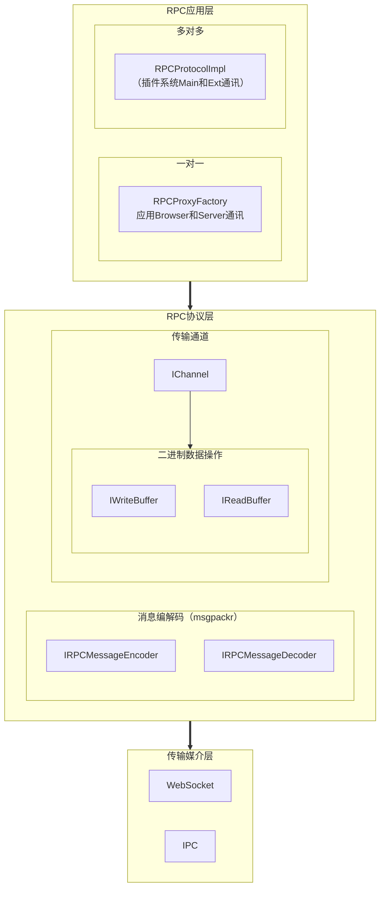
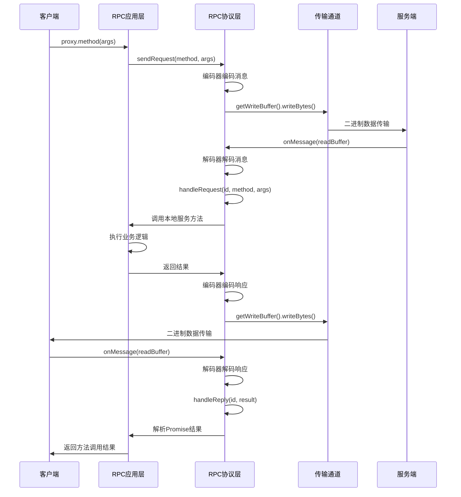

# 设计一个RPC通讯系统

在大型复杂项目当中，跨进程、跨网络通信的处理是一个绕不开的话题。首先，需要支持丰富的插件生态系统，允许第三方开发者扩展系统功能，这就要求系统具备强大的插件隔离和通信能力。其次，系统需要实现前后端分离架构，前端负责用户界面和交互逻辑，后端处理文件系统操作、网络请求、系统级功能等，两者之间需要高效的数据交换和状态同步。此外，系统还需要支持多进程架构，包括主进程、渲染进程、插件进程、Worker 进程等，这些进程之间需要协调工作，共享数据和状态。面对这些复杂需求，传统的通信方案都存在明显的局限性。HTTP API 虽然简单易用，但在实时通信、大量数据传输和类型安全方面存在不足；WebSocket 提供了实时双向通信能力，但缺乏标准化的协议和类型系统；共享内存虽然性能优异，但在 Web 环境中不可用，且存在安全风险。远程过程调用（RPC）技术为解决这些问题提供了理想的解决方案。RPC 通过提供透明、高效、类型安全的远程调用机制，使得开发者可以像调用本地函数一样调用远程服务，大大简化了分布式系统的开发复杂度。在插件系统中，RPC 能够实现插件与主进程的安全隔离，同时提供高效的通信能力；在前后端分离架构中，RPC 提供了类型安全的 API 调用机制，确保前后端接口的一致性和可靠性；在多进程协作中，RPC 实现了进程间的标准化通信，提高了系统的可维护性和扩展性。

为此，我在项目当中引入了基于二进制消息传输的RPC服务，它相对于第一版本的JSON-RPC有着更高的跨进程传输效率和处理能力。下面是服务的基本架构图：





## RPC应用层

假如没有这一层的封装，我们需要手动去调用rpc协议的相关操作来完成rpc请求。每种服务重复完成这个过程就会产生大量重复代码，完全是没必要的。而RPC应用层封装了RPC协议的具体使用方法，让我们得以通过`proxy.method()`的方式便捷使用远程服务。

- 对于local service，我们需要提供注册该service的api

  - 对于`RPCProtocolImpl`，提供了`set<T, R extends T>(identifier: ProxyIdentifier<T>, target: R): R`
  - 对于`RpcProxyFactory`，提供了两种方式：
    - `constructor(public target?: any, protected rpcProtocolFactory = defaultRpcProtocolFactory)`
    - `factory.target = this.targetFactory(proxy) `

- 对于remote service，我们需要提供获取该service的api

  - 对于`RPCProtocolImpl`，提供了`createProxy<T>(proxyId: string): T`
  - 对于`RpcProxyFactory`，提供了`createProxy(): RpcProxy<T> `

- rpc消息分成两种类型：请求和通知，因此我们需要处理请求和处理通知的api

  - 对于`RPCProtocolImpl`，提供了
    - `handleNotification(method: any, args: any[]): void` 处理通知
    - `handleRequest(method: string, args: any[]): Promise<any> `处理请求
    - `proxy get handler`发送通知和发送请求
  - 对于`RpcProxyFactory`，提供了
    - `onNotification(method: string, ...args: any[]): void`处理通知
    - `onRequest(method: string, ...args: any[]): Promise<any> `处理请求
    - `proxy get handler`发送通知和发送请求

- 对于rpc应用封装，都需要rpc协议的支持

  - 对于`RPCProtocolImpl`，提供了

    ```ts
    constructor(channel: Channel) {
            this.rpc = new RpcProtocol(new BatchingChannel(channel), (method, args) => this.handleRequest(method, args));
            this.rpc.onNotification((evt: { method: string; args: any[]; }) => this.handleNotification(evt.method, evt.args));
            this.toDispose.push(Disposable.create(() => this.proxies.clear()));
    }
    ```

  - 对于`RpcProxyFactory`，提供了

    ```ts
     listen(channel: Channel): void {
            const protocol = this.rpcProtocolFactory(channel, (meth, args) => this.onRequest(meth, ...args));
            protocol.onNotification(event => this.onNotification(event.method, ...event.args));
    
            this.rpcDeferred.resolve(protocol);
    }
    ```

    无论哪种封装，都需要基于channel进行rpc协议的实现，channel作为rpc协议的传输层。

- rpc的应用层设计了两种应用封装：

  - 对于`RPCProtocolImpl`：
    - 多local service <====> 多remote service
    - 构造时立即使用参数channel建立rpc protocol
    - 一个rpc protocol服务多种service（local 或者remote都是多种）
  - 对于`RpcProxyFactory`，
    - 单local service <====> 单remote service
    - 调用listen时使用参数channel建立rpc protocol
    - 一个rpc protocol服务一种service（local或者remote都是一种）

- rpc应用层封装，不同的封装方式，使用方式以及使用场景是不同的：

  - 对于`RPCProtocolImpl`

    ```ts
    // ===== 无论main端还是ext端使用方式都一致 =====
    
    // 建立rpc
    const rpc = new RPCProtocolImpl(...)
    
    // 注册local service
    function setUpPluginApi(rpc: RPCProtocol, container: interfaces.Container): void {
        const commandRegistryMain = new CommandRegistryMainImpl(rpc, container);
        rpc.set(PLUGIN_RPC_CONTEXT.COMMAND_REGISTRY_MAIN, commandRegistryMain);
    }
    
    // 获取remote service
    export class CommandRegistryMainImpl {
      constructor(rpc: RPCProtocol, container: interfaces.Container) {
            this.proxy = rpc.getProxy(MAIN_RPC_CONTEXT.COMMAND_REGISTRY_EXT);
      }
    }
    ```

  - 对于`RpcProxyFactory`

    ```ts
    // ===== 服务端和客户端使用方式不太一致=====
    
    // #region 服务端的使用方式
    class RpcConnectionHandler<T extends object> implements ConnectionHandler {
        constructor(
            readonly path: string,
            readonly targetFactory: (proxy: RpcProxy<T>) => any,
            readonly factoryConstructor: new () => RpcProxyFactory<T> = RpcProxyFactory
        ) { }
    
        onConnection(connection: Channel): void {
            const factory = new this.factoryConstructor();
            // 获取remote service
            const proxy = factory.createProxy();
            // 注册local service
            factory.target = this.targetFactory(proxy);
            // 建立rpc
            factory.listen(connection);
        }
    }
    
    bind(ConnectionHandler).toDynamicValue(ctx =>         // 获取remote service
       new RpcConnectionHandler(pluginServerJsonRpcPath, (proxy: IPluginClient ) => {
            const pluginServer = ctx.container.get(PluginServer)
                              
            pluginServer.setClient(proxy)
       
            return pluginServer
      })
    )
    // #endregion
     
     
     // #region 客户端的使用方式
     class ServiceConnectionProvider { 
       // 注册local service 即new RpcProxyFactory<T>(arg)
       createProxy<T extends object>(path: string, arg?: object): RpcProxy<T> {
            const factory = arg instanceof RpcProxyFactory ? arg : new RpcProxyFactory<T>(arg)
            this.listen(path, 
                        (_, c) => factory.listen(c), // 建立rpc
                        true
                       );
            // 获取remote service
            return factory.createProxy();
       }
    }
    
    bind(PluginServer).toDynamicValue(ctx => {
       const provider = ctx.container.get(ServiceConnectionProvider);
       return provider.createProxy<PluginServer>(pluginServerJsonRpcPath);
    })
    // #endregion
    
    ```

## RPC协议层

 得益于RPC应用层的封装，我们能够方便地调用`proxy.method`。但为了真正完成rpc协议的相关操作，还得靠RPC协议层来完成。没有协议层的规范操作，应用层的封装就没有任何意义了。

RPC协议是双向的，设计RPC协议层时我们需要考虑到使用RPC协议的两端角色：

- 客户端：当身为客户端时，我们能够发送RPC请求，发送RPC取消请求，处理RPC通知。
- 服务端：当身为服务端时，我们能够处理RPC请求，处理RPC取消请求，发送RPC通知。

### 使用“Channel”处理底层通讯

整个RPC协议还需要连通通讯底层，才能够将消息发送出去。为了统一消息的收发能力的操作接口，我们对通许底层抽象出了一个`Channel`的概念，`Channel`可以理解成通道或者频道，通过调整到同一个`Channel`，客户端和服务端就能够互相收发消息。这就好像两台对讲机，都调到频道A，对讲机的两边就能够互相收消息和发消息。现在我们给出`Channel`的接口描述，你只需要知道有RPC协议层的下层通讯底层就是`Channel`，拿着`Channel`就可以在RPC协议层收发消息。

定义一个`IChannel`包括以下API：

- 收消息：onMessage
- 发消息：getWriteBuffer
- 收发出错：onError
- 主动关通道：close
- 监听通道关闭：onClose

```ts
interface IChannel {
    // 当远端关闭了当前通道时
    onClose: Event<ChannelCloseEvent>;

    // 当使用Channel进行读写出错时
    onError: Event<unknown>;

    // 当Channel收到消息时
    onMessage: Event<MessageProvider>;

    // 使用Channel发送消息
    getWriteBuffer(): WriteBuffer;

    // 主动关闭当前通道
    close(): void;
}
```

这样一来我们就能够利用Channel来统一实现RPC协议收发消息的能力了。

得益于Channel为RPC协议层提供了收发消息的能力，RPC协议能够进一步的利用channel来进一步细化RPC协议的相关操作：

- 收消息：`channel.onMessage(readBuffer => this.handleMessage(this.decoder.parse(readBuffer())))`
  - 处理RPC请求：`async handleRequest(id: number, method: string, args: any[]): Promise<void>`
  - 处理RPC通知：`async handleNotify(method: string, args: any[], id?: number): Promise<void>`
  - 处理RPC请求取消：`handleCancel(id: number): void`
  - 处理RPC请求回复：`handleReply(id: number, value: any): void`
  - 处理RPC请求错误回复：`handleReplyErr(id: number, error: any): void`
- 发消息：` channel.getWriteBuffer()`
  - 发送RPC请求：`sendRequest<T>(method: string, args: any[]): Promise<T>`
  - 发送RPC通知：`sendNotification(method: string, args: any[]): void`
  - 发送RPC请求取消：`sendCancel(requestId: number): void`
  - 发送RPC请求回复：`encoder.replyOK`
  - 发送RPC请求错误回复：`encoder.replyErr`

### 使用“消息编解码器”处理消息格式

我们根据收发消息的角度整理出了RPC相关操作，不同的操作所携带的参数不同，那么我们如何在发消息的时候统一消息格式，然后在收消息的时候将统一的消息格式重新按照操作类型分发出去处理的呢？这就需要涉及到RPC协议消息类型和消息格式的编解码问题。

在RPC协议层，我们还会针对消息格式的编解码问题设计两个组件：消息编码器和消息解码器。在发消息的相关操作中，将消息发送之前使用编码器对消息进行编码。而在收消息的相关操作中，在处理消息之前使用解码器对消息进行解码。

针对RPC协议的收发消息的相关操作，我们可以总结出以下几种消息类型：

```ts
export const enum RpcMessageType {
    Request = 1,
    Notification = 2,
    Reply = 3,
    ReplyErr = 4,
    Cancel = 5,
}

/**
 * 此代码允许你将 RPC 协议消息（请求/回复/通知/错误/取消）编码到通道写缓冲区中，
 * 并从读缓冲区中解码相同的消息。可以注册自定义编码器/解码器来专门处理某些类型的值进行编码。
 * 客户端负责确保编码器的标签集在通道两端是不同且相同的。
 */
export type RpcMessage = IRequestMessage | INotificationMessage  | IReplyMessage | IReplyErrMessage | ICancelMessage;


export interface IRequestMessage {
    type: RpcMessageType.Request;
    id: number;
    method: string;
    args: any[];
}

export interface INotificationMessage {
    type: RpcMessageType.Notification;
    id?: number;
    method: string;
    args: any[];
}

export interface IReplyMessage {
    type: RpcMessageType.Reply;
    id: number;
    res: any;
}

export interface IReplyErrMessage {
    type: RpcMessageType.ReplyErr;
    id: number;
    err: any;
}

export interface ICancelMessage {
    type: RpcMessageType.Cancel;
    id: number;
}
```

为了提升通讯的效率，我们会直接传输二进制数据。因此消息编码器的作用是将相关操作对应的参数包装成对应类型的RPC消息，然后将该消息编码成二进制。而消息解码器则将二进制消息重新解码成RPC消息以通过消息的类型进行不同种类的消息处理。

```ts
/**
 * IRpcMessageDecoder将通过 ReadBuffer接收的二进制消息解析为RpcMessage
 */
export interface IRpcMessageDecoder {
    parse(buffer: ReadBuffer): RpcMessage;
}


/**
 * RpcMessageEncoder将RpcMessage对象写入WriteBuffer。注意，发消息的责任在于客户端，这就允许在发送之前编码多个消息。
 */
export interface IRpcMessageEncoder {
    cancel(buf: WriteBuffer, requestId: number): void;

    notification(buf: WriteBuffer, method: string, args: any[], id?: number): void

    request(buf: WriteBuffer, requestId: number, method: string, args: any[]): void

    replyOK(buf: WriteBuffer, requestId: number, res: any): void

    replyErr(buf: WriteBuffer, requestId: number, err: any): void
}
```

既然消息编码和解码都需要二进制数据的参与，我们就需要有办法将RPC消息转为二进制，在接收到消息处理前，将二进制转为RPC消息。在这里我们利用到一个包`msgpackr`来实现我们说的这点，它的`encode`将 JavaScript 对象编码为 MessagePack 格式，而它的`decode`将 MessagePack 格式解码为 JavaScript 对象。至此，我们就拥有了对消息格式进行序列化和反序列化的能力。

#### 使用WriteBuffer和ReadBuffer操作二进制数据

在完成消息的序列化后，我们就可以使用`Channel`的发消息能力将消息发送出去，对端使用`Channel`的收消息能力将消息接收。这期间就涉及到了二进制数据的操作问题，为了解决二进制数据的读写，我们又设计了`IWriteBuffer`和`IReadBuffer`两个结构来便捷地完成二进制数据的读写操作。比如，消息编码器将RPC消息编码成二进制数据后，我们就可以使用`IWriteBuffer.writeBytes`将二进制数据写入到`Uint8Array`类型的Buffer当中。当接收到消息时，我们又可以使用`IReadBuffer.readBytes`读取数据为`Uint8Array`进而使用消息解码器将其解析为RPC消息。

## 传输媒介层

传输媒介层为 RPC 系统中Channel提供了底层的具体传输实现。它作为 Channel 的底层支撑，传输媒介层负责将 RPC 消息通过不同的通信协议进行实际传输，确保消息能够可靠、高效地在不同进程、不同机器之间传递。根据这层的具体实现，Channel就有了很多不同实现，例如：

- `IPCChannel`：用于进程间通信的Channel
- `WebSocketChannel`：用于WebSocket通信的Channel
- `ForwardingChannel`：用于转发信息的Channel

## RPC协议各组件交互流程



我们以RPC请求-响应完整流程为例子进行描述：

### 第一阶段：客户端发起请求

- 1.  `proxy.method(args)`：客户端通过代理对象调用远程方法这是RPC应用层的封装，让开发者像调用本地方法一样调用远程服务。例如：`logger.info("app start")`。

- 2.  `sendRequest(method, args)`：RPC应用层将方法调用转换为RPC请求，提取方法名和参数，准备发送给服务端，同时生成唯一的请求ID用于后续响应匹配。

- 3. 编码器编码消息：将请求信息编码为标准的RPC消息格式，创建 `IRequestMessage` 对象：

  ```typescript
  {
    type: RpcMessageType.Request,
    id: requestId,
    method: "info",
    args: ["app start"]
  }
  ```

- 4.  `getWriteBuffer().writeBytes()`：使用MessagePack将消息序列化为二进制数据，通过WriteBuffer写入二进制数据到传输通道。

- 5. 二进制数据传输：通过网络或其他传输介质发送二进制数据，这是实际的网络传输过程。

### 第二阶段：服务端处理请求

- 6.  `onMessage(readBuffer)`：服务端接收到二进制数据，触发消息接收事件，传入ReadBuffer。

- 7. 解码器解码消息：从ReadBuffer读取二进制数据，使用MessagePack解码为RPC消息对象，根据消息类型分发处理。

- 8.  `handleRequest(id, method, args)`：识别这是一个请求消息，提取请求ID、方法名和参数，准备调用对应的本地服务。

- 9. 调用本地服务方法：根据方法名找到对应的本地服务实例，调用实际的服务方法，传入参数。例如这里是`logger.info("app start")`

- 10. 执行业务逻辑：本地服务执行具体的业务逻辑，可能涉及数据库查询、文件操作等，这是实际的业务处理过程。

### 第三阶段：服务端返回响应

- 11. 返回结果：业务逻辑执行完成，返回结果，可能是成功的数据或异常信息。

- 12. 编码器编码响应：将结果编码为响应消息

      - 如果是成功：创建 `IReplyMessage`

        ```ts
        {
          type: RpcMessageType.Reply,
          id: requestId,
          res: { content: "app start" }
        }
        ```

      - 如果是失败：创建 `IReplyErrMessage`

- 13. `getWriteBuffer().writeBytes()`：将响应消息序列化为二进制数据，通过WriteBuffer发送。

- 14. 二进制数据传输：将响应数据发送回客户端。

### 第四阶段：客户端处理响应

- 15.  `onMessage(readBuffer)`：客户端接收到响应数据，触发消息接收事件。

- 16. 解码器解码响应：解码二进制数据为RPC消息对象，识别这是对之前请求的响应。

- 17. `handleReply(id, result)`：根据请求ID找到对应的Promise，解析响应结果。

- 18. 解析Promise结果：

  - 如果是成功响应：resolve Promise
  - 如果是错误响应：reject Promise

- 19. 返回方法调用结果：将Promise的结果返回给调用方，客户端获得最终的调用结果。简单理解这里是，客户端发送请求`const response = await rpc.sendRequest(....);`，在处理完服务端的回复`handleReply`后，response就会有结果产生。


## 总结

RPC在复杂应用当中对于跨进程的通信作用是显而易见的，在各种大型复杂项目源码当中你都能见到它的身影，比如vscode。它是复杂项目当中各个基础系统的通讯基础核心。比如插件系统的实现当中，要实现vscode插件系统同样的Main-Ext模式，就需要提供Main端和Ext端的双向通信，如果没有RPC的参与将无法便捷地开发和维护各端具体实现。可以说它为整个插件系统实现提供了基础的通讯能力。本文只是RPC通讯系统的概述和使用流程介绍，有关于具体的传输媒介参与和插件系统的具体设计有空另开篇幅聊聊。