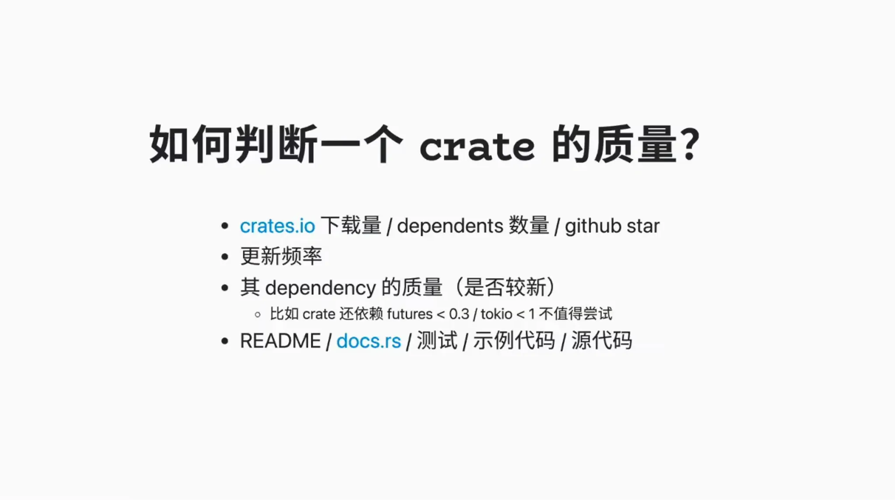

# 如何快速学习一个crate

## 如何判断一个crate的质量

- crates.io 下载量 / dependents 数量 / github star
- 更新频率
- 其 dependency 的质量（是否较新）
- README / docs.rs / 测试 / 示例代码 / 源代码

## 快速尝试crates的方法

- 带着问题
- 快速阅读文档（why,what,how）
- 了解相关的知识（包括ecosystem）
- clone repo
- 尝试example（并用自己的方式实现某些example）
- 阅读源码

> [!TIP]
>
> program = data-structure + algorithms，快速了解一个crate就是看它的data-structure有啥，algorithm（即API）有啥，这两个结合起来构成了crate对外提供的能力。

## 使用crate在解决完问题之后的学习总结

在使用一个crate解决完问题后，要立马做一个学习总结，让学习效果达到最佳。如果只是使用crate解决问题，而不去做内容的总结，学习吸收的效果往往只有百分之四十，很快就忘记了。

## 参考

- 视频
  - [如何快速学习一个crate?](https://www.youtube.com/watch?v=5OtTgr51DZM&list=PL2XM89iiOzkud-BMooV19IWyBtfMVVNJj&index=3)
