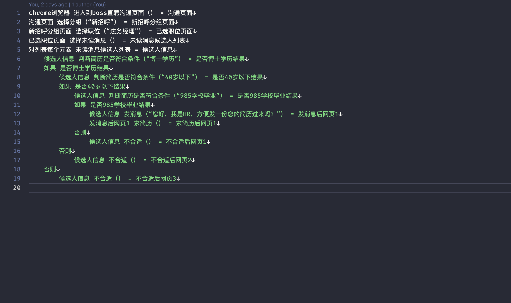
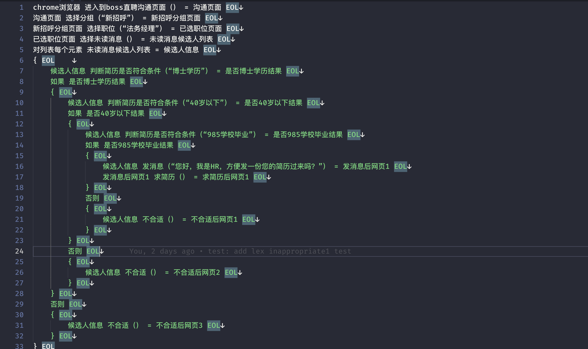

# wizard缩进语法实现

wizard是我们内部自定义的一套平台DSL，用来约束GPT表达的颗粒度，尽量不让它一本正经地胡说八道。而wizard转译器是用于将wizard语法转译程js语法的一个核心工具，第一版是我基于pegjs去实现的，但是随着需求变动，我们不再满足于转译器的定位，需要支持类似函数或者宏展开的机制，于是我开始了基于Rust开发的第二版wizard转译器。其中类Python缩进风格语法的处理是wizard转译器的核心，下面分享下相关处理流程。

- 处理之前

- 处理之后

## 算法执行流程

 0.初始化： 缩进栈 = [0]，缩进数量 = 0

1. 处理第一行：`chrome浏览器 进入到boss直聘沟通页面（） = 沟通页面 EOL`
    - 处理token，识别缩进：缩进数量 = 0
    - 结算缩进：因为当前行的缩进数量为0，跟栈顶元素相同，所以不需要压栈。此时缩进栈为[0],缩进数量 = 0
    - 将当前行加入程序
    - 处理结果：缩进栈 = [0]，缩进数量 = 0
2. 处理第二行：`沟通页面 选择分组（“新招呼”） = 新招呼分组页面 EOL`
    - 处理token，识别缩进：缩进数量 = 0
    - 结算缩进：因为当前行的缩进数量为0，跟栈顶元素相同，所以不需要压栈。
    - 将当前行加入程序
    - 处理结果：缩进栈 = [0]，缩进数量 = 0
3. 处理第三行：`新招呼分组页面 选择职位（“法务经理”） = 已选职位页面 EOL`
    - 处理token，识别缩进：缩进数量 = 0
    - 结算缩进：因为当前行的缩进数量为0，跟栈顶元素相同，所以不需要压栈。
    - 将当前行加入程序
    - 处理结果：缩进栈 = [0]，缩进数量 = 0
4. 处理第四行：`已选职位页面 选择未读消息（） = 未读消息候选人列表 EOL`
    - 处理token，识别缩进：缩进数量 = 0
    - 结算缩进：因为当前行的缩进数量为0，跟栈顶元素相同，所以不需要压栈。
    - 将当前行加入程序
    - 处理结果：缩进栈 = [0]，缩进数量 = 0
5. 处理第五行：`对列表每个元素 未读消息候选人列表 = 候选人信息 EOL`
    - 处理token，识别缩进：缩进数量 = 0
    - 结算缩进：因为当前行的缩进数量为0，跟栈顶元素相同，所以不需要压栈。
    - 将当前行加入程序
    - 处理结果：缩进栈 = [0]，缩进数量 = 0
6. 处理第六行：`候选人信息 判断简历是否符合条件（“博士学历”） = 是否博士学历结果 EOL`
    - 处理token，识别缩进：缩进数量 = 1
    - 结算缩进：当前缩进数量 > 缩进栈顶，压入当前缩进数量到缩进栈，同时给当前行压入Indent + EOL
    - 将当前行加入程序
    - 处理结果：缩进栈 = [0,1]，缩进数量 = 1
7. 处理第七行：`如果 是否博士学历结果 EOL`
    - 处理token，识别缩进：缩进数量 = 1
    - 结算缩进：因为当前行的缩进数量为1，跟栈顶元素相同，所以不需要压栈。
    - 将当前行加入程序
    - 处理结果：缩进栈 = [0,1]，缩进数量 = 1
8. 处理第八行：`候选人信息 判断简历是否符合条件（“40岁以下”） = 是否40岁以下结果 EOL`
    - 处理token，识别缩进：缩进数量 = 2
    - 结算缩进：当前缩进数量 > 缩进栈顶，压入当前缩进数量到缩进栈，同时给当前行压入 Indent + EOL
    - 将当前行加入程序
    - 处理结果：缩进栈 = [0,1,2]，缩进数量 = 2
9. 处理第九行：`如果 是否40岁以下结果 EOL`
    - 处理token，识别缩进：缩进数量 = 2
    - 结算缩进：因为当前行的缩进数量为2，跟栈顶元素相同，所以不需要压栈。
    - 将当前行加入程序
    - 处理结果：缩进栈 = [0,1,2]，缩进数量 = 2
10. 处理第十行：`候选人信息 判断简历是否符合条件（“985学校毕业”） = 是否985学校毕业结果 EOL`
    - 处理token，识别缩进：缩进数量 = 3
    - 结算缩进：当前缩进数量 > 缩进栈顶，压入当前缩进数量到缩进栈，同时给当前行压入 Indent + EOL
    - 将当前行加入程序
    - 处理结果：缩进栈 = [0,1,2,3]，缩进数量 = 3
11. 处理第十一行：`如果 是否985学校毕业结果 EOL`
    - 处理token，识别缩进：缩进数量 = 3
    - 结算缩进：因为当前行的缩进数量为3，跟栈顶元素相同，所以不需要压栈。
    - 将当前行加入程序
    - 处理结果：缩进栈 = [0,1,2,3]，缩进数量 = 3
12. 处理第十二行：`候选人信息 发消息（“您好，我是HR，方便发一份您的简历过来吗？”） = 发消息后网页1 EOL`
    - 处理token，识别缩进：缩进数量 = 4
    - 结算缩进：当前缩进数量 > 缩进栈顶，压入当前缩进数量到缩进栈，同时给当前行压入 Indent +EOL
    - 将当前行加入程序
    - 处理结果：缩进栈 = [0,1,2,3,4]，缩进数量 = 4
13. 处理第十三行：`发消息后网页1 求简历（） = 求简历后网页1 EOL`
    - 处理token，识别缩进：缩进数量 = 4
    - 结算缩进：因为当前行的缩进数量为4，跟栈顶元素相同，所以不需要压栈。
    - 将当前行加入程序
    - 处理结果：缩进栈 = [0,1,2,3,4]，缩进数量 = 4
14. 处理第十四行：`否则 EOL`
    - 处理token，识别缩进：缩进数量 = 3
    - 结算缩进
        - 缩进数量 < 栈顶 吗？此时栈顶是4，缩进数量是3，于是弹出栈顶，结算一个Dedent + EOL插入到当前行首
        - 当前结果：缩进栈 = [0,1,2,3]，缩进数量 = 3
        - 缩进数量 < 栈顶 吗？此时栈顶是3，缩进数量是3，停止计算
    - 将当前行加入程序
    - 处理结果：缩进栈 = [0,1,2,3]，缩进数量 = 3
15. 处理第十五行：`候选人信息 不合适（） = 不合适后网页1 EOL`
    - 处理token，识别缩进：缩进数量 = 4
    - 结算缩进：当前缩进数量 > 缩进栈顶，压入当前缩进数量到缩进栈，同时给当前行压入 Indent +EOL
    - 将当前行加入程序
    - 处理结果：缩进栈 = [0,1,2,3,4]，缩进数量 = 4
16. 处理第十六行：`否则 EOL`
    - 处理token，识别缩进：缩进数量 = 2
    - 结算缩进
        - 缩进数量 < 栈顶 吗？此时栈顶是4，缩进数量是2，于是弹出栈顶，结算一个Dedent + EOL插入到当前行首
        - 当前结果：缩进栈 = [0,1,2,3]，缩进数量 = 2
        - 缩进数量 < 栈顶 吗？此时栈顶是3，缩进数量是2，于是弹出栈顶，结算一个Dedent + EOL插入到当前行首
        - 当前结果：缩进栈 = [0,1,2]，缩进数量 = 2
        - 缩进数量 < 栈顶 吗？此时栈顶是2，缩进数量是2，停止计算
    - 将当前行加入程序
    - 处理结果：缩进栈 = [0,1,2]，缩进数量 = 2
17. 处理第十七行：`候选人信息 不合适（） = 不合适后网页2 EOL`
    - 处理token，识别缩进：缩进数量 = 3
    - 结算缩进：当前缩进数量 > 缩进栈顶，压入当前缩进数量到缩进栈，同时给当前行压入 Indent +EOL
    - 将当前行加入程序
    - 处理结果：缩进栈 = [0,1,2,3]，缩进数量 = 3
18. 处理第十八行：`否则 EOL`
    - 处理token，识别缩进：缩进数量 = 1
    - 结算缩进
        - 缩进数量 < 栈顶 吗？此时栈顶是3，缩进数量是1，于是弹出栈顶，结算一个Dedent + EOL插入到当前行首
        - 当前结果：缩进栈 = [0,1,2]，缩进数量 = 1
        - 缩进数量 < 栈顶 吗？此时栈顶是2，缩进数量是1，于是弹出栈顶，结算一个Dedent + EOL插入到当前行首
        - 当前结果：缩进栈 = [0,1]，缩进数量 = 1
        - 缩进数量 < 栈顶 吗？此时栈顶是1，缩进数量是1，停止计算
    - 将当前行加入程序
    - 处理结果：缩进栈 = [0,1]，缩进数量 = 1
19. 处理第十九行：`候选人信息 不合适（） = 不合适后网页3 EOL`
    - 处理token，识别缩进：缩进数量 = 2
    - 结算缩进：当前缩进数量 > 缩进栈顶，压入当前缩进数量到缩进栈，同时给当前行压入 Indent +EOL
    - 将当前行加入程序
    - 处理结果：缩进栈 = [0,1,2]，缩进数量 = 2
20. 所有行处理完毕，如果缩进栈栈顶不为0，说明还有没结算完的结束块。
    - 结算缩进：
        - 当前栈顶 != 0 吗？是的，结算一个Dedent + EOL
        - 当前结果缩进栈 = [0,1]
        - 当前栈顶 != 0 吗？是的，结算一个Dedent + EOL
        - 当前结果缩进栈 = [0]
        - 当前栈顶 != 0 吗？不是的，停止结算。

## 总结

缩进风格的算法实现整体上不算多难，主要的核心点就是对当前行token的读取同时计算缩进的数量，然后开始处理行并对缩进进行结算。结算的过程其实就是发射Indent和Decent的过程，为了使用方便，我是将每一行都加上EOL token，设计过程当中可以根据业务情况的不同去设计。简而言之，在我看来其实就是两个阶段：读取行+处理行，不同的就是处理缩进的过程（ps：其实思考下如果能够做成常规语言那样的用大括号”{}”表明一个块处理起来可能简单不少，不过产品形态设计希望这样啦🐶）。

## 参考

[1] [设计类Python编译器时如何处理tab和space缩进？](https://www.zhihu.com/question/28773001)

[2] [tokenize — Tokenizer for Python source](https://docs.python.org/3/library/tokenize.html)

[3] [Parsing blocks as Python](https://stackoverflow.com/questions/50120724/parsing-blocks-as-python)

[4] [用 Rust 学习解析器组合子 (combinator)](https://rustmagazine.github.io/rust_magazine_2021/chapter_6/parser-combinator.html)
