# 使用Mermaid绘制UML类图

## 节点定义

### 类

#### 基础类

**TypeScript 定义：**
```typescript
class User {
  public id: string;
  public name: string;
  public email: string;
  
  constructor(id: string, name: string, email: string) {
    this.id = id;
    this.name = name;
    this.email = email;
  }
  
  public getInfo(): string {
    return `${this.name} (${this.email})`;
  }
}
```

**对应的 UML 类图：**
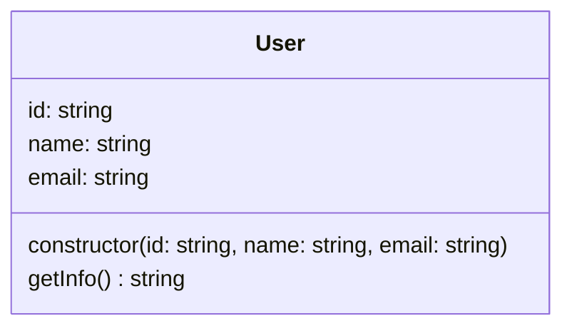

**Mermaid 语法：**
```
classDiagram
  class User {
   id: string
   name: string
   email: string
   constructor(id: string, name: string, email: string)
   getInfo() string
  }
```

#### 抽象类

**TypeScript 定义：**
```typescript
abstract class Animal {
  protected name: string;
  protected age: number;
  
  constructor(name: string, age: number) {
    this.name = name;
    this.age = age;
  }
  
  abstract makeSound(): void;
  
  public getInfo(): string {
    return `${this.name}, ${this.age} years old`;
  }
  
  protected sleep(): void {
    console.log(`${this.name} is sleeping`);
  }
}
```

**对应的 UML 类图：**
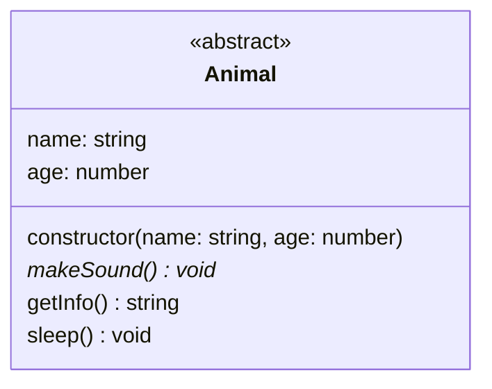

**Mermaid 语法：**
```
classDiagram
  class Animal {
    <<abstract>>
   name: string
   age: number
   constructor(name: string, age: number)
   makeSound()* void
   getInfo() string
   sleep() void
  }
```

#### 泛型类

**TypeScript 定义：**
```typescript
class Container<T> {
  private items: T[] = [];
  
  public add(item: T): void {
    this.items.push(item);
  }
  
  public remove(item: T): boolean {
    const index = this.items.indexOf(item);
    if (index >1) {
      this.items.splice(index, 1);
      return true;
    }
    return false;
  }
  
  public get(index: number): T | undefined {
    return this.items[index];
  }
  
  public size(): number {
    return this.items.length;
  }
}

class StringContainer extends Container<string> {
  public join(separator: string = ','): string {
    return this.items.join(separator);
  }
}
```

**对应的 UML 类图：**
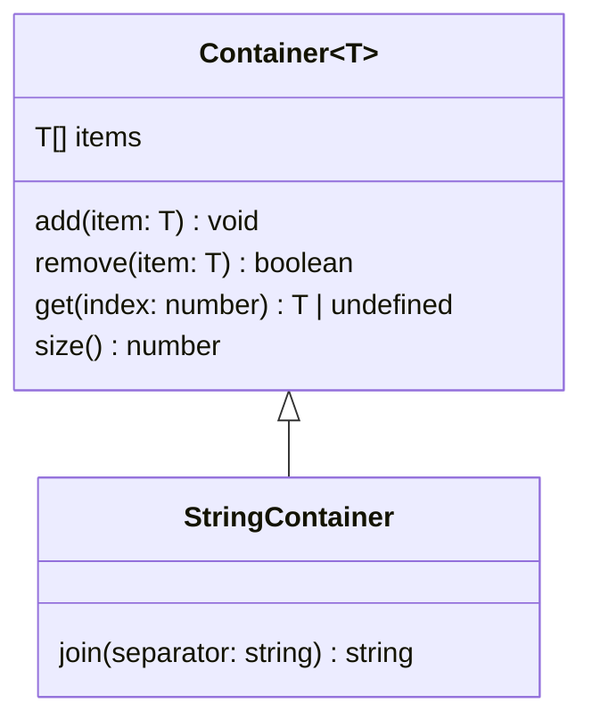

**Mermaid 语法：**
```
classDiagram
  class Container~T~ {
   T[] items
   add(item: T) void
   remove(item: T) boolean
   get(index: number) T | undefined
   size() number
  }
  
  class StringContainer {
   join(separator: string) string
  }
  
  Container~T~ <|-- StringContainer
```

### 接口

#### 基础接口

**TypeScript 定义：**
```typescript
interface IVehicle {
  brand: string;
  model: string;
  year: number;
  start(): void;
  stop(): void;
  getInfo(): string;
}
```

**对应的 UML 类图：**
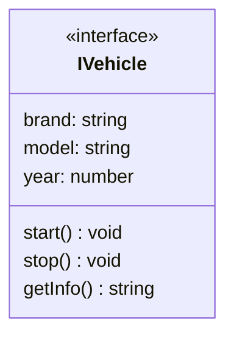

**Mermaid 语法：**
```
classDiagram
  class IVehicle {
    <<interface>>
   brand: string
   model: string
   year: number
   start() void
   stop() void
   getInfo() string
  }
```

#### 泛型接口

**TypeScript 定义：**
```typescript
interface IRepository<T> {
  save(entity: T): void;
  findById(id: string): T | null;
  findAll(): T[];
  delete(id: string): boolean;
}
```

**对应的 UML 类图：**
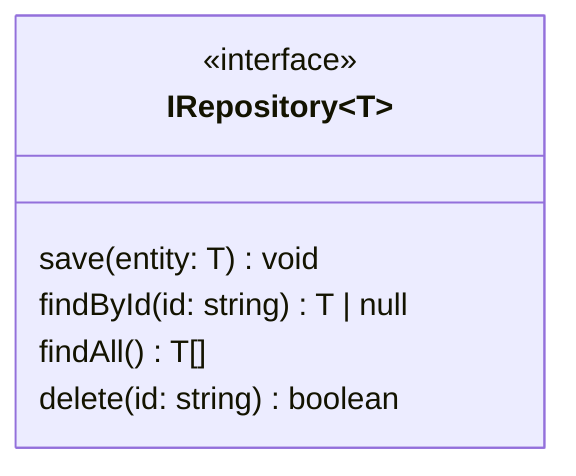

**Mermaid 语法：**
```
classDiagram
  class IRepository~T~ {
    <<interface>>
   save(entity: T) void
   findById(id: string) T | null
   findAll() T[]
   delete(id: string) boolean
  }
```

### TypeScript 类型系统

#### 联合类型和可选属性

**TypeScript 定义：**
```typescript
class Product {
  public id: string;
  public name: string;
  public price: number;
  public description?: string; // 可选属性
  public category: string | number; // 联合类型
  public tags?: string[]; // 可选数组
  public metadata?: Record<string, any>; // 可选对象
}
```

**对应的 UML 类图：**
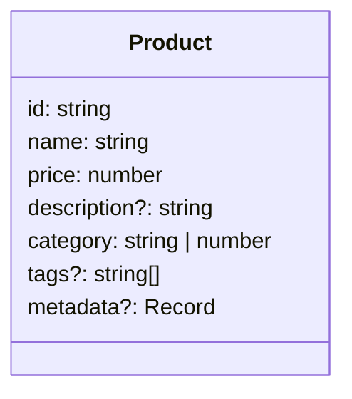

**Mermaid 语法：**
```
classDiagram
  class Product {
   id: string
   name: string
   price: number
   description?: string
   category: string | number
   tags?: string[]
   metadata?: Record<string, any>
  }
```

#### 枚举类型

**TypeScript 定义：**
```typescript
enum OrderStatus {
  PENDING = 'pending',
  PLACED = 'placed',
  SHIPPED = 'shipped',
  DELIVERED = 'delivered',
  CANCELLED = 'cancelled'
}

enum UserRole {
  ADMIN = 'admin',
  USER = 'user',
  MODERATOR = 'moderator',
  GUEST = 'guest'
}

class Order {
  public id: string;
  public status: OrderStatus;
  public userId: string;
  public total: number;
  
  constructor(id: string, userId: string, total: number) {
    this.id = id;
    this.userId = userId;
    this.total = total;
    this.status = OrderStatus.PENDING;
  }
}
```

**对应的 UML 类图：**
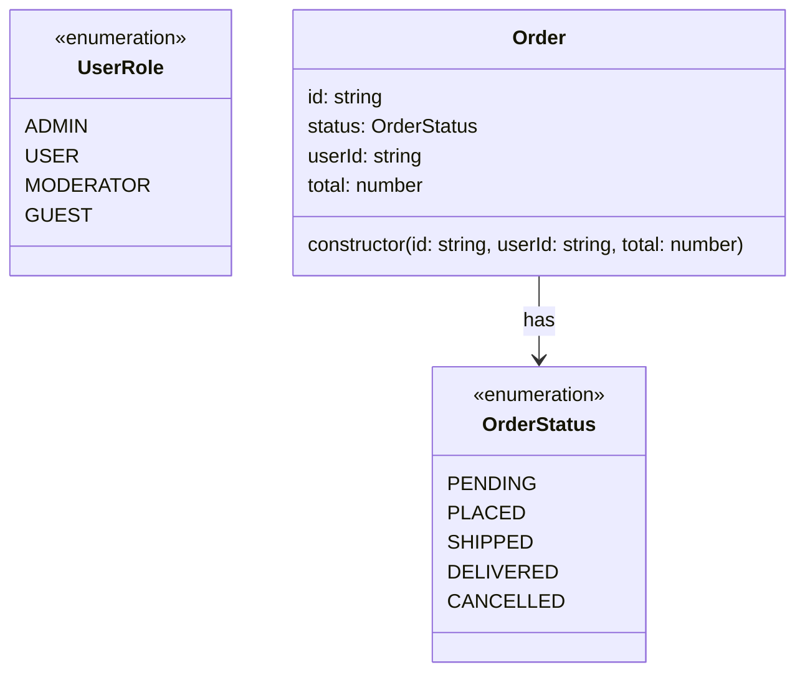

**Mermaid 语法：**
```
classDiagram
  class OrderStatus {
    <<enumeration>>
    PENDING
    PLACED
    SHIPPED
    DELIVERED
    CANCELLED
  }
  
  class UserRole {
    <<enumeration>>
    ADMIN
    USER
    MODERATOR
    GUEST
  }
  
  class Order {
   id: string
   status: OrderStatus
   userId: string
   total: number
   constructor(id: string, userId: string, total: number)
  }
  
  Order --> OrderStatus : has
```

## 节点关系

### 继承关系

**用例场景：**
动物分类系统 - 动物是一个抽象基类，定义了所有动物共有的属性和行为。狗和猫都继承自动物类，它们都有名字和年龄，都会发出声音，但具体的叫声不同。狗有独特的品种属性，猫有独特的颜色属性。

**TypeScript 定义：**
```typescript
class Dog extends Animal {
  private breed: string;
  
  constructor(name: string, age: number, breed: string) {
    super(name, age);
    this.breed = breed;
  }
  
  public makeSound(): void {
    console.log('Woof!');
  }
  
  public fetch(): void {
    console.log(`${this.name} is fetching`);
  }
}

class Cat extends Animal {
  private color: string;
  
  constructor(name: string, age: number, color: string) {
    super(name, age);
    this.color = color;
  }
  
  public makeSound(): void {
    console.log('Meow!');
  }
  
  public climb(): void {
    console.log(`${this.name} is climbing`);
  }
}
```

**对应的 UML 类图：**
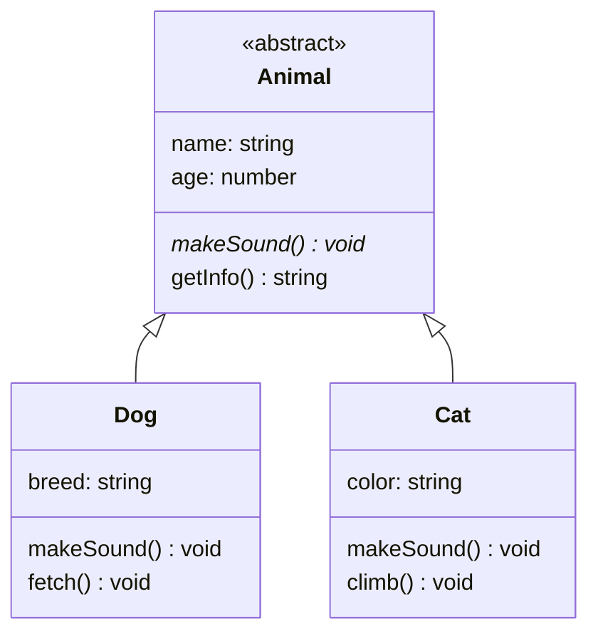

**Mermaid 语法：**
```
classDiagram
  class Animal {
    <<abstract>>
   name: string
   age: number
   makeSound()* void
   getInfo() string
  }
  
  class Dog {
   breed: string
   makeSound() void
   fetch() void
  }
  
  class Cat {
   color: string
   makeSound() void
   climb() void
  }
  
  Animal <|-- Dog
  Animal <|-- Cat
```

### 实现关系

**用例场景：**
飞行器系统 - 定义了飞行接口，规定了所有飞行器都必须具备的飞行能力。鸟类和飞机都实现了这个接口，但它们的飞行方式和高度完全不同。鸟类是生物飞行，飞机是机械飞行，但它们都遵循相同的飞行协议。

**TypeScript 定义：**
```typescript
interface IFlyable {
  fly(): void;
  getAltitude(): number;
}

class Bird implements IFlyable {
  private species: string;
  private altitude: number = 0;
  
  constructor(species: string) {
    this.species = species;
  }
  
  public fly(): void {
    this.altitude = 100;
    console.log(`${this.species} is flying`);
  }
  
  public getAltitude(): number {
    return this.altitude;
  }
}

class Airplane implements IFlyable {
  private model: string;
  private altitude: number = 0;
  
  constructor(model: string) {
    this.model = model;
  }
  
  public fly(): void {
    this.altitude = 30000;
    console.log(`${this.model} is flying`);
  }
  
  public getAltitude(): number {
    return this.altitude;
  }
}
```

**对应的 UML 类图：**
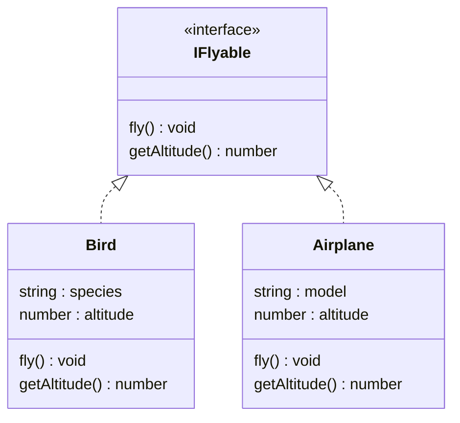

### 关联关系

**用例场景：**
学生选课系统 - 学生可以选择多门课程，每门课程也可以有多个学生。学生和课程之间是多对多的关联关系，学生可以随时选课或退课，课程也可以添加或移除学生。

**TypeScript 定义：**
```typescript
class Student {
  public id: string;
  public name: string;
  public courses: Course[] = [];
  
  constructor(id: string, name: string) {
    this.id = id;
    this.name = name;
  }
  
  public enrollCourse(course: Course): void {
    this.courses.push(course);
  }
}

class Course {
  public id: string;
  public name: string;
  public students: Student[] = [];
  
  constructor(id: string, name: string) {
    this.id = id;
    this.name = name;
  }
  
  public addStudent(student: Student): void {
    this.students.push(student);
  }
}
```

**对应的 UML 类图：**
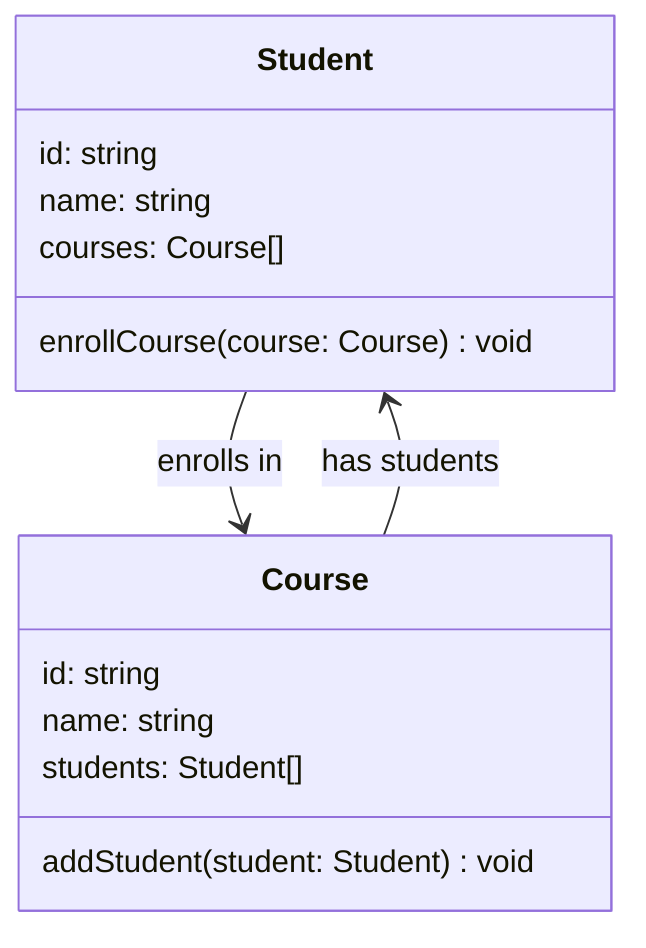

**Mermaid 语法：**
```
classDiagram
  class Student {
   id: string
   name: string
   courses: Course[]
   enrollCourse(course: Course) void
  }
  
  class Course {
   id: string
   name: string
   students: Student[]
   addStudent(student: Student) void
  }
  
  Student --> Course : enrolls in
  Course --> Student : has students
```

### 组合关系（强依赖）

**用例场景：**
汽车制造系统 - 汽车由发动机和轮子组成，这些部件是汽车的核心组成部分。发动机和轮子不能独立于汽车存在，当汽车被销毁时，这些部件也会被销毁。这体现了"整体与部分不可分离"的组合关系。

**TypeScript 定义：**
```typescript
class Car {
  public brand: string;
  public model: string;
  public engine: Engine;
  public wheels: Wheel[];
  
  constructor(brand: string, model: string) {
    this.brand = brand;
    this.model = model;
    this.engine = new Engine(); // 组合：汽车拥有发动机
    this.wheels = [
      new Wheel(), new Wheel(), 
      new Wheel(), new Wheel()
    ]; // 组合：汽车拥有四个轮子
  }
  
  public start(): void {
    this.engine.start();
  }
}

class Engine {
  public horsepower: number;
  
  constructor() {
    this.horsepower = 200;
  }
  
  public start(): void {
    console.log('Engine started');
  }
}

class Wheel {
  public size: number;
  
  constructor() {
    this.size = 17;
  }
}
```

**对应的 UML 类图：**
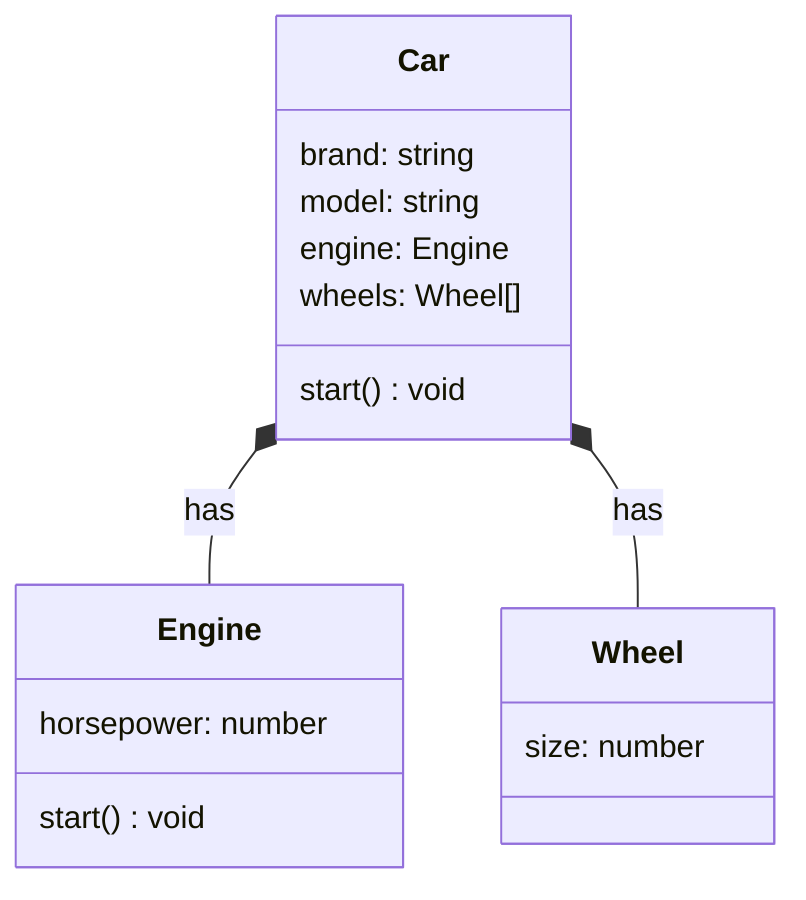

**Mermaid 语法：**
```
classDiagram
  class Car {
   brand: string
   model: string
   engine: Engine
   wheels: Wheel[]
   start() void
  }
  
  class Engine {
   horsepower: number
   start() void
  }
  
  class Wheel {
   size: number
  }
  
  Car *-- Engine : has
  Car *-- Wheel : has
```

### 聚合关系（弱依赖）

**用例场景：**
公司组织架构 - 部门包含多个员工，但员工可以调岗到其他部门，也可以离职。部门解散时，员工可以选择去其他部门或离开公司。这体现了"整体与部分可以分离"的聚合关系。

**TypeScript 定义：**
```typescript
class Department {
  public id: string;
  public name: string;
  public employees: Employee[] = [];
  
  constructor(id: string, name: string) {
    this.id = id;
    this.name = name;
  }
  
  public addEmployee(employee: Employee): void {
    this.employees.push(employee);
  }
  
  public removeEmployee(employee: Employee): void {
    const index = this.employees.indexOf(employee);
    if (index > -1) {
      this.employees.splice(index, 1);
    }
  }
}

class Employee {
  public id: string;
  public name: string;
  public department?: Department;
  
  constructor(id: string, name: string) {
    this.id = id;
    this.name = name;
  }
  
  public assignToDepartment(department: Department): void {
    this.department = department;
    department.addEmployee(this);
  }
}
```

**对应的 UML 类图：**
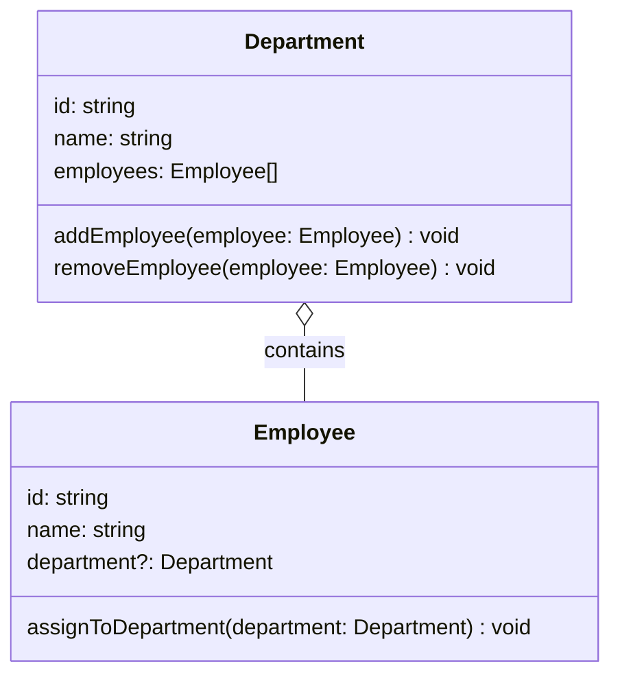

**Mermaid 语法：**
```
classDiagram
  class Department {
   id: string
   name: string
   employees: Employee[]
   addEmployee(employee: Employee) void
   removeEmployee(employee: Employee) void
  }
  
  class Employee {
   id: string
   name: string
   department?: Department
   assignToDepartment(department: Department) void
  }
  
  Department o-- Employee : contains
```

### 依赖关系

**用例场景：**
订单处理系统 - 订单服务在创建订单时需要临时使用验证器来验证订单数据，在发送通知时需要临时使用邮件通知器。这些依赖对象只在特定方法中使用，不是订单服务的持久属性。

**TypeScript 定义：**
```typescript
class OrderService {
  public createOrder(orderData: OrderData): Order {
    const validator = new OrderValidator(); // 依赖：临时使用验证器
    if (!validator.validate(orderData)) {
      throw new Error('Invalid order data');
    }
    
    const order = new Order(orderData);
    return order;
  }
  
  public sendNotification(order: Order): void {
    const notifier = new EmailNotifier(); // 依赖：临时使用通知器
    notifier.send(`Order ${order.id} created successfully`);
  }
}

class OrderValidator {
  public validate(orderData: OrderData): boolean {
    // 验证逻辑
    return orderData.items && orderData.items.length > 0;
  }
}

class EmailNotifier {
  public send(message: string): void {
    console.log(`Email sent: ${message}`);
  }
}

class Order {
  public id: string;
  public items: any[];
  
  constructor(orderData: OrderData) {
    this.id = Math.random().toString(36).substr(2, 9);
    this.items = orderData.items;
  }
}

interface OrderData {
  items: any[];
}
```

**对应的 UML 类图：**
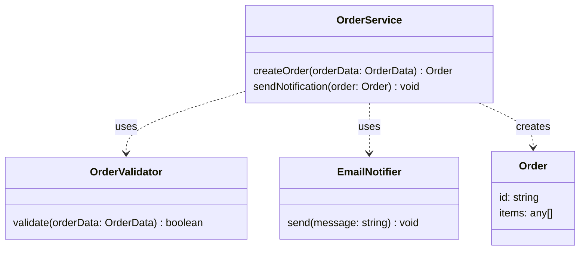

**Mermaid 语法：**
```
classDiagram
  class OrderService {
   createOrder(orderData: OrderData) Order
   sendNotification(order: Order) void
  }
  
  class OrderValidator {
   validate(orderData: OrderData) boolean
  }
  
  class EmailNotifier {
   send(message: string) void
  }
  
  class Order {
   id: string
   items: any[]
  }
  
  OrderService ..> OrderValidator : uses
  OrderService ..> EmailNotifier : uses
  OrderService ..> Order : creates
```

### 多重关系示例

**用例场景：**
大学管理系统 - 这是一个复杂的业务系统，包含大学、院系、教授、学生、课程等多个实体。大学包含多个院系（聚合），院系雇佣多个教授（聚合），教授属于某个院系（关联），教授教授多门课程（关联），学生选修多门课程（关联），课程有多个学生（关联）。这个系统展示了多种关系类型的综合应用。

**TypeScript 定义：**
```typescript
class University {
  public name: string;
  public departments: Department[] = [];
  public students: Student[] = [];
  
  constructor(name: string) {
    this.name = name;
  }
  
  public addDepartment(department: Department): void {
    this.departments.push(department);
  }
  
  public enrollStudent(student: Student): void {
    this.students.push(student);
  }
}

class Department {
  public name: string;
  public professors: Professor[] = [];
  public courses: Course[] = [];
  
  constructor(name: string) {
    this.name = name;
  }
  
  public addProfessor(professor: Professor): void {
    this.professors.push(professor);
  }
  
  public addCourse(course: Course): void {
    this.courses.push(course);
  }
}

class Professor {
  public name: string;
  public department?: Department;
  public courses: Course[] = [];
  
  constructor(name: string) {
    this.name = name;
  }
  
  public teachCourse(course: Course): void {
    this.courses.push(course);
  }
}

class Student {
  public name: string;
  public courses: Course[] = [];
  
  constructor(name: string) {
    this.name = name;
  }
  
  public enrollCourse(course: Course): void {
    this.courses.push(course);
  }
}

class Course {
  public name: string;
  public professor?: Professor;
  public students: Student[] = [];
  
  constructor(name: string) {
    this.name = name;
  }
}
```

**对应的 UML 类图：**
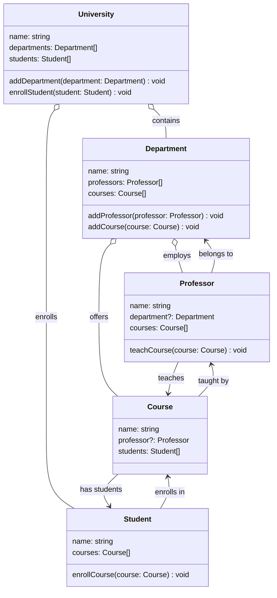

**Mermaid 语法：**
```
classDiagram
  class University {
   name: string
   departments: Department[]
   students: Student[]
   addDepartment(department: Department) void
   enrollStudent(student: Student) void
  }
  
  class Department {
   name: string
   professors: Professor[]
   courses: Course[]
   addProfessor(professor: Professor) void
   addCourse(course: Course) void
  }
  
  class Professor {
   name: string
   department?: Department
   courses: Course[]
   teachCourse(course: Course) void
  }
  
  class Student {
   name: string
   courses: Course[]
   enrollCourse(course: Course) void
  }
  
  class Course {
   name: string
   professor?: Professor
   students: Student[]
  }
  
  University o-- Department : contains
  University o-- Student : enrolls
  Department o-- Professor : employs
  Department o-- Course : offers
  Professor --> Department : belongs to
  Professor --> Course : teaches
  Student --> Course : enrolls in
  Course --> Professor : taught by
  Course --> Student : has students
```


## 语法要点总结

### 访问修饰符
- `+` 表示 public（公开）
- `-` 表示 private（私有）
- `#` 表示 protected（受保护）

### 关系符号
- `<|--` 继承关系（extends）：子类继承父类
- `<|..` 实现关系（implements）：类实现接口
- `-->` 关联关系：类之间的引用关系
- `*--` 组合关系：强依赖，整体与部分不可分离
- `o--` 聚合关系：弱依赖，整体与部分可以分离
- `..>` 依赖关系：临时使用，方法参数或局部变量

### 特殊标记
- `<<interface>>` 接口
- `<<abstract>>` 抽象类
- `<<enumeration>>` 枚举
- `*` 抽象方法

### 类型语法
- `string`、`number`、`boolean` 基本类型
- `string[]` 数组类型
- `T` 泛型类型
- `string | number` 联合类型
- `string?` 可选类型

## 总结

UML类图是项目代码结构梳理的重要工具，通过使用Mermaid，可以快速绘制出类图，放到markdown中。在如今的AI时代，你完全可以将各节点交给AI去分析，你只需要将分析结果整合到类图中，并进行人工校验即可。如果你在探索一个类似vscode的超大型复杂项目，那么UML类图可以代替你的大脑记忆项目各模块的关系和结构，让你能够腾出大脑去专门分析项目代码，理解项目结构，并进行系统复刻。

## 参考

- [Mermaid 官方文档 - Class diagrams](https://mermaid.js.org/syntax/classDiagram.html)